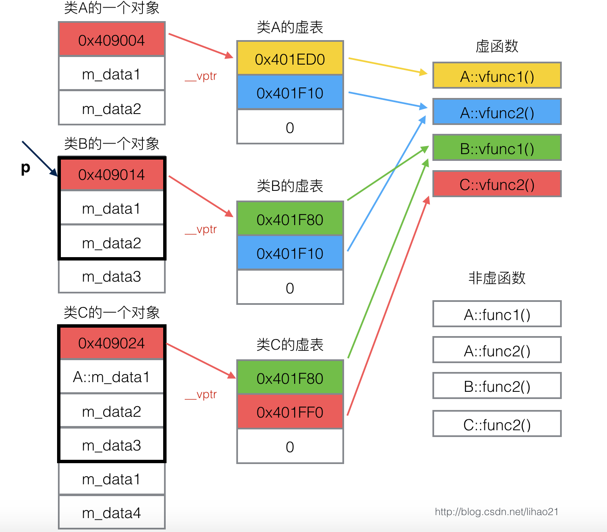
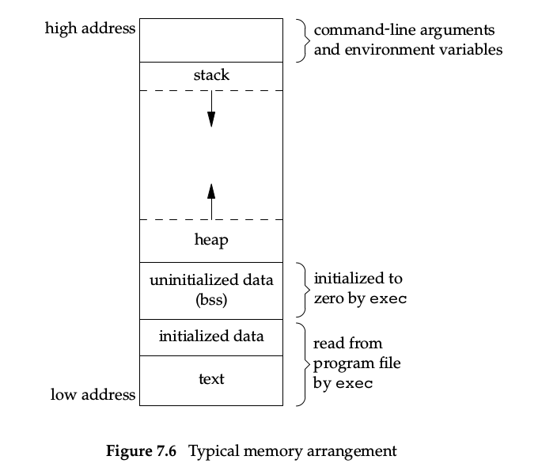
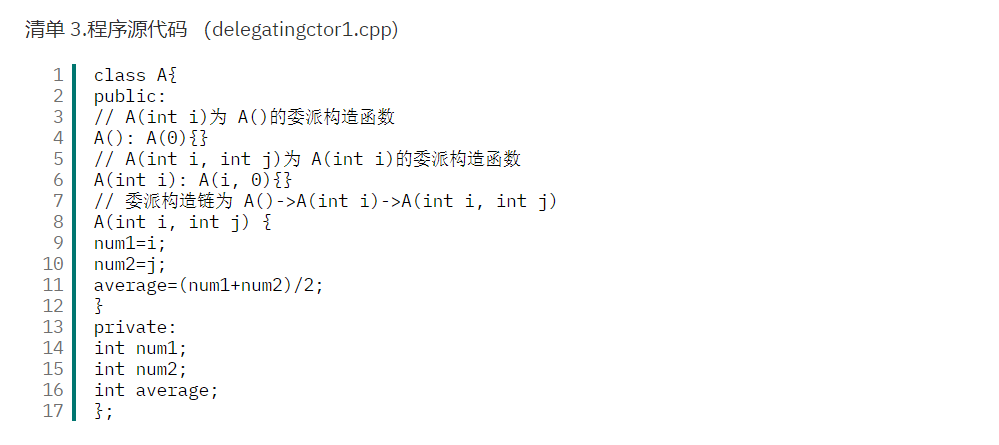

## 虚函数与多态

面向对象三大特性: 封装, 继承, 多态.

多态性指相同对象收到不同消息或不同对象收到相同消息时产生不同的实现动作。C++支持两种多态性：编译时多态性，运行时多态性。

好文: https://zhuanlan.zhihu.com/p/37340242

### 分类

1. 编译时多态性（静态多态）：通过重载函数(模板)实现：先期联编 early binding
2. 运行时多态性（动态多态）：通过虚函数实现 ：滞后联编 late binding

### 运行时多态

C++运行时多态性是通过虚函数来实现的，虚函数允许子类重新定义成员函数，而子类重新定义父类的做法称为覆盖(Override)，或者称为重写。


**多态与非多态的实质区别就是函数地址是早绑定还是晚绑定。**如果函数的调用，在编译器编译期间就可以确定函数的调用地址，并生产代码，是静态的，就是说地址是早绑定的。而如果函数调用的地址不能在编译器期间确定，需要在运行时才确定，这就属于晚绑定。

**多态的目的则是为了“接口重用”.** 

如果没有使用虚函数的话，即没有利用C++多态性，则**利用基类指针调用相应的函数的时候，将总被限制在基类函数本身，而无法调用到子类中被重写过的函数。** 

比如下面这段代码

```cpp
#include <bits/stdc++.h>

using namespace std;

class Base {
   public:
    // virtual void func() {  // 加上 virtual 关键字才可以正确打印
	void func() {
		cout << "hello" << endl;
	}
};

class Two : public Base {
   public:
	void func() {
		cout << "world" << endl;
	}
};

int main() {
	Two test;
	test.func();  // 打印 world
	Base *ptest = &test;
	ptest->func();  // 打印 hello
}
```


### 对比

https://www.cnblogs.com/lizhenghn/p/3667681.html

静态多态包括**函数重载, 泛型编程(模板)**

静态多态也称为静态绑定或早绑。编译器在编译期间完成的， 编译器根据函数实参的类型(可能会进行隐式类型转换) ， 可推断出要调用那个函数， 如果有对应的函数就调用该函数， 否则出现编译错误。

动态绑定： 在程序执行期间(非编译期) 判断所引 用对象的实际类型， 根据其实际类型调用相应的方法。使用virtual关键字修饰类的成员 函数时， 指明该函数为虚函数， 派生类需要重新实现， 编译器将实现动态绑定。

### 原理

**好文: https://blog.csdn.net/afei__/article/details/82142775**

* 当类中存在虚函数时，编译器会在类中自动生成一个虚函数表
* 虚函数表是一个**存储类成员函数指针**的数据结构
* **虚函数表由编译器自动生成和维护**
* virtual 修饰的成员函数会被编译器放入虚函数表中
* 存在虚函数时，编译器**会为对象自动生成一个指向虚函数表的指针**（通常称之为 vptr 指针）


### 虚函数表存在哪里

https://www.cnblogs.com/chenhuan001/p/6485233.html

虚函数表在Linux中存在**.rdata只读数据段**. 

https://blog.csdn.net/lihao21/article/details/50688337

* 每个包含了虚函数的类都包含一个虚表。

对于这样一份示例代码

```cpp
class A {
public:
    virtual void vfunc1();
    virtual void vfunc2();
    void func1();
    void func2();
private:
    int m_data1, m_data2;
};

class B : public A {
public:
    virtual void vfunc1();
    void func1();
private:
    int m_data3;
};

class C: public B {
public:
    virtual void vfunc2();
    void func2();
private:
    int m_data1, m_data4;
};
```



### 虚析构函数

为什么要有虚析构函数?

如果一个类不作为基类, 那么它不需要有虚析构函数. 

但是如果一个类会作为基类且没有定义虚析构函数, 定义了一个基类指针, 指向子类, 那么在delete这个指针的时候, 将不会执行子类的析构函数(都会执行父类的析构函数). 当然, 如果该指针是子类指针, 那么会执行子类的析构函数. 

而子类的析构函数会用来做一些指针的清理工作, 因此会造成内存泄漏. 

例如下面的代码

```cc
#include <iostream>
using namespace std;

class Base {
    public:
    Base() {};
    // virtual ~Base() {
    ~Base() {
        cout << "~ of 1" << endl;
    };

    virtual void DoSomething() {
        cout << "something ... 1" << endl;
    }
};

class NewClass: public Base {
    public:
    NewClass() {};
    ~NewClass() {
        cout << "~ of 2" << endl;
    }
    void DoSomething() {
        cout << "something ... 2\n";
    }
};

int main() {
    Base *p1 = new NewClass();
    p1->DoSomething();
    delete p1;

    NewClass *p2 = new NewClass();
    p2->DoSomething();
    delete p2;
}
```

执行的结果是

```bash
something ... 2
~ of 1
something ... 2
~ of 2
~ of 1
```

[参考资料](https://blog.csdn.net/starlee/article/details/619827)


### C++虚构造函数

C++是不支持虚构造函数的

https://www.zhihu.com/question/35632207


## 一些关键字


### struct 和 class 的区别

有两种struct

c语言的struct和C++的有很大的区别, C语言的struct基本只是一种自定义的数据结构, 它没有成员函数, 也就没有那些面向对象的特性了. **但是c语言是可以一些实现出面向对象的特性的**: [参考文章](https://blog.csdn.net/foruok/article/details/18192167)  [2](https://blog.csdn.net/foruok/article/details/18325977) [3](https://blog.csdn.net/foruok/article/details/18422955) 

面向对象三大基本特征: 封装、继承、多态.


C++的struct也可以继承 ..…

**在C++中struct得到了很大的扩充：**

**1.struct可以包括成员函数**

**2.struct可以实现继承**

**3.struct可以实现多态**

[参考](https://zhuanlan.zhihu.com/p/47808468) 

[从语法上，在C++中（只讨论C++中）。class和struct做类型定义时只有两点区别：](https://blog.csdn.net/hustyangju/article/details/24350175) 

（一）默认继承权限。如果不明确指定，来自class的继承按照private继承处理，来自struct的继承按照public继承处理；

（二）成员的默认访问权限。class的成员默认是private权限，struct默认是public权限。


### static关键字

http://c.biancheng.net/cpp/biancheng/view/141.html

有时希望函数中的局部变量的值在函数调用结束后不消失而保留原值，即其占用的存储单元不释放，在下一次该函数调用时，该变量保留上一次函数调用结束时的值。这时就应该指定该局部变量为**静态局部变量(static local variable)**。

对静态局部变量的说明：

1. 静态局部变量在静态存储区内分配存储单元。在程序整个运行期间都不释放。**而自动变量(即动态局部变量)属于动态存储类别，存储在动态存储区空间(而不是静态存储区空间)，函数调用结束后即释放。**
2. **为静态局部变量赋初值是在编译时进行的**，即只赋初值一次，在程序运行时它已有初值。以后**每次调用函数时不再重新赋初值而只是保留上次函数调用结束时的值**。而为自动变量赋初值，不是在编译时进行的，而是在函数调用时进行，每调用一次函数重新给一次初值，相当于执行一次赋值语句。
3. 如果在定义局部变量时不赋初值的话，**对静态局部变量来说，编译时自动赋初值0(对数值型变量)或空字符(对字符型变量)。而对自动变量来说，如果不赋初值，则它的值是一个不确定的值。**这是由于每次函数调用结束后存储单元已释放，下次调用时又重新另分配存储单元，而所分配的单元中的值是不确定的。
4. 虽然静态局部变量在函数调用结束后仍然存在，**但其他函数是不能引用它的，也就是说，在其他函数中它是“不可见”的。** 

比如下面的代码, fac函数中的f值会保留. 

```cpp
#include <iostream>
using namespace std;
int fac(int);  //函数声明
int main() {
	int i;
	for (i = 1; i <= 5; i++)
		cout << i << "!=" << fac(i) << endl;
	return 0;
}

int fac(int n) {
	static int f = 1;	   //f为静态局部变量，函数结束时f的值不释放
	f			 = f * n;  //在f原值基础上乘以n
	return f;
}
```

当static关键字用在类的成员函数中时

https://blog.csdn.net/zhizhengguan/article/details/81183602 


### extern关键字

https://blog.csdn.net/FX677588/article/details/52687707

它属于**变量声明**，extern int a和int a的区别就是，**前者告诉编译器，有一个int类型的变量a定义在其他地方，如果有调用请去其他文件中查找定义。** 

关于extern变量声明使用，例如一个工程中：
　　　　Test1.cpp文件开头定义了int i =10; //定义了一个全局变量
　　　　Test2.cpp文件中定义：extern int i; //声明在另一个编译单元有i变量
注意：不可以写成extern int i =10，因为变量已经存在，不可以在声明时候赋初始值。

### extern和static比较

　　static静态变量虽然和整个程序共生存期，但是作用域还是需要看其定义的地方，当你在某个函数中定义一个变量，该变量作用域仅在该函数中。**但你在文件开头定义一个全局变量，该变量作用域仅在该文件中**。**所以当你声明一个变量调用另一个文件静态变量，编译器会报错的。** 

extern声明尽量写在头文件中


### auto关键字

https://blog.csdn.net/qq_42957923/article/details/90107840

在早期C/C++中auto的含义是：使用auto修饰的变量，是具有**自动存储器**的局部变量(也就是上面几节谈到的东西)
C++11中，标准委员会赋予了auto全新的含义即：auto不再是一个存储类型指示符，而是作为一个新的类型指示符来指示编译器，auto声明的变量必须由编译器在编译时期推导而得

auto特性:
1.auto不能作为函数参数
2.auto不能直接声明数组

3. 为了避免与C++98中的auto发生混淆，C++11只保留了auto作为类型指示符的用法
4. auto在实际中最常见的优势用法就是跟以后会讲到的C++11提供的新式for循环，还有lambda表达式等进行配合使用。
5. auto不能定义类的非静态成员变量
6. 实例化模板时不能使用auto作为模板参数

下面的代码可以在C中通过而在C++中无法通过

```c
#include <stdio.h>

int main() {
	auto int a = 1;
	printf("%d\n", a);
}
```

下面的代码可以在C++中通过而在C中无法通过

```cpp
#include <bits/stdc++.h>

using namespace std;

int main() {
	auto a = 1;
	cout << a << endl;
}
```


## 内存空间

### 堆和栈的区别

操作系统中的堆和栈都是指内存空间，不同的是堆为按需申请、动态分配，例如 C 中的 malloc 函数和 C++ 中的 new 操作（当然 C++ 的 new 不仅仅是申请内存这么简单）。内存中的空闲空间并不是连续的，而是不同程序占用了不同的一块一块的内存，即使是同一个程序也可能占用了不同地方的多块内存。操作系统中则会对这些空间进行统一的管理，在应用程序提出申请时，就会从堆中按照一定算法找出一块可用内存，标记占用空间等信息之后返回其起始地址给程序。在程序结束之前，操作系统不会删除已经申请的内存，而是要靠程序主动提出释放的请求（free、delete），如果使用后忘记释放，就会造成所谓的内存泄漏问题。因此堆基本上可以理解为当前可以使用的空闲内存，但是其申请和释放都要程序员自己写代码管理。

而操作系统的栈则是程序运行时自动拥有的一小块内存，大小在编译期时由编译器参数决定(? 但是如果有行为不确定的多线程, 这个大小怎么确定的?)，用于局部变量的存放或者函数调用栈的保存。在 C 中如果声明一个局部变量（例如 int a），它存放的地方就在栈中，而当这个局部变量离开其作用域之后，所占用的内存则会被自动释放，因此在 C 中局部变量也叫自动变量。栈的另一个作用则是保存函数调用栈，这时和数据结构的栈就有关系了。在函数调用过程中，常常会多层甚至递归调用。每一个函数调用都有各自的局部变量值和返回值，每一次函数调用其实是先将当前函数的状态压栈，然后在栈顶开辟新空间用于保存新的函数状态，接下来才是函数执行。当函数执行完毕之后，栈先进后出的特性使得后调用的函数先返回，这样可以保证返回值的有序传递，也保证函数现场可以按顺序恢复。操作系统的栈在内存中高地址向低地址增长，也即低地址为栈顶，高地址为栈底。这就导致了栈的空间有限制，一旦局部变量申请过多（例如开个超大数组），或者函数调用太深（例如递归太多次），那么就会导致栈溢出（Stack Overflow），操作系统这时候就会直接把你的程序杀掉。

windows下, 栈的大小是2MB, 也就是可以有0.5M的int型数据.

在Linux下, 栈的大小是8MB, 可以通过ulimit -s来设置. 可以有2M的int数据.

编译时是不会报错的, 运行的时候会段错误. 因为栈会溢出. 如果放在函数外面, 就可以很大.

但是有一点很奇怪, 比如下面的代码, 生成的可执行文件才58KB

```cpp
#include <bits/stdc++.h>

using namespace std;

int test[10000][10000];

int main() {
	for (int i = 0; i < 10000; ++i) {
		for (int j = 0; j < 10000; j++) {
			test[i][j] = 1;
		}
	}
	cout << test[99999][9999] << endl;
}
```


不是说放在程序的静态区吗? 为什么这个可执行文件还是这么小? (应该是因为静态区是内存(虚拟地址空间)的概念, 当初始值都为0的时候, 没有必要在编译的时候将这段空间)

我如果这样, 将一些数据初始化, 可执行文件就会变得很大

```cpp
// int test[10000][10000] = {0}; // 这样大小还是很小
int test[10000][10000] = {1};
```


### 进程的内存分布情况

https://blog.csdn.net/i_scream_/article/details/51366809



* 代码段[.text]: 存储机器码序列／全局常量／代码／字符串常量．

* 初始化数据段: 初始化的全局变量／初始化的（局部/全局）静态变量(static修饰的变量)。

* 未初始化数据段[.bbs]: 未初始化的全局变量／未初始化的（局部/全局）静态变量(static修饰的变量)．

* 堆(从低地址往高低至增长): 所使用的局部变量还是在栈上，内容则在堆上．手动释放或者程序结束时由操作系统释放回收．

    * 由程序员分配[new/malloc/realloc/calloc]．

    * windows下， 申请的堆空间一般小于2GB。

* 栈(从高地址往低地址增长): 局部变量／局部常量(const)[局部只读变量]／函数调用时返回地址／调用者的环境信息（例如某些机器寄存器）．
  由编译器自动分配释放管理．
  windows下，申请的栈空间一般为2MB。
  Linux默认的栈空间是8MB，可以用ulimit -s 命令来修改。

>  const 局部变量也存储在栈区，栈区向地址减小的方向增长


## 一些函数和方法

### 拷贝构造函数

https://blog.csdn.net/tunsanty/article/details/4264738

为什么拷贝构造函数需要使用引用?

> 如果拷贝构造函数中的参数不是一个引用，即形如CClass(const CClass c_class)，那么就相当于采用了传值的方式(pass-by-value)，而传值的方式会调用该类的拷贝构造函数，从而造成无穷递归地调用拷贝构造函数。因此拷贝构造函数的参数必须是一个引用。


### 在构造函数中调用构造函数

https://www.cnblogs.com/stemon/p/4834043.html

一个实际开发中遇到的bug

不行, 和Java不一样, 会导致生成一个匿名对象, 然后那个对象初始化他的变量, 而这个调用者的变量没有初始化. 

> 如果仅仅为了一个构造函数重用另一个构造函数的代码，那么完全可以**把构造函数中的公共部分抽取出来定义一个成员函数**(推荐为private),然后在每个需要这个代码的构造函数中调用该函数即可
>
> 但是这样其他的成员函数可能会调用初始化成员函数, 而这一般是不好的.

下面这种方法更好. 这是**C++11标准的委派构造函数** . 而外层的构造函数称为目标构造函数. 

https://www.ibm.com/developerworks/cn/rational/1508_chenjing_c11/index.html




### 类构造函数初始化列表

https://www.runoob.com/w3cnote/cpp-construct-function-initial-list.html

初始化和赋值对内置类型的成员没有什么大的区别，像上面的任一个构造函数都可以。**对非内置类型成员变量，为了避免两次构造，推荐使用类构造函数初始化列表**。

**但有的时候必须用带有初始化列表的构造函数：** 

- 1.成员类型是**没有默认构造函数的类**。若没有提供显示初始化式，则编译器隐式使用成员类型的默认构造函数，若类没有默认构造函数，则编译器尝试使用默认构造函数将会失败。
- 2.**const 成员**或**引用类型**的成员。因为 const 对象或引用类型只能初始化，不能对他们赋值。

比如下面的代码是正常的

```cpp
#include <bits/stdc++.h>

using namespace std;

class Test {
   public:
	int a;
	double b;

	// Test() {}
	Test(int a, int b) : a(a), b(b) {}
};

class Test2 {
   public:
	Test test;
	Test2(Test t) : test(t) {}
};

int main() {
	Test* test = new Test(1, 2);
	Test2* t = new Test2(*test);
}
```

但是如果Test2的Test不在参数列表中, 将会出错, 因为会调用Test类的默认构造函数, 而默认构造函数没有定义

```cpp
#include <bits/stdc++.h>

using namespace std;

class Test {
   public:
	int a;
	double b;

	// Test() {}
	Test(int a, int b) : a(a), b(b) {}
};

class Test2 {
   public:
	Test test;
	// Test2(Test t) : test(t) {}
	Test2(Test t) {
		test = t;
	}
};

int main() {
	Test* test = new Test(1, 2);
	Test2* t = new Test2(*test);
}
```

**初始化数据成员与对数据成员赋值的含义是什么？有什么区别？**

首先把数据成员按类型分类并分情况说明:

- 1.**内置数据类型，复合类型（指针，引用）**- 在成员初始化列表和构造函数体内进行，在性能和结果上都是一样的
- 2.**用户定义类型（类类型）**- 结果上相同，但是性能上存在很大的差别。因为类类型的数据成员对象在进入函数体前已经构造完成，也就是说在成员初始化列表处进行构造对象的工作，调用构造函数，在进入函数体之后，进行的是对已经构造好的类对象的赋值，又调用个拷贝赋值操作符才能完成（如果并未提供，则使用编译器提供的默认按成员赋值行为）


好文: https://www.cnblogs.com/graphics/archive/2010/07/04/1770900.html

**哪些东西必须放在初始化列表中**

除了性能问题之外，有些时场合初始化列表是不可或缺的，以下几种情况时必须使用初始化列表

- 常量成员，因为常量只能初始化不能赋值，所以必须放在初始化列表里面
- 引用类型，**引用必须在定义的时候初始化，并且不能重新赋值**，所以也要写在初始化列表里面
- 没有默认构造函数的类类型，因为使用初始化列表可以不必调用默认构造函数来初始化，而是直接调用拷贝构造函数初始化。

**成员变量的初始化顺序**

成员是按照他们在类中出现的顺序进行初始化的，而不是按照他们在初始化列表出现的顺序初始化的，看代码。

```
struct foo
{
    int i ;
    int j ;
    foo(int x):i(x), j(i){}; // ok, 先初始化i，后初始化j
};
```

再看下面的代码

```
struct foo
{
    int i ;
    int j ;
    foo(int x):j(x), i(j){} // i值未定义
};
```

这里i的值是未定义的，虽然j在初始化列表里面出现在i前面，但是i先于j定义，所以先初始化i，但i由j初始化，此时j尚未初始化，所以导致i的值未定义。所以，一个好的习惯是，按照成员定义的顺序进行初始化。


### 实现c语言的memcpy函数

C 库函数 void *memcpy(void *str1, const void *str2, size_t n) 从存储区 str2 复制 n 个字符到存储区 str1。

实现这个函数需要注意以下几个点: 

1. 传递进入memcpy的指针参数是 `void *`, 是通用的指针类型
2. 首先需要判断指针是否为NULL
3. 对字节进行操作, 因为size指的是字节数. 因此可以将`void *`转化为`char *`进行操作
4. 需要考虑到如果源地址和目标地址有重合的部分


下面是我的实现, main 中的测试包括 int的拷贝, 字符数组的拷贝, 重叠情况的拷贝.

```cpp
#include <iostream>
using namespace std;

void* memcpy(void* dst, void* src, size_t size) {
    if (dst == NULL || src == NULL)
        return NULL;
    char* new_dst = (char*)dst;
    char* new_src = (char*)src;

    if (dst > src && new_dst - new_src <= size) {
        for (int i = size - 1; i >= 0; i--) {
            new_dst[i] = new_src[i];
        }
    } else {
        for (int i = 0; i < size; i++) {
            new_dst[i] = new_src[i];
        }
    }

    return dst;
}

int main() {
    // 整形的拷贝
    int a = 12, b = 2;
    int* c = (int*)memcpy(&b, &a, sizeof(b));
    cout << (*c) << endl;

    // 字符串的拷贝
    char f[] = "abcfajlafd";
    char d[] = "fuck";
    cout << "sizeof d: " << sizeof(d) << endl;
    char* e = (char*)memcpy(f, d, sizeof(d));
    cout << e << endl;

    // ! 考虑地址重叠的情况
    char g[] = "12345";
    char* h  = (char*)memcpy(g + 2, g, sizeof(g));
    cout << h << endl;
}
```


## C++ string操作

http://c.biancheng.net/view/400.html


## 智能指针

两个关键点:

1. 动态内存的自动释放
2. 引用计数, 当引用为0的时候说明没有使用它的变量了, 就可以释放空间


## 用C语言实现面向对象

to be continue

