## 概率论

[概率论面经](https://zhuanlan.zhihu.com/p/42473598) 

[nowcoder面经](https://www.nowcoder.com/discuss/94581) 

[https://www.omegaxyz.com/2019/12/11/cs-graduate/](https://www.omegaxyz.com/2019/12/11/cs-graduate/) 

作者在面试中遇到的高频问题

**①项目问题，**简历的项目一定要 好好准备，这是问得最多的。

**②线性代数**

- 矩阵的秩
- 线性相关
- 矩阵的特征值及物理意义
- 向量空间

**③概率论与数理统计**

- 大数定律和中心极限定理的意义与作用（切比雪夫大数定律）
- 独立和不相关的区别
- 正太分布（正态分布的和还是正态分布吗，正态分布性质与独立同分布）

**③数据结构**

- 堆实现及应用
- 排序算法
- 迪杰斯特拉
- 最小生成树等
- 邻接表和邻接矩阵（如何存储大数据）

**④机器学习与人工智能**（一般英文问得比较多，很多都是些观点看法，也有很多是与项目联系在一起）

### 相关问题截图

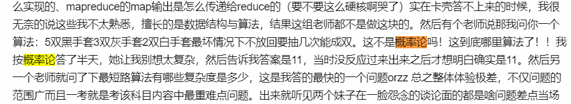

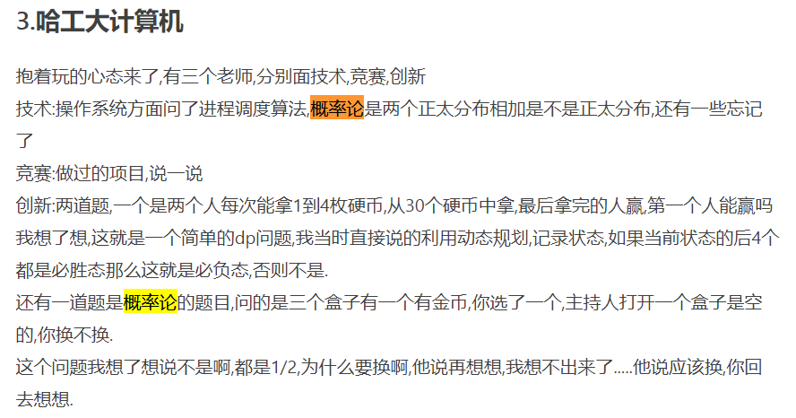

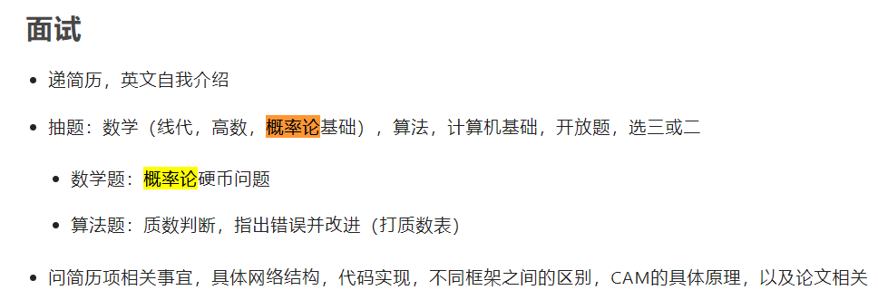

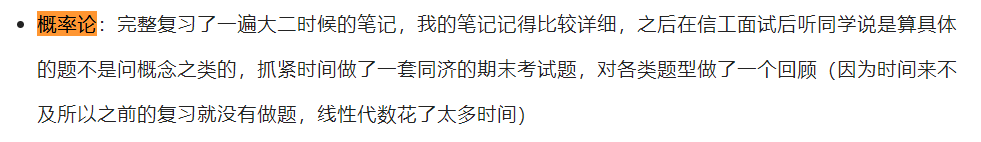

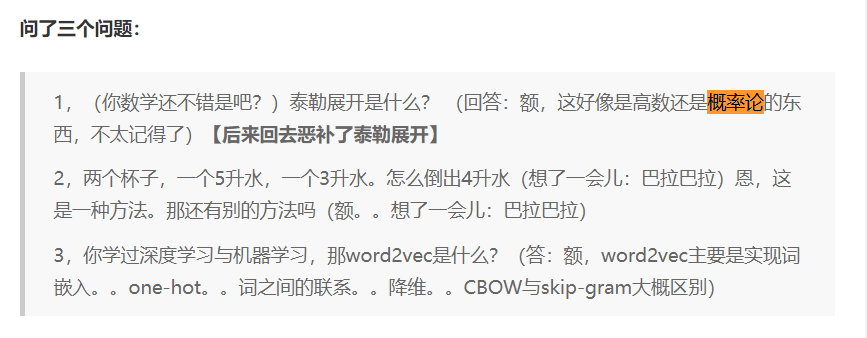

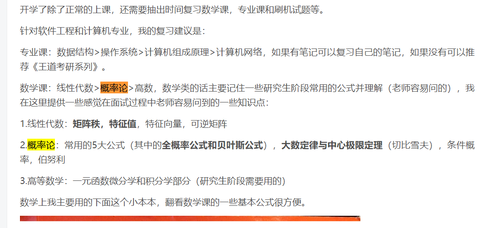

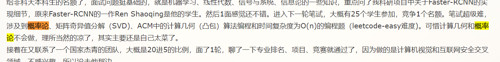

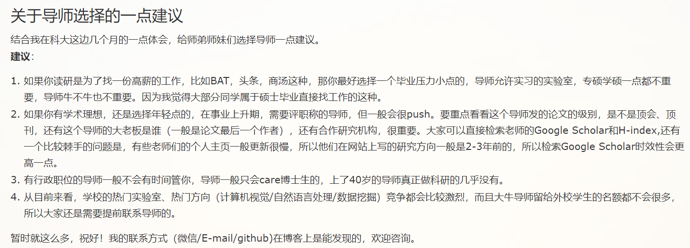

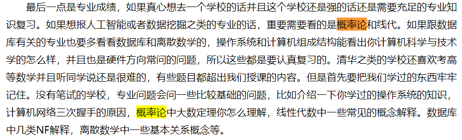

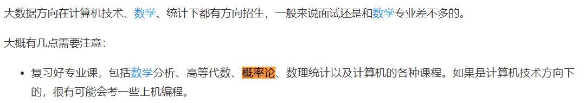

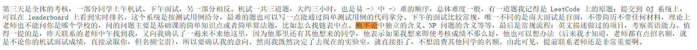

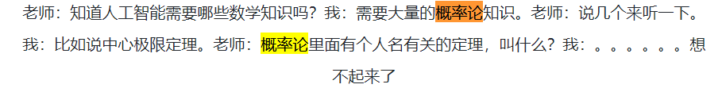

### 基本概念

独立: P(AB) = P(A)P(B)

不相关(线性): Cov(X,Y)=E(XY)-EXEY=0

[期望](https://baike.baidu.com/item/数学期望): 是试验中每次可能结果的[概率](https://baike.baidu.com/item/概率/828845)乘以其结果的总和，是最基本的数学特征之一。它反映随机变量平均取值的大小。

[概率密度函数](https://baike.baidu.com/item/概率密度函数): 是概率分布函数的求导. 

协方差: 在[概率论](https://baike.baidu.com/item/概率论/829122)和[统计学](https://baike.baidu.com/item/统计学/1175)中用于衡量两个变量的总体[误差](https://baike.baidu.com/item/误差/738024)。而[方差](https://baike.baidu.com/item/方差/3108412)是协方差的一种特殊情况，即当两个变量是相同的情况。是一个衡量[线性独立](https://baike.baidu.com/item/线性独立)的[无量纲](https://baike.baidu.com/item/无量纲)的数。

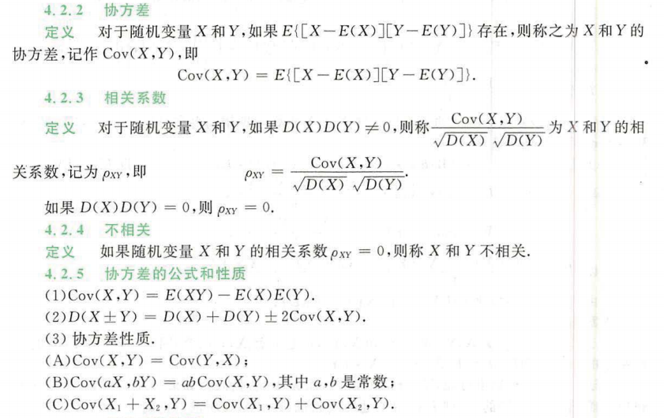

条件概率

先验概率

### 独立和不相关的区别

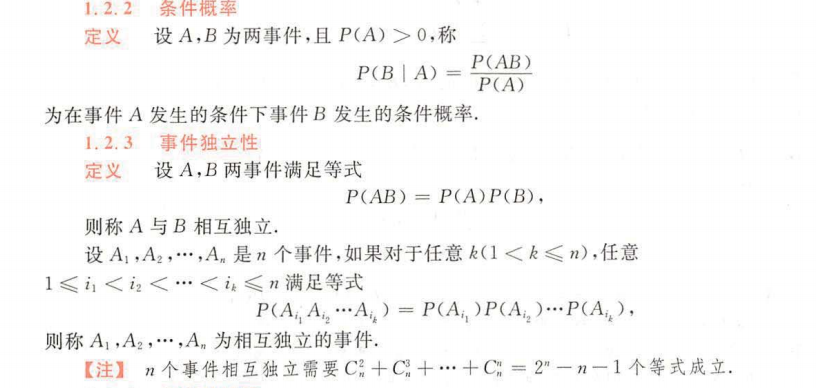

独立: $P(AB) = P(A)P(B)$ 

不相关: 这里默认指的是**不线性相关** : Cov(X,Y)=E(XY)-EXEY=0 或者说 EXY=EXEY。

- 若**独立**则必然**不相关**，即有**独立**=>**不相关**（条件符号不可反）

    由于独立, 所以E(xy) = E(x)E(y), 所以Conv(x,y)=0, 所以不相关

- 若**不相关**则不一定**独立** 

    可举反例. 比如x为[-1, 1]上的均匀分布, y=x^2, 则x, y不线性相关, 但是不独立. 

    

为什么随机变量X和Y不相关却不一定独立？ - 蕭議的回答 - 知乎 https://www.zhihu.com/question/26583332/answer/33327497 

在某些特殊的情况下，不相关可以推出独立，这时候不相关和独立等价

1. X，Y的联合分布服从二元高斯分布
2. X，Y都是两值随机变量（Bernoulli random variable）

### 贝叶斯公式

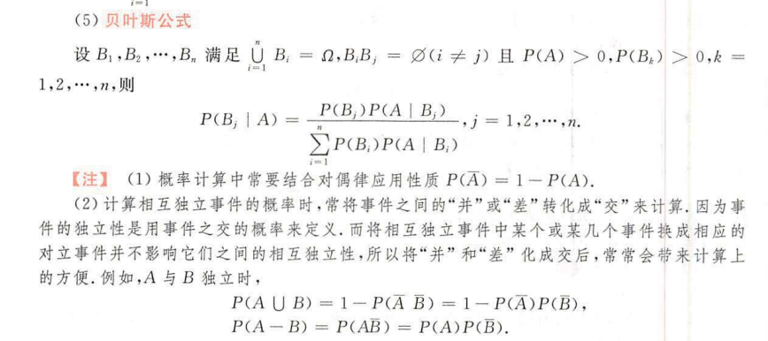

P(A|B)P(B) = P(B|A)P(A) = P(AB)

### 各种概率

### 正态分布

标准正态分布又称为u分布，是以0为[均数](https://baike.baidu.com/item/均数)、以1为[标准差](https://baike.baidu.com/item/标准差)的正态分布，记为N（0，1）。

> 正态分布的和还是正态分布吗，正态分布性质与独立同分布

[正态分布又名**高斯**分布](https://zh.wikipedia.org/wiki/正态分布) 

正态分布积分的结果为1

之所以也叫高斯分布大概是因为它是**高斯函数**的一个实例. 而不是因为这个是由高斯定义的. 

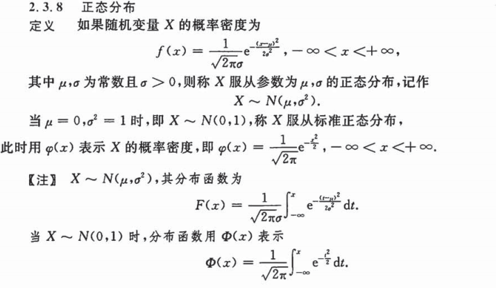

**μ决定了分布位置, σ决定了分布幅度** 

正态分布的和还是正态分布吗? 结论是

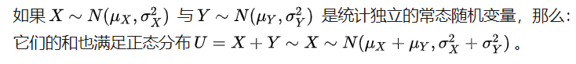

如何证明? 正态分布随机变量的和还是正态分布吗？ - Comzyh的回答 - 知乎 https://www.zhihu.com/question/26055805/answer/241374535

过程是: 

先通过积分求出[Z = X + Y 的概率密度函数](https://blog.csdn.net/u011240016/article/details/53097048), 再求Z的概率分布函数, 这个函数可写成正态分布的形式, 得到一个正态分布. 

要求X和Y相互独立是再求Z的概率密度函数中使用的, 如果不相互独立, 则Z的概率密度函数无法对应正态分布. 

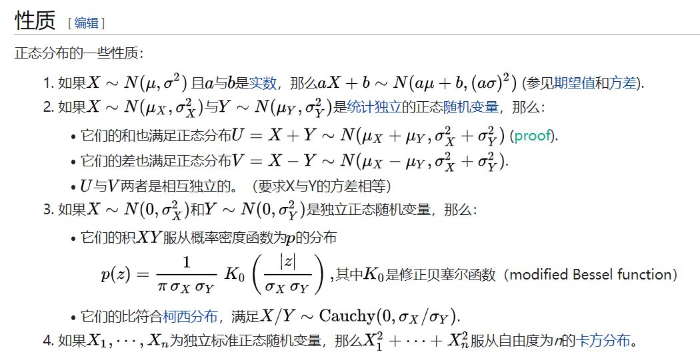

 

### 其他基本分布

0-1分布, 二项分布, 几何分布

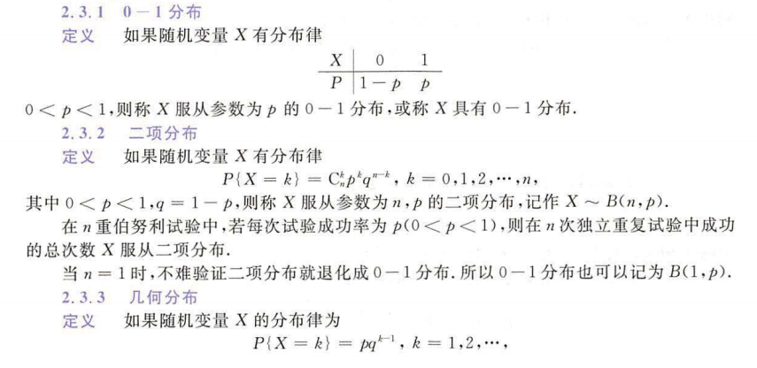

泊松分布, 均匀分布, 指数分布

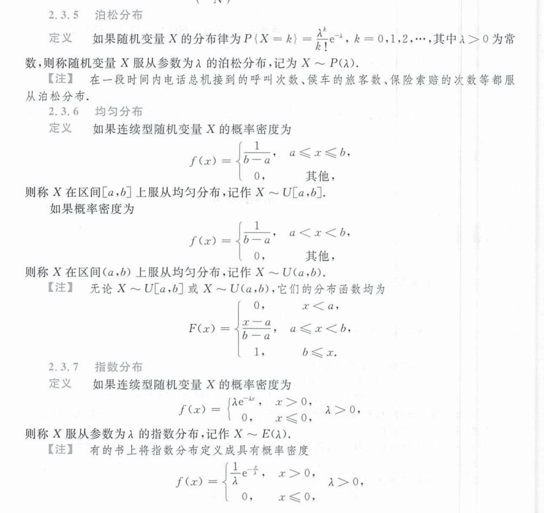

### 大数定律

>  大数定律和中心极限定理的意义与作用（切比雪夫大数定律）

https://www.zhihu.com/question/19911209

切比雪夫大数定律只需相互独立分布

**辛钦大数定律**需要独立同分布的条件

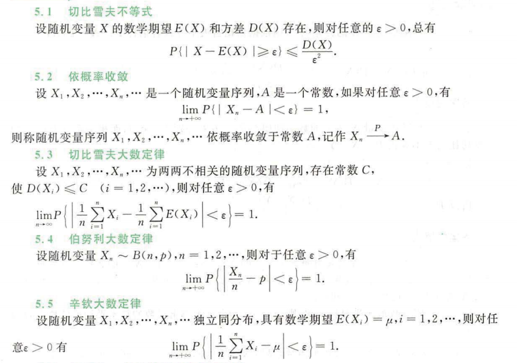

大数定律具体是个什么概念？ - 猴子的回答 - 知乎 https://www.zhihu.com/question/19911209/answer/245487255

大数定律说如果统计数据足够大,那么事物出现的频率就能无限接近他的期望值. 

一个例子: 在csapp中浮点数的向偶数舍入中, 通过大数定律我们可以知道所有的舍入最后都是平衡的. 

### 中心极限定理

**中心极限定理**说明的是在一定条件下，**大量独立随机变量的平均数是以正态分布为极限的**。
而大数定律只是揭示了**大量随机变量的平均结果，但没有涉及到随机变量的分布的问题**。

条件: **独立同分布 ** 

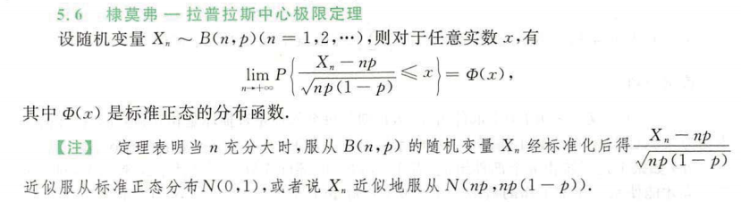

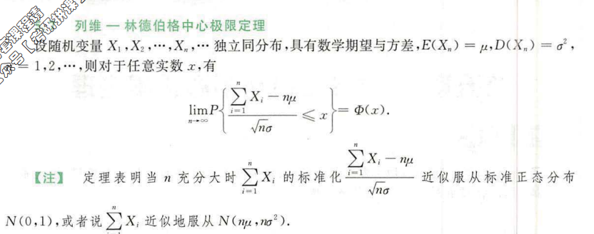

[中心极限定理通俗介绍](https://zhuanlan.zhihu.com/p/25241653) 

> 中心极限定理指的是给定一个任意分布的总体。我每次从这些总体中随机抽取 n 个抽样，一共抽 m 次。 然后把这 m 组抽样分别求出平均值。 这些平均值的分布接近正态分布。 

例子: 平均身高调查

随机抽取n组, 每组m个人, 这m个人的平均身高的分布符合正态分布. 

### 常用公式

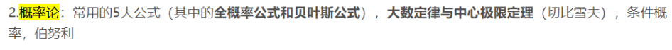

全概率公式

也就是P(A) = P(AB1) + P(AB2) + ... P(ABn)

要求 B1, B2, B3...Bn 两两不相交

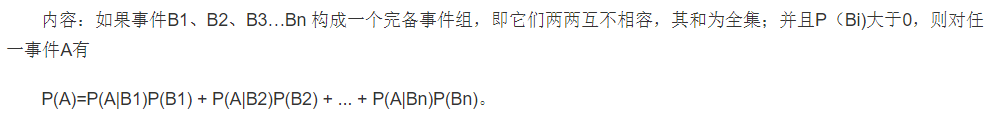

### 概率论以人名命名的概念

贝叶斯公式

高斯分布(正态分布)

泊松分布

伯努利概型

切比雪夫大数定律

大数定律部分很多, 都是以人名来命名的. 

### 概率论智力题

https://www.dazhuanlan.com/2019/12/18/5df9e63ca40f6/

#### 扔硬币问题

https://www.zhihu.com/question/29683794

> 小概率事件发生，说明很可能出大问题了！！！

连续100次都是正面, 那么第101次是反面的概率? 

如果说了**每次扔硬币是50%**(均匀的硬币), 那应该就是50%

否则"小概率事件发生，说明很可能出大问题了."  

还有一种变式, 就是已知一个人扔了101次硬币, 前100次都是正面, 那么第101次是正面的概率. 之前的问题是实时发生的, 而这个就是已发生, 然后提供了一些信息. 这个应该需要通过贝叶斯公式来求解. 

2^32 = 4,294,967,296, 如果让地球43亿人同时连续抛32次硬币, 那么期望是有一个人每次硬币都是正面. 

## 线性代数

### 一些资料链接

[某博主保研复习-线性代数](https://blog.csdn.net/weixin_43871127/category_9651962.html) 

### 相关问题截图

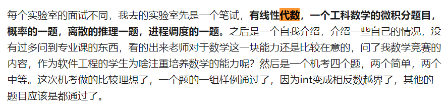

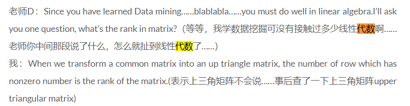

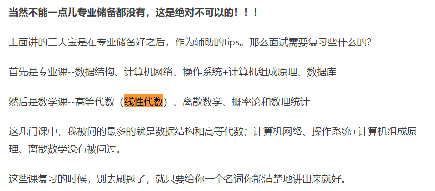

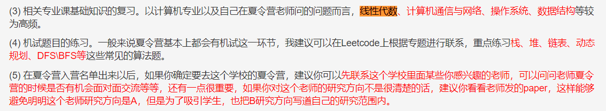

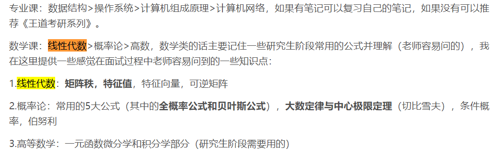

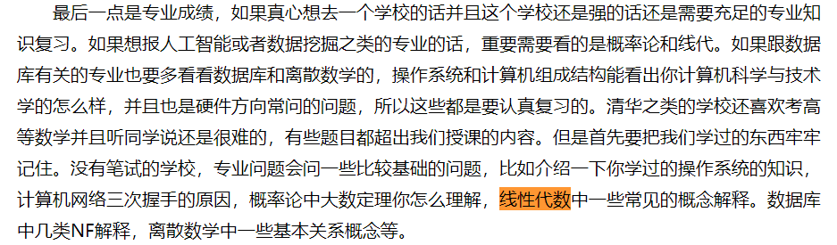

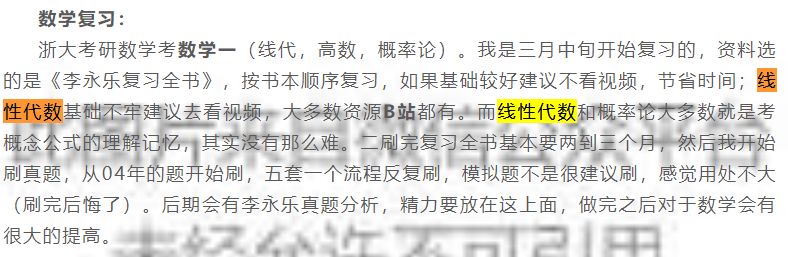

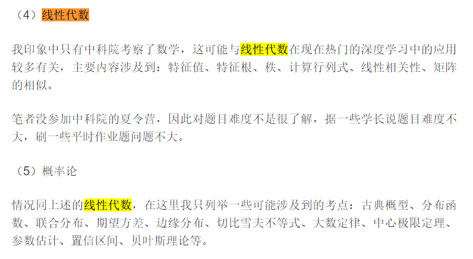 

### 什么是行列式

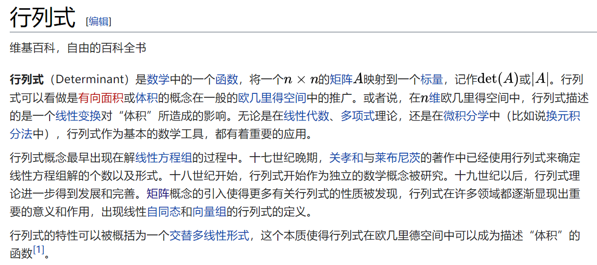

### 什么是矩阵

一个m行n列元素组成的矩形阵列. 

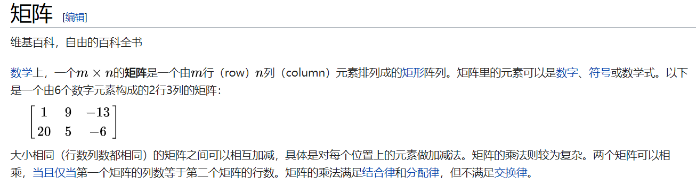

行和列相等的矩阵叫做**方阵**. 

### 对称矩阵

转置等于自己的矩阵, 叫做对称矩阵. 

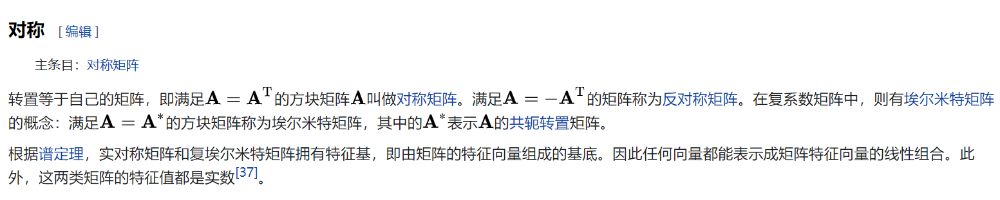

### 相似矩阵

[https://zh.wikipedia.org/wiki/%E7%9B%B8%E4%BC%BC%E7%9F%A9%E9%99%A3](https://zh.wikipedia.org/wiki/相似矩陣) 

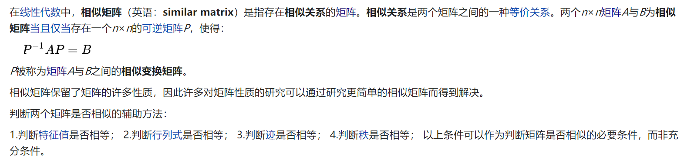

### 可逆矩阵

也叫非奇异矩阵. 

可逆矩阵乘以它的逆矩阵结果为E(单位矩阵). 

单位矩阵只有对角线为1, 其余都为0. 

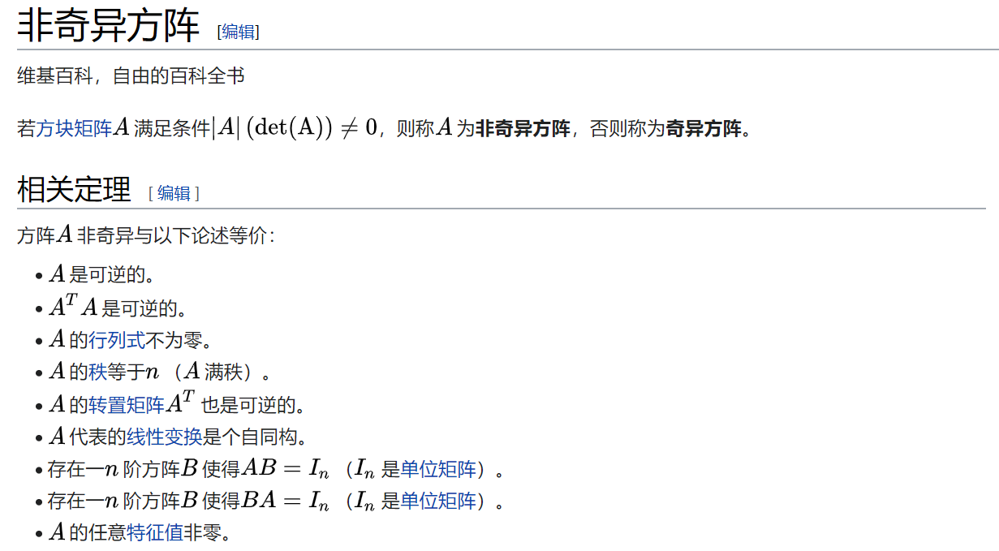

### 矩阵的秩

[如何理解矩阵的「秩」？](https://www.zhihu.com/question/21605094) 

定义上: 矩阵中所有行向量中**极大线性代无关组**的元素个数

形象: 有用的方程的个数

### 线性相关

可被其他向量组成的向量

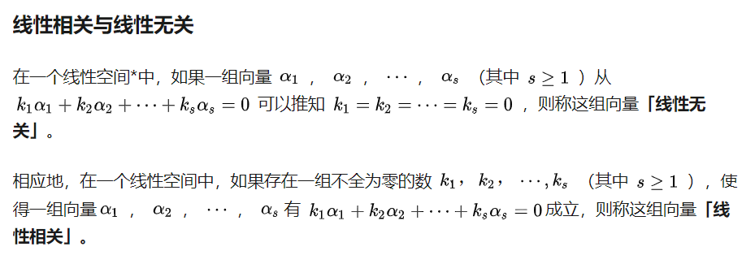

### 向量空间

符合向量运算的全体集合, 就是向量空间

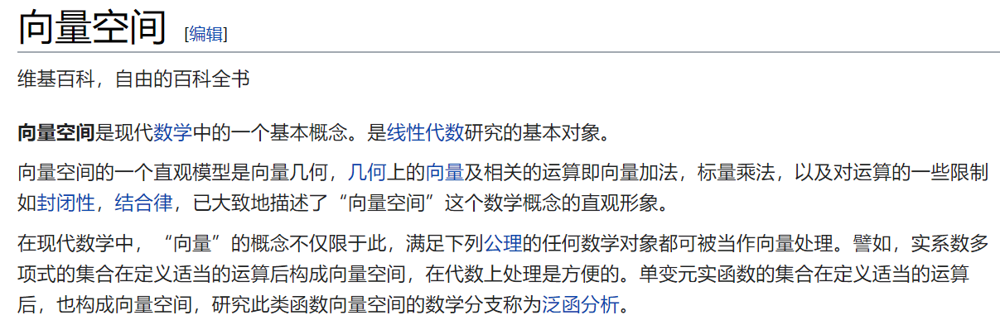

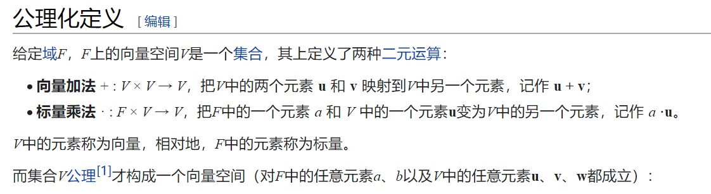

### 特征值与特征向量

[如何理解矩阵特征值？](https://www.zhihu.com/question/21874816/answer/181864044) 

这两个鬼有点难理解

设 A 是n阶方阵，如果存在数m和非零n维[列向量](https://baike.baidu.com/item/列向量) x，使得 Ax=mx 成立，则称 m 是矩阵A的一个特征值（characteristic value)或[本征值](https://baike.baidu.com/item/本征值/5123308)（eigenvalue)。这个列向量就是这个方阵的**特征向量**. 

## 高数

### 泰勒公式

[https://zh.wikipedia.org/wiki/%E6%B3%B0%E5%8B%92%E7%BA%A7%E6%95%B0](https://zh.wikipedia.org/wiki/泰勒级数) 

https://www.zhihu.com/question/21149770

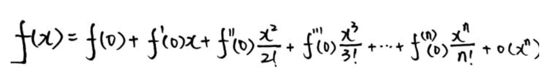

泰勒公式的作用是描述如何在x0点附近, **用一个多项式函数去近似一个复杂函数**.

在计算机中，计算机可不会直接求![[公式]](assets/equation.svg)，![[公式]](assets/equation.svg)等函数的具体值，通过泰勒公式展开函数可求其近似值。

**意义**

https://www.guokr.com/question/550320/

泰勒公式的强大之处就在于**把一个复杂的函数近似成了一系列幂函数的简单线性叠加，于是就可以很方便地进行比较、估算规模、求导、积分、解微分方程等等操作**。

### 梯度

梯度的本意是一个向量（矢量），表示**某一函数在该点处的方向导数沿着该方向取得最大值**，即函数在该点处沿着该方向（此梯度的方向）变化最快，变化率最大（为该梯度的模）。

<全概率>

