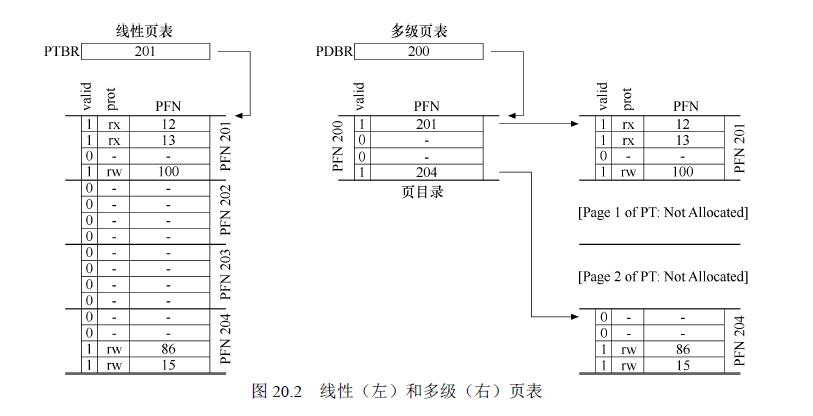
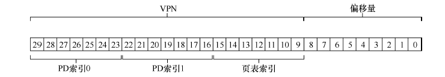

## 操作系统

三个大部分

* 虚拟化
    * CPU虚拟化
        * 进程调度策略
        * 进程上下文切换
        * 用户态内核态
    * 进程
        * 组成结构
        * 进程间通信
    * 内存虚拟化
        * 虚拟地址空间
        * 取指译码过程
        * 多级页表
        * TLB
        * 空闲空间管理
* 并发
    * 线程
        * 和进程的优缺点对比
    * 同步原语
        * 信号量
        * 互斥锁
        * 条件变量
    * 经典问题
        * 死锁
        * 生产者消费者
        * 哲学家就餐问题
        * 读者写者锁
* 持久化
    * 磁盘的物理结构
    * RAID
    * 文件与目录
    * 文件系统
* 其他
    * 异常
        * 中断
        * 陷阱
        * 信号


## 进程


### 虚拟地址空间

https://www.cnblogs.com/sparkdev/p/8410350.html

1个4G的虚拟地址空间, 包括两个部分: 用户空间和内核空间. 之前我理解的都是用户空间(包括代码段, 数据段, 堆, 共享库, 栈). 这些占据了3G, 还有1G是留给内核的, 且这1G的内核在所有的进程中都是相同的. 


**内核态与用户态：**

（1）**当一个任务（进程）执行系统调用而陷入内核代码中执行时，称进程处于内核运行态（内核态）。**此时处理器处于特权级最高的（0级）内核代码中执行。当进程处于内核态时，**执行的内核代码会使用当前进程的内核栈。每个进程都有自己的内核栈。**

（2）**当进程在执行用户自己的代码时，则称其处于用户运行态（用户态）**。此时处理器在特权级最低的（3级）用户代码中运行。当正在执行用户程序而突然被中断程序中断时，此时用户程序也可以象征性地称为处于进程的内核态。因为中断处理程序将使用当前进程的内核栈。


* linux内核栈空间只有4KB或8KB


### 为什么要有虚拟地址空间

1. 安全: 进程之间的地址空间相互独立, 涉及危险操作由操作系统来操作

2. 给每个进程假象, 让它以为自己独占整个空间

### 几个问题

1. 用户空间页表和内核空间页表?

    从第二点

2. 内核空间是如何映射的?

    https://zhuanlan.zhihu.com/p/66794639

    内核空间的前896M空间是直接映射(线性)的, 也即内核空间的虚拟空间是连续的, 对应的物理空间也是连续的, 没有复杂的多级页表, 只需要加一个初始位置偏移. 

    

    剩下的128M空间用来动态地映射: https://www.cnblogs.com/liuxiaoming/p/3219682.html

    > 在32位系统中，线性地址空间是4G，其中规定3~4G的范围是内核空间（1G），0~3G是用户空间（3G）。如果把这1G的内核线性地址空间全部拿来直接一一映射物理内存的话，在内核态的所有进程（线程）能使用的物理内存总共最多只有1G，很显然，如果你有4G内存，3G都不能用来做内核空间，太浪费了！
    >
    > 　　**为了能使在内核态的所有进程能使用更多的物理内存，linux采取了一种变通的形式**：它将1G内核线性地址空间分为2部分，第一部分为1G的前896M，这部分内核线性空间与物理内存的0~896M一一映射，第二部分为1G的后128M的线性空间，拿来动态映射剩下的所有物理内存。
    >
    > 　　看到这里应该几乎懂了为什么要有高端内存和低端内存的区分了！内核线性地址空间的前896M映射的就是我们的低端页框内存（ZONE_DMA和ZONG_NORMAL），而且是直接映射；内核线性地址空间的后128M映射的是我们的高端页框内存（ZONG_HIGHMEME）。

    

    

    

### PCB的内容

以下来自百度百科：https://baike.baidu.com/item/PCB/16067368

在不同的操作系统中对进程的控制和管理机制不同，PCB中的信息多少也不一样，通常PCB应包含如下一些信息。

**1、进程标识符信息: PID**

每个进程都必须有一个唯一的标识符，可以是字符串，也可以是一个数字。UNIX系统中就是一个整型数。在进程创建时由系统赋予。进程标识符用于唯一的标识一个进程。一个进程通常有以下两种标识符。

外部标识符。由创建者提供，通常是由字母、数字组成，往往是用户（进程）访问该进程使用。外部标识符便于记忆，如：计算进程、打印进程、发送进程、接收进程等。

内部标识符：为了方便系统使用而设置的。在所有的OS中，都为每一个进程赋予一个唯一的整数，作为内部标识符。它通常就是一个进程的符号，为了描述进程的家族关系，还应该设置父进程标识符以及子进程标识符。还可以设置用户标识符，来指示该进程由哪个用户拥有。

**2、处理机状态信息**

说明进程当前所处的状态。为了管理的方便，系统设计时会将相同的状态的进程组成一个队列，如就绪进程队列，等待进程则要根据等待的事件组成多个等待队列，如等待打印机队列、等待等。处理机状态信息主要是由处理机各种寄存器中的内容所组成。

[通用寄存器](https://baike.baidu.com/item/通用寄存器)。又称为用户可视寄存器，可被用户程 序访问，用于暂存信息。

[指令寄存器](https://baike.baidu.com/item/指令寄存器)。存放要访问的下一条指令的地址。

程序状态字PSW。其中含有状态信息。（条件码、 执行方式、中断屏蔽标志等）

**用户栈指针**。每个用户进程有一个或若干个与之相 关的系统栈，用于存放过程和系统调用参数及调用地址。栈指针指向该栈的栈顶。

**3.进程调度信息**

在PCB中还存放了一些与进程调度和进程对换有关的信息。

（1）进程状态。指明进程当前的状态，作为进程调度和对换时的依据。

（2）进程优先级。用于描述进程使用处理机的优先级别的一个整数，优先级高的进程优先获得处理机。

（3）进程调度所需要的其他信息。（进程已等待CPU的时间总和、进程已执行的时间总和）

（4）事件。这是进程由执行状态转变为阻塞状态所等待发生的事件。（阻塞原因）

进程上下文：

是进程执行活动全过程的静态描述。包括计算机系统中与执行该进程有关的各种寄存器的值、程序段在经过编译之后形成的机器指令代码集、数据集及各种堆栈值和PCB结构。可按一定的执行层次组合，如用户级上下文、系统级上下文等。

进程存在的唯一标志：

在进程的整个生命周期中，系统总是通过PCB对进程进行控制的，亦即，系统是根据进程的PCB而不是任何别的什么而感知到该进程的存在的，所以说，PCB是进程存在的唯一标志 [1] 。


### 进程结构

xv6系统中proc的结构是这样的

```c
// the registers xv6 will save and restore
// to stop and subsequently restart a process
// 寄存器上下文
struct context {
    int eip;
    int esp;
    int ebx;
    int ecx;
    int edx;
    int esi;
    int edi;
    int ebp;
};
// the different states a process can be in
// 进程状态
enum proc_state { UNUSED,
                  EMBRYO,
                  SLEEPING,
                  RUNNABLE,
                  RUNNING,
                  ZOMBIE };

// the information xv6 tracks about each process
// including its register context and state
// 进程结构
struct proc {
    char *mem;     // Start of process memory
    uint sz;       // Size of process memory
    // 内核栈
    char *kstack;  // Bottom of kernel stack
    // for this process
    enum proc_state state;       // Process state
    int pid;                     // Process ID
    struct proc *parent;         // Parent process
    void *chan;                  // If non-zero, sleeping on chan
    int killed;                  // If non-zero, have been killed
    struct file *ofile[NOFILE];  // Open files
    struct inode *cwd;           // Current directory
    struct context context;      // Switch here to run process
    struct trapframe *tf;        // Trap frame for the
    // current interrupt
};
```


### 进程切换(上下文)

进程上下文包括

>  每个进程执行过的、执行时的以及待执行的指令和数据；在[指令寄存器](https://baike.baidu.com/item/指令寄存器)、[堆栈](https://baike.baidu.com/item/堆栈/1682032)、状态字寄存器等中的内容。此外, 还包括进程打开的[文件描述符](https://baike.baidu.com/item/文件描述符/9809582)等.


### 进程调度算法

**调度指标**

1. 周转时间

    

2. 响应时间: 保证交互性

    


**调度算法**

1. FIFO: 先入先出

    不够智能. 会造成**护航效应**: 长的任务排在前面, 会造成后面的任务等待太长时间. 

    周转时间一般, 响应时间不好

2. SJF: 最短任务优先

    不抢占的, 一个job被调度执行了, 就会执行完. 但会造成饥饿. 因为一个长的任务可能一直不会被调度. 

    周转时间不错, 响应时间一般(可能会极差)

3. STCF: 最短完成时间优先

    抢占的, 比上一个更容易造成饥饿. 因为会一直执行最短的任务, 当更短的新任务来到时, 会抢占当前调度.

    周转时间最佳, 响应时间不好. 

4. 轮转

    每个job一个时间片, 轮转执行. 

    响应时间极佳, 周转时间极差

**上面四种算法都只是简单地考虑CPU占用, 没有考虑IO, IO将会使调度更复杂. 且操作系统不知道job会执行多长时间, 所以SJF和STCF无法执行**. 


**多级反馈队列**

>  多个不同优先级的任务队列

五个规则: 


优点: 


**比例份额调度**

> 也算彩票调度

首先需要获取每个进程的优先级, 比如1, 2, 3, 然后取他们的公倍数如6, 得到他们的步长6, 3, 2. 开始所有的进程的总步长为0, 然后没执行完一次总步长+单次步长. 每次选择总步长最小的进程进行调度. 

类似优先队列的方式. 


### 多处理器调度

存在的问题

1. **缓存一致性**: CPU缓存没有及时更新到内存, 导致其他CPU的程序读取这一部分过期的数据. 

    > CPU的每个核都有L1, L2缓存

    

    解决方法: 及时更新它. 

    

    

2. 缓存亲和度

    

    解决方法1: 尽量让一个进程只在一个CPU上执行

    

    多队列调度(每个CPU一个调度队列):

    

    


### 页表

linux分为四层(《深入理解Linux内核第三版》) 


### 为什么栈的大小较小

https://www.zhihu.com/question/26997321

因为栈需要是连续的地址空间(虚拟), 在单线程情况下可能受影响不大, 但是如果有了多线程, 会导致地址难以分配. 比如2G的地址空间, 如果限制2M的栈大小, 那么可以开1024个线程, 而这在多线程服务器里算很少的. 如果限制为200M, 那么只能大概10个了, 这甚至连普通的多线程程序都支持不了.

设置最大大小又不是一定会用, 只要在需要的时候用, 理论上可以更多啊? 这是因为栈的空间要求连续, 因此需要预分配那么大间隔的空间, 否则, 在产生地址冲突的时候寻找空间, 会导致性能下降.


### 在处理中断的时候发生中断

比如ucore系统在处理中断的时候, 会关闭中断


## 线程


### 线程与进程对比

[参考](https://github.com/huihut/interview/tree/master/docs#多进程与多线程间的对比优劣与选择) 

**线程优点**

* 线程创建, 切换开销小

* 数据共享简单

**线程缺点** 

* 资源之间的同步复杂
* 一个线程崩溃可能导致其他线程(整个进程)崩溃. 
* 编程复杂


**进程优点**

* 数据同步简单
* 可靠: 进程之间独立, 一个进程崩溃不会影响其他进程
* 编程简单

**进程缺点** 

* 共享复杂(要用到IPC) 

* 创建, 切换复杂

  


**进程拥有独立的资源(相对其他进程)**

1. 文件资源(打开的文件)
2. 内存资源
3. CPU资源


**线程拥有独立的资源(相对其他线程)**

1. 内存资源(独立的栈)
2. CPU资源(独立的上下文, 寄存器)

**线程共享的资源**

1. 共享虚拟内存空间
2. 共享进程的文件


### 内核态线程和用户态线程

待续


### 信号量

什么是信号量?

信号量是一个具有一个整数值的对象, 它有两个操作: sem_wait()和sem_post(). 信号量需要初始化, 初始化的值能够决定它的行为. 

第二个参数值为0时代表它在同一个进程的多个线程中共享. 


两个函数的含义如下

```c
int sem_wait(sem_t *s) {
	decrement the value of semaphore s by one
	wait if value of semaphore s is negative
}

int sem_post(sem_t *s) {
	increment the value of semaphore s by one
	if there are one or more threads waiting, wake one
}
```

当信号量的值 >= 1的时候, 调用wait会将值 -1 然后直接返回. 当值 <= 0的时候, 调用wait会阻塞. 知道被post唤醒. 

post函数则直接将值+1, 如果有等待线程, 那么会唤醒一个. 


**使用信号量实现互斥锁**

只需要将初始值设置为1. 然后 wait就是lock, post就是unlock. 

这样, 只有第一个线程进来才不会睡眠. 

```c
sem_t m;
sem_init(&m, 0, 1);

sem_wait(&m);
// critical section here
sem_post(&m);
```

比如一个例子:


**使用信号量实现条件变量**

条件变量只要执行wait就会阻塞, 执行post就会唤醒一个睡眠线程, 因此设置信号量的初始值为0. 

信号量实现的条件变量跟真实的条件变量的行为是有些差别的.  sem_wait是会根据它自己的值来决定是否睡眠, 而真实的条件变量的wait则是无条件. 因此需要使用while循环来决定是否调用wait. 这也是条件变量的含义: **等待一个条件完成再继续执行当前线程**. 

```c
sem_t s;

void *
child(void *arg) {
    printf("child\n");
    sem_post(&s);  // signal here: child is done
    return NULL;
}

int main(int argc, char *argv[]) {
    sem_init(&s, 0, 0);  
    printf("parent: begin\n");
    pthread_t c;
    Pthread_create(c, NULL, child, NULL);
    sem_wait(&s);  // wait here for child
    printf("parent: end\n");
    return 0;
}
```


### 条件变量

条件变量有两个函数, 一个是wait, 一个是signal. 

```c
// API
pthread_cond_wait(pthread_cond_t *c, pthread_mutex_t *m);
pthread_cond_signal(pthread_cond_t *c);
```

wait会使当前线程睡眠(无条件, 因此在实际使用过程中需要用while进行条件判断). 

> 为什么不用 if 而要用 while 呢?
>
> 因为如果用 if, 当另一个线程刚好被调度(抢占)执行并且改编了条件, 然后再次调度到这个线程时, 线程会跳出条件判断. 而它本不应该跳出. 

signal会唤醒一个睡眠的线程(如果有的话). 


下面一个例子: 条件变量实现父线程等待子线程

```c
// API
// pthread_cond_wait(pthread_cond_t *c, pthread_mutex_t *m);
// pthread_cond_signal(pthread_cond_t *c);

// 初始化
int done          = 0;
pthread_mutex_t m = PTHREAD_MUTEX_INITIALIZER;
pthread_cond_t c  = PTHREAD_COND_INITIALIZER;

void thr_exit() {
    Pthread_mutex_lock(&m);
    done = 1;
    Pthread_cond_signal(&c);
    Pthread_mutex_unlock(&m);
}

void *child(void *arg) {
    printf("child\n");
    thr_exit();
    return NULL;
}

void thr_join() {
    Pthread_mutex_lock(&m);
    while (done == 0)  // 条件
        Pthread_cond_wait(&c, &m);
    Pthread_mutex_unlock(&m);
}

int main(int argc, char *argv[]) {
    printf("parent: begin\n");
    pthread_t p;
    Pthread_create(&p, NULL, child, NULL);
    thr_join();
    printf("parent: end\n");
    return 0;
}
```


### 管程

参考操作系统概念6.8

为什么要有管程?

> 虽然[信号量](http://c.biancheng.net/view/1232.html)提供了一种方便且有效的进程同步机制，但是它们的使用错误可能导致难以检测的时序错误，因为这些错误只有在特定执行顺序时才会出现，而这些顺序并不总是出现。
>
> 为了处理这种错误，研究人员开发了一些高级语言工具，一种重要的、高级的同步工具，即**管程（monitor）**。

管程是一种程序结构, 而不是像互斥锁或者条件变量这种系统提供的API. 在管程中, 有一些共享变量, 以及条件变量. 它是语言实现的一种数据类型, 不同的问题实现的管程不一样. 


* 在管程中, 只有管程内的方法才能访问管程内的变量.

* 管程确保只有一个线程在管程中处于活动状态.

* 管程中有条件变量(同步信息), 用来唤醒和阻塞线程


### 协程

#### 什么是协程?

[参考程序员小灰的漫画协程](https://zhuanlan.zhihu.com/p/38528865) 


协程不是被操作系统内核所管理，而**完全是由程序所控制**. 这样带来的好处就是性能得到了很大的提升，不会像线程切换那样消耗资源。

**协程拥有自己的寄存器上下文和栈**。协程调度切换时，将寄存器上下文和栈保存到其他地方，在切回来的时候，恢复先前保存的寄存器上下文和栈。


#### 为什么协程切换更快?

[参考-不错的回答](https://www.zhihu.com/question/308641794/answer/572499202) 

1. **协程切换是在用户态进行的, 而线程切换是需要进入内核态.** 
2. 协程切换((只需要更新CPU上下文, 也就是一系列列寄存器))做的事情比线程切换更少(上下文的大小以及步骤数) 


[这篇文章介绍了go协程调度原理, 好像非常不错的样子](https://github.com/LeoYang90/Golang-Internal-Notes/blob/master/Go 协程调度——基本原理与初始化.md) 

[这个项目也是值得关注](https://github.com/LeoYang90/Golang-Internal-Notes) 

### 生产者消费者

考虑多生产者多消费者, 注意一些细节:

* 临界区要加锁
* 用两个条件变量, 一个负责full, 一个负责empty. put之后唤醒empty上的睡眠线程. 反之成立.
* 条件变量的条件判断时要使用 while 

C++11风格实现代码

```cpp
#ifndef MUDUO_BASE_BOUNDEDBLOCKINGQUEUE_H
#define MUDUO_BASE_BOUNDEDBLOCKINGQUEUE_H


#include <assert.h>
#include <mutex>
#include <condition_variable>
#include <vector>


/*
 * 把生产者与消费者问题的buf 换成队列， 注意要线程安全
 * */

template<typename T>
class BoundedBlockingQueue {
public:
    // 默认
    explicit BoundedBlockingQueue() : BoundedBlockingQueue(1024) {}

    explicit BoundedBlockingQueue(int max_size) {
        capacity_ = max_size;
        queue_.resize(capacity_);

        size_ = 0;
        put_idx_ = 0;
        get_idx_ = 0;
    }


    void put(const T &x) {
        // 在unique_lock对象的声明周期内，它所管理的锁对象会一直保持上锁状态
        // unique_lock 具有 lock_guard 的所有功能，而且更为灵活
        std::unique_lock<std::mutex> lck(mutex_);
        while (size_ == capacity_) {
            // 传 引用
            notFull.wait(std::ref(lck));
        }
        queue_[put_idx_] = x;
        put_idx_++;
        size_++;
        put_idx_ = put_idx_ % capacity_;
        // 告诉消费者可以消费了
        notEmpty.notify_one();
        // 此时可以解锁
        lck.unlock();
    }

    void put(T &&x) {
        put(x);
    }

    T get() {
        std::unique_lock<std::mutex> lck(mutex_);
        while (size_ == 0) {
            notEmpty.wait(std::ref(lck));
        }
        T val = queue_[get_idx_];
        get_idx_++;
        size_--;
        get_idx_ = get_idx_ % capacity_;
        notFull.notify_one();
        lck.unlock();
        return val;
    }

    bool empty() const {
        return size_ == 0;
    }

    bool full() const {
        return size_ == capacity_;
    }

    size_t size() const {
        return size_;
    }

    //
    size_t capacity() const {
        return capacity_;
    }

private:
    // 锁
    std::mutex mutex_{};
    // 条件变量
    std::condition_variable notEmpty;  // 在 get 中使用
    std::condition_variable notFull;  // 在 put 中使用

private:
    size_t capacity_;  // 容量
    size_t size_;  // 实际的大小
    std::vector<T> queue_;  // 存储数据
    int put_idx_;  // 放 下一个数据 的索引
    int get_idx_;  // 取 当前数据 的索引
};
```

测试部分

```cpp
//
// Created by Firefly on 2020/5/10.
//
#include <iostream>
#include <thread>
#include <chrono>
#include <cassert>
#include <syslog.h>

#include "../coordinator/BoundedBlockingQueue.h"
#include "../common/loguru.hpp"

std::vector<int> testVector;
std::mutex g_mutex{};

void putTest(BoundedBlockingQueue<int>& queueTest, int x) {
    for (int i = 1; i <= x; i++) {
//        定时
//        std::this_thread::sleep_for(std::chrono::milliseconds (5));
        queueTest.put(i);
    }
}

void getTest(BoundedBlockingQueue<int>& queueTest, int x) {
    for (int i = 1; i <= x; i++) {
//         定时
//        std::this_thread::sleep_for(std::chrono::milliseconds(4));
// 要加锁, 保证原子操作
        std::unique_lock<std::mutex> lck(g_mutex);
        auto get_val = queueTest.get();
        testVector.emplace_back(get_val);
//        std::cout << get_val << std::endl;
    }
}

void oneToOneTest() {
    std::cout << "oneToOneTest start ..." << std::endl;

    BoundedBlockingQueue<int> queueTest(10);
    testVector.clear();

    // 测试的数据量
    int test_size = 10000;

    std::thread putThread(putTest, std::ref(queueTest), test_size);
    std::thread getThread(getTest, std::ref(queueTest), test_size);

    putThread.join();
    getThread.join();

    // 取出的数量是否正确
    assert(testVector.size() == test_size);

    for (int i = 0; i < testVector.size() - 1; i++) {
        // 取出的数据顺序是否正确
        assert(testVector[i + 1] - testVector[i] == 1);
    }

    std::cout << "oneToOneTest pass..." << std::endl;
}

void multiToMultiTest() {
    std::cout << "multiToMultiTest start ..." << std::endl;

    BoundedBlockingQueue<int> queueTest(1024);
    testVector.clear();

    int threads_cnt = 100;
    int test_size = 5000;

    std::vector<std::thread> putThreads;
    std::vector<std::thread> getThreads;

    for (int i = 0; i < threads_cnt; i++) {
        putThreads.emplace_back(std::thread(putTest, std::ref(queueTest), test_size));
        getThreads.emplace_back(std::thread(getTest, std::ref(queueTest), test_size));
    }

    for (int i = 0; i < threads_cnt; i++) {
        putThreads[i].join();
        getThreads[i].join();
    }
//    std::cout << testVector.size() << std::endl;
    // 取出的数量是否正确
    assert(testVector.size() == threads_cnt * test_size);

    int should_sum = threads_cnt * (((1 + test_size) * test_size) / 2);
    int sum = 0;
    for (int i = 0; i < testVector.size(); i++) {
        // 取出的数据顺序是否正确
        sum += testVector[i];
    }
//    std::cout << sum << std::endl;
    // 所有数的和
    assert(sum == should_sum);

    std::cout << "multiToMultiTest pass..." << std::endl;
}


int main() {
    // 单生产者 to 单消费者
    oneToOneTest();

    // 多生产者 to 多消费者
    multiToMultiTest();
    return 0;
}
```


### 自旋锁

CAS 比较并交换 https://www.cnblogs.com/HuiH/p/11905021.html

乐观锁的实现

ABA问题(一个值, 从A变成B, 然后又变成A, 这时可以执行CAS, 但不代表就正确) -> 通过版本号解决

非阻塞

只有一个会成功, 其他的都失败. 然后可以重新尝试, 或者退出


### 读者写者锁

读者写者锁是在这种情况下使用的:

对并发数据进行操作的时候, 同时只能有一个写, 而同时可以有多个读. 在写的时候不能读.

但是这样的并发有一些问题, 就是读和写进入的时间不一样, 如果现在有一个写在运行, 又来了一些读, 那么读等待这个写结束, 读的时候不能有写. 那么在这个过程中, 不断地有读, 容易造成写的饥饿.(当然, 这只是一种实现)

 代码来自操作系统导论

```c
typedef struct _rwlock_t {
    sem_t lock;       // binary semaphore (basic lock)
    sem_t writelock;  // used to allow ONE writer or MANY readers
    int readers;      // count of readers reading in critical section
} rwlock_t;

void rwlock_init(rwlock_t *rw) {
    rw->readers = 0;
    sem_init(&rw->lock, 0, 1);
    sem_init(&rw->writelock, 0, 1);
}

void rwlock_acquire_readlock(rwlock_t *rw) {
    sem_wait(&rw->lock);
    rw->readers++;
    if (rw->readers == 1)
        sem_wait(&rw->writelock);  // first reader acquires writelock
    sem_post(&rw->lock);
}

void rwlock_release_readlock(rwlock_t *rw) {
    sem_wait(&rw->lock);
    rw->readers--;
    if (rw->readers == 0)
        sem_post(&rw->writelock);  // last reader releases writelock
    sem_post(&rw->lock);
}

void rwlock_acquire_writelock(rwlock_t *rw) {
    sem_wait(&rw->writelock);
}

void rwlock_release_writelock(rwlock_t *rw) {
    sem_post(&rw->writelock);
}
```


### 死锁

### 哲学家就餐问题


## 内存

虚拟地址空间


### API: malloc, free

malloc和free并不是系统调用, 而是库调用. 


malloc和free应该配对使用


### new和malloc的区别

[转载自此文章](https://www.jianshu.com/p/8a5b5ee5c4d0) 

**（1）new 返回指定类型指针**，并且可以**自动计算所需要的大小**；**malloc需要手动计算**字节数，并且在返回后**强制类型转换**为实际类型的指针。

**（2）malloc只管分配内存**，并不能对所得到的内存进行初始化，所以得到的一片新内存中，其值将是随机的；**new不仅分配内存，还对内存中的对象进行初始化;**free只管释放内存；delete不仅释放内存，还会调用对象的析构函数，销毁对象。

**（3） malloc/free是c++/c的标准库函数**，头文件为stdlib.h;而**new/delete是c++的运算符。**他们都可用于申请动态内存和释放内存。

**（4）** 对于**非内部数据结构的对象**而言，光用malloc/free无法满足动态对象的要求，**对象在创建的同时，还要自动执行构造函数，对象在消亡之前要自动执行析构函数，**由于malloc/free是库函数而不是运算符，**不在编译器控制权限之内，不能够把执行构造函数和析构函数的任务强加于malloc/free;**因此，c++语言需要一个能够完成动态内存分配和初始化的运算符new，以及一个能完成清理与释放内存工作的运算符delete；我们不要企图用malloc和free来完成动态对象的内存管理，应该用new/delete。由于**内部数据类型没有构造和析构过程，对他们而言malloc/free和new/delete是等价的。**


### 空闲空间管理

* 最优匹配

    遍历整个空闲列表, 找到最小的满足请求大小的块, 然后返回. 

    在遍历查找时, 需要遍历整个列表, 代价较大.

* 最差匹配

    和最优匹配相反, 他尝试找最大的块返回. 同样需要遍历整个列表. 研究表明这种方式非常慢. 

* 首次匹配

    每次找到第一个足够大的块. 会造成列表开头有很多小块.

* 下次匹配

    从上次匹配结束的位置找下一个足够大的块. 


**伙伴系统**

将空闲空间看成2^n大小的空间, 当有空间请求时, 将空间一分为二, 直到刚好满足要求. 

只允许分配2^k的空间, 因此会有内部碎片. 

当块被释放时, 检查"伙伴"是否空间, 如果是, 那么合并. 然后继续向上回溯检查. 


用链表实现的空闲空间管理搜索起来往往很慢, 因此可以考虑用更复杂的结构来实现, 比如红黑树. 红黑树以空间的大小为键来维护空闲空间. 


### 基址+界限

硬件实现的动态重定位. 每一个虚拟地址空间都有一个基址存在寄存器中, 使用虚拟地址的偏移即可快速重定位. 

但是需要将整个虚拟地址空间都装入内存中, 有大量的内部碎片, 非常浪费空间. 

### 分段

分段是将地址空间分为几个独立的段, 比如代码段, 堆, 栈各一个段, 分别用三个寄存器存储段基址, 每个段可以向自己的方向自由延展. 这样就避免了栈和堆之间大量空间的浪费. 

一个地址的前两位可以表示这是属于哪个段. 

细粒度的分段可以将一个虚拟地址空间分为成千上万各段, 从而更高效地使用内存. 


#### 优点

* 相比于基址+界限的方式, 减少了内部碎片, 节约了很多空间
* 相比于分页方式, 操作简单, 速度快(更少的内存引用)


#### 缺点

* 会产生大量的内部碎片, 造成空间浪费
* 段需要连续空间, 当段需要扩展而没有连续空间时, 需要迁移整个段. 拷贝段是CPU密集型的, 因此会占用大量处理器时间. 


### 分页

分页将空间分成固定大小的页面, 并且通过建立映射来实现虚拟地址到物理地址的映射. 

虚拟地址有两大部分: VPN 与 偏移量


VPN是虚拟页号, 可以通过VPN找到物理地址对应的页表项(页表的起始地址存储在寄存器中, 页表是一个类似数组的结构), 然后通过页表项存储的物理页起始地址, 加上偏移量, 得到真实的物理地址. 


每个进程都有一个虚拟地址空间, 因此也有一个页表. 对于未分级的页表, 一个4G的空间, 如果页大小为1KB, 那么需要有页表4MB, 太占用空间了. 事实上虚拟地址空间中大多数空间都没有被使用, 而保留了他们的映射关系. 因此提出**多级页表**来节省空间.

**多级页表**通过按需分配二级或更高级页表来实现空间的利用. 当一个一级页表的某一项对应的二级页表中没有一个建立了映射, 那么这个对应的二级页就不需要分配空间. 这样大大地节省了空间.



由于多级页表的存在, 虚拟地址的结构也发生了变化. 表现在VPN也是分段的, 每个段对应一级页表的索引. 第一级被称为页目录. 


不只是两级, 可能会有3级, 4级等



据说Linux被分为4级


#### 优点

1. 由于映射的存在, 物理空间不需要连续, 使得分配内存更方便
2. 页大小固定, 极大的减少了外部碎片

#### 缺点

1. 和分段相比, 速度更慢, 因为映射的存在增加了内存引用. 页表级数越多, 内存引用次数越多. 
2. 系统的复杂性增加 
3. 页表的存在, 占用了一定的空间 


### 局部性原理

局部性通常有两种不同的形式：**时间局部性 (temporal locality) 和空间局部性 (spatiallocality)** 。

在一个具有良好时间局部性的程序中，**被引用过一次的存储器位置很可能在不远的将来再被多次引用**。

在一个具有良好空间局部性的程序中，**如果一个存储器位置被引用了一次，那么程序很可能在不远的将来引用附近的一个存储器位置。** 


### TLB

TLB: 地址转换旁路缓冲存储器. 

TLB的位置在CPU芯片中, 位于MMU旁边. 在进行地址转换的时候, 会先查询TLB中是否存在缓存, 如果存在, 那么可以直接使用, 大大加快了地址翻译速度. 


TLB项的结构: 通过VPN进行索引, 得到对应的PFN. 其中有一些标志位标志这个项的状态.


| 标志位 | 含义                         |
| ------ | ---------------------------- |
| G      | 全局位, 表示是否是全局共享   |
| ASID   | 用来区分进程空间             |
| C      | 一致性位(3个)                |
| D      | 脏位, 该页是否被写入新数据   |
| V      | 该TLB映射是否有效(和PTE无关) |


**TLB替换策略**

更L1, L2等类似, 可以使用LRU策略.


### 交换空间

交换空间是为了提供一个更大的内存. 

当需要使用内存中的一页时, 需要先从页表中查找, 检查其有效位和存在位. 如果有效位为1而存在位为0, 说明这个页在交换空间中, 发生页错误, 然后从交换空间中进行页替换. 

当发生页错误时, 需要从磁盘中读取页面, 进程会阻塞. 因此操作系统会调用其他进程. 

当内存中没有空间时, 需要用一种交换策略将内存中的某一页交换出去. 现代操作系统往往会设置一个区间, 而不是完全的在没有空间的时候才交换. 


**有哪些页替换策略呢?**

1. 最优替换策略: 理想化的替换策略, 使得全局效果达到最优

2. FIFO: 先来先踢出

3. 随机: 随机替换一页

4. LRU: 最近最少使用

    代价过高

5. 近似LRU

    比如时钟算法(一种实现)

    

拥有局部性的话, LRU比FIFO, RAND更好. CLOCK与LRU接近


还要考虑脏页


## CPU


### 抢占式和非抢占式

百度百科: 


抢占式: 允许将逻辑上可继续运行的在运行过程暂停的调度方式   可防止单一进程长时间独占CPU   系统开销大（降低途径：硬件实现进程切换，或扩充主存以贮存大部分程序）

非抢占式: 让进程运行直到结束或阻塞的调度方式

https://blog.csdn.net/uniquewonderq/article/details/48803087

Linux抢占式调度: https://juejin.im/post/5ce10ddd6fb9a07ebe74907f

高优先级获得的虚拟运行时间更多: 

> 虚拟运行时间 vruntime += 实际运行时间 delta_exec * NICE_0_LOAD/ 权重(优先级)

在操作系统中维护了一个红黑树，红黑树就是一颗平衡二叉树，也就是说红黑树上面挂了好多进程，最左边的进程就是运行时间最少的进程，所有操作系统在，选取下一个进程就会选取这个红黑树上最左侧的进程。


Go协程是抢占式调度

> (早先) 引入抢占式调度，会对最初的设计产生比较大的影响，Go还只是引入了一些很初级的抢占，并没有像操作系统调度那么复杂，没有对goroutine分时间片，设置优先级等。
>
> 只有长时间阻塞于系统调用，或者运行了较长时间才会被抢占。runtime会在后台有一个检测线程，它会检测这些情况，并通知goroutine执行调度。
>
> 目前并没有直接在后台的检测线程中做处理调度器相关逻辑，只是相当于给goroutine加了一个“标记”，然后在它进入函数时才会触发调度。这么做应该是出于对现有代码的修改最小的考虑。

比如下面这个例子, 设置核心数为1那么第一个协程在不阻塞的情况下不会被调度(抢占). 会导致无法进入主协程, 然后一直死循环. 

```go
package main

import (
	"fmt"
	"runtime"
	"time"
)

func main() {
	// 设置CPU核心数为 1
	runtime.GOMAXPROCS(1)
	go func() {
		i := 0
		for {
			i += 1
			// 如果不阻塞, 那么设置成了单个核心的go程序将不会被切换协程
			// 会一直执行这个协程, 不会抢占, 所以后面的协程和主协程都不会被调度
			// time.Sleep(time.Second*2)
		}
	}()
	go func() {
		fmt.Println("hello, go")
	}()
	time.Sleep(time.Second*5)
}
```

go 1.14 中加入了新的抢占式机制来避免上述问题

http://xiaorui.cc/archives/6535

> go team已经意识到抢占是个问题，所以在1.14中加入了基于信号的协程调度抢占。原理是这样的，首先注册绑定 SIGURG 信号及处理方法runtime.doSigPreempt，sysmon会间隔性检测超时的p，然后发送信号，m收到信号后休眠执行的goroutine并且进行重新调度。


### Linux 进程调度

Linux内核调度分析（进程调度）: https://cloud.tencent.com/developer/article/1027448

公平调度算法CFS

> 现在我们来看一个简单的例子，假设我们的系统只有两个进程在运行，一个是文本编辑器（I/O消耗型），另一个是视频解码器（处理器消耗型）。
>
> 理想的情况下，文本编辑器应该得到更多的处理器时间，至少当它需要处理器时，处理器应该立刻被分配给它（这样才能完成用户的交互），这也就意味着当文本编辑器被唤醒的时候，它应该抢占视频解码程序。
>
> 按照普通的情况，OS应该分配给文本编辑器更大的优先级和更多的时间片，但在Linux中，这两个进程都是普通进程，他们具有相同的nice值，因此它们将得到相同的处理器使用比（50%）。
>
> 但实际的运行过程中会发生什么呢？CFS将能够注意到，文本编辑器使用的处理器时间比分配给它的要少得多（因为大多时间在等待I/O），这种情况下，要实现所有进程“公平”地分享处理器，就会让文本编辑器在需要运行时立刻抢占视频解码器（每次都是如此）。

如何确定程序的优先级?

nice值如何确定?

CFS原理: https://www.jianshu.com/p/673c9e4817a8

权重由nice值确定，具体的，权重跟进程nice值之间有一一对应的关系，可以通过全局数组prio_to_weight来转换，nice值越大，权重越低。

**新创建进程的vruntime**

> 假如新进程的vruntime初值为0的话，比老进程的值小很多，那么它在相当长的时间内都会保持抢占CPU的优势，老进程就要饿死了，这显然是不公平的。**CFS是这样做的：**每个CPU的运行队列cfs_rq都维护一个min_vruntime字段，记录该运行队列中所有进程的vruntime最小值，新进程的初始vruntime值就以它所在运行队列的min_vruntime为基础来设置，与老进程保持在合理的差距范围内。

**休眠进程的vruntime一直保持不变吗？**

>  如果休眠进程的 vruntime 保持不变，而其他运行进程的 vruntime 一直在推进，那么等到休眠进程终于唤醒的时候，它的vruntime比别人小很多，会使它获得长时间抢占CPU的优势，其他进程就要饿死了。这显然是另一种形式的不公平。**CFS是这样做的：**在休眠进程被唤醒时重新设置vruntime值，以min_vruntime值为基础，给予一定的补偿，但不能补偿太多。

假设有两个进程，它们的vruntime初值都是一样的，第一个进程只要一运行，它的vruntime马上就比第二个进程更大了，那么它的CPU会立即被第二个进程抢占吗？**CFS是这样做的：**为了避免过于短暂的进程切换造成太大的消耗，**CFS设定了进程占用CPU的最小时间值，sched_min_granularity_ns，正在CPU上运行的进程如果不足这个时间是不可以被调离CPU的**。

**进程从一个CPU迁移到另一个CPU上的时候vruntime会不会变？**

当进程从一个CPU的运行队列中出来 (dequeue_entity) 的时候， 它的vruntime要减去队列的min_vruntime值；

而当进程加入另一个CPU的运行队列 ( enqueue_entiry) 时，它的vruntime要加上该队列的min_vruntime值。

### CFS

#### 一些概念

https://www.cnblogs.com/zengkefu/p/5564626.html

实时任务, 非实时任务.

常规优先级, 静态优先级, 实时优先级

#### 一些问题

进程的优先级是如何确定的?


## 持久性

这个章节需要理解每一层的接口, 向上提供什么服务


### 磁盘

基本结构


旋转: 在磁道上旋转

寻道: 移动磁道

磁道偏斜


**后写缓存**(write back)与**直写**(write through) 


### RAID

同计算


### 文件与目录


### 链接


### 文件系统

API

组成结构


### 日志与恢复


## 进程通信

https://cloud.tencent.com/developer/article/1496658

### 共享内存

共享内存就是映射一段能被其他进程所访问的内存,这段共享内存由一个进程创建,但多个进程都可以访问. 共享内存是最快的IPC(进程间通信)方式,**它是针对其它进程间通信方式运行效率低而专门设计的**.**它往往与其他通信机制,如信号量,配合使用,来实现进程间的同步与通信.**  

访问共享内存区域和访问进程独有的内存区域一样快，并不需要通过系统调用或者其它需要切入内核的过程来完成. 

共享在共享大数据文件时有用，直接在相同进行内存的拷贝，速度快，效率高，需要考虑访问临界资源并发同步

优点：无须复制，快捷，信息量大；

缺点：

​	1）通信是通过将**共享空间缓冲区**直接附加到进程的虚拟地址空间中来实现的，因此**进程间的读写操作的同步问题**；

​	2)利用内存缓冲区直接交换信息，内存的实体存在于计算机中，**只能同一个计算机系统中的诸多进程共享**，不方便网络通信

#### 和其他通信方式的对比

共享内存和消息队列，FIFO，管道传递消息的区别：

消息队列，FIFO，管道的消息传递方式一般为 

> 1：服务器得到输入 
>
> 2：通过管道，消息队列写入数据，通常需要从进程拷贝到内核。 
>
> 3：客户从内核拷贝到进程 
>
> 4：然后再从进程中拷贝到输出文件 

上述过程通常要经过4次拷贝，才能完成文件的传递。 

共享内存只需要

> 1:从输入文件到共享内存区
>
> 2:从共享内存区输出到文件

**上述过程不涉及到内核的拷贝，所以花的时间较少。**

#### 和动态链接库的对比

https://www.cnblogs.com/tongyishu/p/11722004.html

多个程序虽然可以共享同一个动态链接库中的相同代码，但**每一个进程都为动态链接库使用的全部数据分配了自己的地址空间**。而**共享内存是代码和数据均被多个程序所共享**。动态链接库只是实现了代码的复用，对于数据，各个程序要自己保存。共享内存用于进程间通信，主要用于数据的内存共享。这也从侧面反映出**动态链接库并不能用于实现进程之间通信**。

动态链接库相当于是一个大家都可以访问的文件, 在需要使用的时候动态加载, 每个进程使用它的进程都会对它加载和建立映射. 


### 管道

在[类Unix](https://zh.wikipedia.org/wiki/Unix-like)[操作系统](https://zh.wikipedia.org/wiki/操作系统)（以及一些其他借用了这个设计的操作系统，如Windows）中，**管道**（英语：Pipeline）是一系列将[标准输入输出](https://zh.wikipedia.org/wiki/标准流)链接起来的[进程](https://zh.wikipedia.org/wiki/进程)，其中每一个进程的[输出](https://zh.wikipedia.org/wiki/Stdout)被直接作为下一个进程的[输入](https://zh.wikipedia.org/wiki/Stdin)。 每一个链接都由匿名管道实现[[来源请求\]](https://zh.wikipedia.org/wiki/Wikipedia:列明来源)。管道中的组成元素也被称作[过滤程序](https://zh.wikipedia.org/w/index.php?title=过滤程序&action=edit&redlink=1)。

**管道的通信介质是文件**，这种文件通常称为管道文件，两个进程利用管道文件进行通信时，一个进程为写进程，另一个进程为读进程。写进程通过写端（发送端）往管道文件中写入信息；读进程通过读端（接收端）从管道文件中读取信息。两个进程协调不断地进行写、读，便会构成双方通过管道传递信息的流水线。

#### 匿名管道

匿名管道是半双工的，数据只能单向通信；需要双方通信时，需要建立起两个管道；只能用于父子进程或者兄弟进程之间（具有亲缘关系的进程）。

1) 由pipe系统调用，管道由父进程建立
2) 单工通信的
3) 在关系进程中进行(父进程和子进程、同一个父进程的两个子进程之间)
4) 管道位于内核空间，其实是一块缓存

比如命令 `ls -l | less` 在shell上执行, 开始我理解不是说只能在父子进程或兄弟进程之间通信吗? 为什么这两个进程不相关啊? **但其实他们是兄弟进程, 因为他们都是shell进程fork出来的** 

**优点：简单方便；**

**缺点：1）局限于单向通信2）只能创建在它的进程以及其有亲缘关系的进程之间;3）缓冲区有限；**  

#### 有名管道(FIFO)

不同于匿名管道之处在于**它提供一个路径名与之关联，以FIFO的文件形式存在于文件系统中**。这样，即使与FIFO的创建进程不存在亲缘关系的进程，只要可以访问该路径，就能够彼此通过FIFO相互通信（能够访问该路径的进程以及FIFO的创建进程之间），因此，通过FIFO不相关的进程也能交换数据。值得注意的是，FIFO严格遵循先进先出（first in first out），对管道及FIFO的读总是从开始处返回数据，对它们的写则把数据添加到末尾。

**优点：可以实现任意关系的进程间的通信；**

**缺点：1）长期存于系统中，使用不当容易出错；2）缓冲区有限** 


### 信号量


### 消息队列

使用`ipcs -q`查看

```
➜  my-interview git:(master) ✗ ipcs -q

------ Message Queues --------
key        msqid      owner      perms      used-bytes   messages

➜  my-interview git:(master) ✗ ipcs   

------ Message Queues --------
key        msqid      owner      perms      used-bytes   messages

------ Shared Memory Segments --------
key        shmid      owner      perms      bytes      nattch     status

------ Semaphore Arrays --------
key        semid      owner      perms      nsems
```

https://www.jianshu.com/p/7598e5ed5200

MQ 传递的是消息，消息即是我们需要在进程间传递的数据。MQ 采用链表来实现消息队列，该链表是由系统内核维护，系统中可能有很多的 MQ，每个 MQ 用**消息队列描述符**（消息队列 ID：qid）来区分，qid 是唯一的，用来区分不同的 MQ。在进行进程间通信时，一个进程将消息加到 MQ 尾端，另一个进程从消息队列中取消息（**不一定以先进先出来取消息，也可以按照消息类型字段取消息**），这样就实现了进程间的通信。如下 MQ 的模型：


### Unix Domain Socket

socket进程间通信. 实现了使用socket的同主机下的进程间通信

https://blog.csdn.net/Roland_Sun/article/details/50266565


