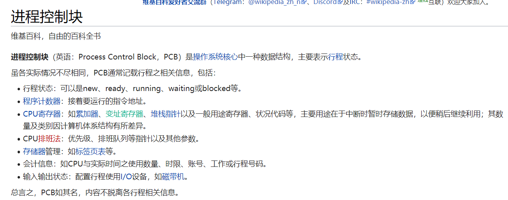
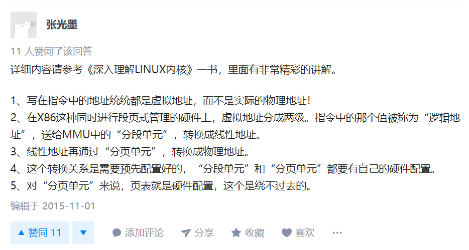

## 操作系统


## 进程通信

https://cloud.tencent.com/developer/article/1496658

### 共享内存

共享内存就是映射一段能被其他进程所访问的内存,这段共享内存由一个进程创建,但多个进程都可以访问.共享内存是最快的IPC(进程间通信)方式,**它是针对其它进程间通信方式运行效率低而专门设计的**.**它往往与其他通信机制,如信号量,配合使用,来实现进程间的同步与通信.**  

访问共享内存区域和访问进程独有的内存区域一样快，并不需要通过系统调用或者其它需要切入内核的过程来完成. 

共享在共享大数据文件时有用，直接在相同进行内存的拷贝，速度快，效率高，需要考虑访问临界资源并发同步

优点：无须复制，快捷，信息量大；

缺点：

​	1）通信是通过将**共享空间缓冲区**直接附加到进程的虚拟地址空间中来实现的，因此**进程间的读写操作的同步问题**；

​	2)利用内存缓冲区直接交换信息，内存的实体存在于计算机中，**只能同一个计算机系统中的诸多进程共享**，不方便网络通信

#### 和其他通信方式的对比

共享内存和消息队列，FIFO，管道传递消息的区别：

消息队列，FIFO，管道的消息传递方式一般为 

> 1：服务器得到输入 
>
> 2：通过管道，消息队列写入数据，通常需要从进程拷贝到内核。 
>
> 3：客户从内核拷贝到进程 
>
> 4：然后再从进程中拷贝到输出文件 

上述过程通常要经过4次拷贝，才能完成文件的传递。 

共享内存只需要

> 1:从输入文件到共享内存区
>
> 2:从共享内存区输出到文件

**上述过程不涉及到内核的拷贝，所以花的时间较少。**

#### 和动态链接库的对比

https://www.cnblogs.com/tongyishu/p/11722004.html

多个程序虽然可以共享同一个动态链接库中的相同代码，但**每一个进程都为动态链接库使用的全部数据分配了自己的地址空间**。而**共享内存是代码和数据均被多个程序所共享**。动态链接库只是实现了代码的复用，对于数据，各个程序要自己保存。共享内存用于进程间通信，主要用于数据的内存共享。这也从侧面反映出**动态链接库并不能用于实现进程之间通信**。

动态链接库相当于是一个大家都可以访问的文件, 在需要使用的时候动态加载, 每个进程使用它的进程都会对它加载和建立映射. 


### 管道

在[类Unix](https://zh.wikipedia.org/wiki/Unix-like)[操作系统](https://zh.wikipedia.org/wiki/操作系统)（以及一些其他借用了这个设计的操作系统，如Windows）中，**管道**（英语：Pipeline）是一系列将[标准输入输出](https://zh.wikipedia.org/wiki/标准流)链接起来的[进程](https://zh.wikipedia.org/wiki/进程)，其中每一个进程的[输出](https://zh.wikipedia.org/wiki/Stdout)被直接作为下一个进程的[输入](https://zh.wikipedia.org/wiki/Stdin)。 每一个链接都由匿名管道实现[[来源请求\]](https://zh.wikipedia.org/wiki/Wikipedia:列明来源)。管道中的组成元素也被称作[过滤程序](https://zh.wikipedia.org/w/index.php?title=过滤程序&action=edit&redlink=1)。

**管道的通信介质是文件**，这种文件通常称为管道文件，两个进程利用管道文件进行通信时，一个进程为写进程，另一个进程为读进程。写进程通过写端（发送端）往管道文件中写入信息；读进程通过读端（接收端）从管道文件中读取信息。两个进程协调不断地进行写、读，便会构成双方通过管道传递信息的流水线。

#### 匿名管道

匿名管道是半双工的，数据只能单向通信；需要双方通信时，需要建立起两个管道；只能用于父子进程或者兄弟进程之间（具有亲缘关系的进程）。

1) 由pipe系统调用，管道由父进程建立
2) 单工通信的
3) 在关系进程中进行(父进程和子进程、同一个父进程的两个子进程之间)
4) 管道位于内核空间，其实是一块缓存

比如命令 `ls -l | less` 在shell上执行, 开始我理解不是说只能在父子进程或兄弟进程之间通信吗? 为什么这两个进程不相关啊? **但其实他们是兄弟进程, 因为他们都是shell进程fork出来的** 

**优点：简单方便；**

**缺点：1）局限于单向通信2）只能创建在它的进程以及其有亲缘关系的进程之间;3）缓冲区有限；**  

#### 有名管道(FIFO)

不同于匿名管道之处在于**它提供一个路径名与之关联，以FIFO的文件形式存在于文件系统中**。这样，即使与FIFO的创建进程不存在亲缘关系的进程，只要可以访问该路径，就能够彼此通过FIFO相互通信（能够访问该路径的进程以及FIFO的创建进程之间），因此，通过FIFO不相关的进程也能交换数据。值得注意的是，FIFO严格遵循先进先出（first in first out），对管道及FIFO的读总是从开始处返回数据，对它们的写则把数据添加到末尾。

**优点：可以实现任意关系的进程间的通信；**

**缺点：1）长期存于系统中，使用不当容易出错；2）缓冲区有限** 


### 信号量


### 消息队列

使用`ipcs -q`查看

```
➜  my-interview git:(master) ✗ ipcs -q

------ Message Queues --------
key        msqid      owner      perms      used-bytes   messages

➜  my-interview git:(master) ✗ ipcs   

------ Message Queues --------
key        msqid      owner      perms      used-bytes   messages

------ Shared Memory Segments --------
key        shmid      owner      perms      bytes      nattch     status

------ Semaphore Arrays --------
key        semid      owner      perms      nsems
```

https://www.jianshu.com/p/7598e5ed5200

MQ 传递的是消息，消息即是我们需要在进程间传递的数据。MQ 采用链表来实现消息队列，该链表是由系统内核维护，系统中可能有很多的 MQ，每个 MQ 用**消息队列描述符**（消息队列 ID：qid）来区分，qid 是唯一的，用来区分不同的 MQ。在进行进程间通信时，一个进程将消息加到 MQ 尾端，另一个进程从消息队列中取消息（**不一定以先进先出来取消息，也可以按照消息类型字段取消息**），这样就实现了进程间的通信。如下 MQ 的模型：


### Unix Domain Socket

socket进程间通信. 实现了使用socket的同主机下的进程间通信

https://blog.csdn.net/Roland_Sun/article/details/50266565


## 进程


### 虚拟地址空间

https://www.cnblogs.com/sparkdev/p/8410350.html

1个4G的虚拟地址空间, 包括两个部分: 用户空间和内核空间. 之前我理解的都是用户空间(包括代码段, 数据段, 堆, 共享库, 栈). 这些占据了3G, 还有1G是留给内核的, 且这1G的内核在所有的进程中都是相同的. 


**内核态与用户态：**

（1）**当一个任务（进程）执行系统调用而陷入内核代码中执行时，称进程处于内核运行态（内核态）。**此时处理器处于特权级最高的（0级）内核代码中执行。当进程处于内核态时，**执行的内核代码会使用当前进程的内核栈。每个进程都有自己的内核栈。**

（2）**当进程在执行用户自己的代码时，则称其处于用户运行态（用户态）**。此时处理器在特权级最低的（3级）用户代码中运行。当正在执行用户程序而突然被中断程序中断时，此时用户程序也可以象征性地称为处于进程的内核态。因为中断处理程序将使用当前进程的内核栈。


* linux内核栈空间只有4KB或8KB


### 虚拟地址空间的优缺点

优点:

1. 发

### 几个问题

1. 用户空间页表和内核空间页表?

    从第二点

2. 内核空间是如何映射的?

    https://zhuanlan.zhihu.com/p/66794639

    内核空间的前896M空间是直接映射(线性)的, 也即内核空间的虚拟空间是连续的, 对应的物理空间也是连续的, 没有复杂的多级页表, 只需要加一个初始位置偏移.

    

    剩下的128M空间用来动态地映射: https://www.cnblogs.com/liuxiaoming/p/3219682.html

    > 在32位系统中，线性地址空间是4G，其中规定3~4G的范围是内核空间（1G），0~3G是用户空间（3G）。如果把这1G的内核线性地址空间全部拿来直接一一映射物理内存的话，在内核态的所有进程（线程）能使用的物理内存总共最多只有1G，很显然，如果你有4G内存，3G都不能用来做内核空间，太浪费了！
    >
    > 　　为了能使在内核态的所有进程能使用更多的物理内存，linux采取了一种变通的形式：它将1G内核线性地址空间分为2部分，第一部分为1G的前896M，这部分内核线性空间与物理内存的0~896M一一映射，第二部分为1G的后128M的线性空间，拿来动态映射剩下的所有物理内存。
    >
    > 　　看到这里应该几乎懂了为什么要有高端内存和低端内存的区分了！内核线性地址空间的前896M映射的就是我们的低端页框内存（ZONE_DMA和ZONG_NORMAL），而且是直接映射；内核线性地址空间的后128M映射的是我们的高端页框内存（ZONG_HIGHMEME）。

    

    

    

### PCB的内容

以下来自百度百科：https://baike.baidu.com/item/PCB/16067368

在不同的操作系统中对进程的控制和管理机制不同，PCB中的信息多少也不一样，通常PCB应包含如下一些信息。

**1、进程标识符信息**

每个进程都必须有一个唯一的标识符，可以是字符串，也可以是一个数字。UNIX系统中就是一个整型数。在进程创建时由系统赋予。进程标识符用于唯一的标识一个进程。一个进程通常有以下两种标识符。

外部标识符。由创建者提供，通常是由字母、数字组成，往往是用户（进程）访问该进程使用。外部标识符便于记忆，如：计算进程、打印进程、发送进程、接收进程等。

内部标识符：为了方便系统使用而设置的。在所有的OS中，都为每一个进程赋予一个唯一的整数，作为内部标识符。它通常就是一个进程的符号，为了描述进程的家族关系，还应该设置父进程标识符以及子进程标识符。还可以设置用户标识符，来指示该进程由哪个用户拥有。

**2、处理机状态信息**

说明进程当前所处的状态。为了管理的方便，系统设计时会将相同的状态的进程组成一个队列，如就绪进程队列，等待进程则要根据等待的事件组成多个等待队列，如等待打印机队列、等待等。处理机状态信息主要是由处理机各种寄存器中的内容所组成。

[通用寄存器](https://baike.baidu.com/item/通用寄存器)。又称为用户可视寄存器，可被用户程 序访问，用于暂存信息。

[指令寄存器](https://baike.baidu.com/item/指令寄存器)。存放要访问的下一条指令的地址。

程序状态字PSW。其中含有状态信息。（条件码、 执行方式、中断屏蔽标志等）

**用户栈指针**。每个用户进程有一个或若干个与之相 关的系统栈，用于存放过程和系统调用参数及调用地址。栈指针指向该栈的栈顶。

**3.进程调度信息**

在PCB中还存放了一些与进程调度和进程对换有关的信息。

（1）进程状态。指明进程当前的状态，作为进程调度和对换时的依据。

（2）进程优先级。用于描述进程使用处理机的优先级别的一个整数，优先级高的进程优先获得处理机。

（3）进程调度所需要的其他信息。（进程已等待CPU的时间总和、进程已执行的时间总和）

（4）事件。这是进程由执行状态转变为阻塞状态所等待发生的事件。（阻塞原因）

进程上下文：

是进程执行活动全过程的静态描述。包括计算机系统中与执行该进程有关的各种寄存器的值、程序段在经过编译之后形成的机器指令代码集、数据集及各种堆栈值和PCB结构。可按一定的执行层次组合，如用户级上下文、系统级上下文等。

进程存在的唯一标志：

在进程的整个生命周期中，系统总是通过PCB对进程进行控制的，亦即，系统是根据进程的PCB而不是任何别的什么而感知到该进程的存在的，所以说，PCB是进程存在的唯一标志 [1] 。




### 页表

linux分为四层(《深入理解Linux内核第三版》)





### 为什么栈的大小较小

https://www.zhihu.com/question/26997321

因为栈需要是连续的地址空间(虚拟), 在单线程情况下可能受影响不大, 但是如果有了多线程, 会导致地址难以分配. 比如2G的地址空间, 如果限制2M的栈大小, 那么可以开1024个线程, 而这在多线程服务器里算很少的. 如果限制为200M, 那么只能大概10个了, 这甚至连普通的多线程程序都支持不了.

设置最大大小又不是一定会用, 只要在需要的时候用, 理论上可以更多啊? 这是因为栈的空间要求连续, 因此需要预分配那么大间隔的空间, 否则, 在产生地址冲突的时候寻找空间, 会导致性能下降.


## 线程


### 内核态线程和用户态线程


### 信号量

### 条件变量

### 互斥锁

### 管程

### 协程

### 生产者消费者

### 读者写者

### 死锁

### 哲学家就餐问题


## 内存

虚拟地址空间


## CPU


### CPU调度


### 多核CPU


### 抢占式和非抢占式

百度百科: 


抢占式: 允许将逻辑上可继续运行的在运行过程暂停的调度方式   可防止单一进程长时间独占CPU   系统开销大（降低途径：硬件实现进程切换，或扩充主存以贮存大部分程序）

非抢占式: 让进程运行直到结束或阻塞的调度方式

https://blog.csdn.net/uniquewonderq/article/details/48803087

Linux抢占式调度: https://juejin.im/post/5ce10ddd6fb9a07ebe74907f

高优先级获得的虚拟运行时间更多: 

> 虚拟运行时间 vruntime += 实际运行时间 delta_exec * NICE_0_LOAD/ 权重(优先级)

在操作系统中维护了一个红黑树，红黑树就是一颗平衡二叉树，也就是说红黑树上面挂了好多进程，最左边的进程就是运行时间最少的进程，所有操作系统在，选取下一个进程就会选取这个红黑树上最左侧的进程。


Go协程是抢占式调度

> (早先) 引入抢占式调度，会对最初的设计产生比较大的影响，Go还只是引入了一些很初级的抢占，并没有像操作系统调度那么复杂，没有对goroutine分时间片，设置优先级等。
>
> 只有长时间阻塞于系统调用，或者运行了较长时间才会被抢占。runtime会在后台有一个检测线程，它会检测这些情况，并通知goroutine执行调度。
>
> 目前并没有直接在后台的检测线程中做处理调度器相关逻辑，只是相当于给goroutine加了一个“标记”，然后在它进入函数时才会触发调度。这么做应该是出于对现有代码的修改最小的考虑。

比如下面这个例子, 设置核心数为1那么第一个协程在不阻塞的情况下不会被调度(抢占). 会导致无法进入主协程, 然后一直死循环. 

```go
package main

import (
	"fmt"
	"runtime"
	"time"
)

func main() {
	// 设置CPU核心数为 1
	runtime.GOMAXPROCS(1)
	go func() {
		i := 0
		for {
			i += 1
			// 如果不阻塞, 那么设置成了单个核心的go程序将不会被切换协程
			// 会一直执行这个协程, 不会抢占, 所以后面的协程和主协程都不会被调度
			// time.Sleep(time.Second*2)
		}
	}()
	go func() {
		fmt.Println("hello, go")
	}()
	time.Sleep(time.Second*5)
}
```

go 1.14 中加入了新的抢占式机制来避免上述问题

http://xiaorui.cc/archives/6535

> go team已经意识到抢占是个问题，所以在1.14中加入了基于信号的协程调度抢占。原理是这样的，首先注册绑定 SIGURG 信号及处理方法runtime.doSigPreempt，sysmon会间隔性检测超时的p，然后发送信号，m收到信号后休眠执行的goroutine并且进行重新调度。


### Linux 进程调度

Linux内核调度分析（进程调度）: https://cloud.tencent.com/developer/article/1027448

公平调度算法CFS

> 现在我们来看一个简单的例子，假设我们的系统只有两个进程在运行，一个是文本编辑器（I/O消耗型），另一个是视频解码器（处理器消耗型）。
>
> 理想的情况下，文本编辑器应该得到更多的处理器时间，至少当它需要处理器时，处理器应该立刻被分配给它（这样才能完成用户的交互），这也就意味着当文本编辑器被唤醒的时候，它应该抢占视频解码程序。
>
> 按照普通的情况，OS应该分配给文本编辑器更大的优先级和更多的时间片，但在Linux中，这两个进程都是普通进程，他们具有相同的nice值，因此它们将得到相同的处理器使用比（50%）。
>
> 但实际的运行过程中会发生什么呢？CFS将能够注意到，文本编辑器使用的处理器时间比分配给它的要少得多（因为大多时间在等待I/O），这种情况下，要实现所有进程“公平”地分享处理器，就会让文本编辑器在需要运行时立刻抢占视频解码器（每次都是如此）。

如何确定程序的优先级?

nice值如何确定?

CFS原理: https://www.jianshu.com/p/673c9e4817a8

权重由nice值确定，具体的，权重跟进程nice值之间有一一对应的关系，可以通过全局数组prio_to_weight来转换，nice值越大，权重越低。

**新创建进程的vruntime**

> 假如新进程的vruntime初值为0的话，比老进程的值小很多，那么它在相当长的时间内都会保持抢占CPU的优势，老进程就要饿死了，这显然是不公平的。**CFS是这样做的：**每个CPU的运行队列cfs_rq都维护一个min_vruntime字段，记录该运行队列中所有进程的vruntime最小值，新进程的初始vruntime值就以它所在运行队列的min_vruntime为基础来设置，与老进程保持在合理的差距范围内。

**休眠进程的vruntime一直保持不变吗？**

>  如果休眠进程的 vruntime 保持不变，而其他运行进程的 vruntime 一直在推进，那么等到休眠进程终于唤醒的时候，它的vruntime比别人小很多，会使它获得长时间抢占CPU的优势，其他进程就要饿死了。这显然是另一种形式的不公平。**CFS是这样做的：**在休眠进程被唤醒时重新设置vruntime值，以min_vruntime值为基础，给予一定的补偿，但不能补偿太多。

假设有两个进程，它们的vruntime初值都是一样的，第一个进程只要一运行，它的vruntime马上就比第二个进程更大了，那么它的CPU会立即被第二个进程抢占吗？**CFS是这样做的：**为了避免过于短暂的进程切换造成太大的消耗，CFS设定了进程占用CPU的最小时间值，sched_min_granularity_ns，正在CPU上运行的进程如果不足这个时间是不可以被调离CPU的。

**进程从一个CPU迁移到另一个CPU上的时候vruntime会不会变？**

当进程从一个CPU的运行队列中出来 (dequeue_entity) 的时候， 它的vruntime要减去队列的min_vruntime值；

而当进程加入另一个CPU的运行队列 ( enqueue_entiry) 时，它的vruntime要加上该队列的min_vruntime值。

### CFS

#### 一些概念

https://www.cnblogs.com/zengkefu/p/5564626.html

实时任务, 非实时任务.

常规优先级, 静态优先级, 实时优先级

#### 一些问题

进程的优先级是如何确定的?


### 进程

#### PCB进程控制块


### 中断


### 信号


