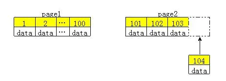

## 数据库

## 数据库事务

### 事务

在数据库系统中，一个事务是指：**由一系列数据库操作组成的一个完整的逻辑过程。**例如银行转帐，从原账户扣除金额，以及向目标账户添加金额，这两个数据库操作的总和，构成一个完整的逻辑过程，不可拆分。

[看维基百科]([https://zh.wikipedia.org/wiki/%E6%95%B0%E6%8D%AE%E5%BA%93%E4%BA%8B%E5%8A%A1](https://zh.wikipedia.org/wiki/数据库事务)) 

### ACID

[以下摘自维基百科](https://zh.wikipedia.org/wiki/ACID) 

**ACID**，是指[数据库管理系统](https://zh.wikipedia.org/wiki/数据库管理系统)（[DBMS](https://zh.wikipedia.org/wiki/DBMS)）在写入或更新资料的过程中，为保证[事务](https://zh.wikipedia.org/wiki/数据库事务)（transaction）是正确可靠的，所必须具备的四个特性：[原子性](https://zh.wikipedia.org/w/index.php?title=原子性&action=edit&redlink=1)（atomicity，或称不可分割性）、[一致性](https://zh.wikipedia.org/w/index.php?title=一致性_(数据库系统)&action=edit&redlink=1)（consistency）、[隔离性](https://zh.wikipedia.org/wiki/隔離性)（isolation，又称独立性）、[持久性](https://zh.wikipedia.org/w/index.php?title=持久性&action=edit&redlink=1)（durability）。

- Atomicity（原子性）：一个事务（transaction）中的所有操作，或者全部完成，或者全部不完成，不会结束在中间某个环节。事务在执行过程中发生错误，会被[回滚](https://zh.wikipedia.org/wiki/回滚_(数据管理))（Rollback）到事务开始前的状态，就像这个事务从来没有执行过一样。即，事务不可分割、不可约简。[[1\]](https://zh.wikipedia.org/wiki/ACID#cite_note-acid-1)
- Consistency（一致性）：在事务开始之前和事务结束以后，数据库的完整性没有被破坏。这表示写入的资料必须完全符合所有的预设[约束](https://zh.wikipedia.org/wiki/数据完整性)、[触发器](https://zh.wikipedia.org/wiki/触发器_(数据库))、[级联回滚](https://zh.wikipedia.org/wiki/级联回滚)等。[[1\]](https://zh.wikipedia.org/wiki/ACID#cite_note-acid-1)
- Isolation（隔离性）：数据库允许多个并发事务同时对其数据进行读写和修改的能力，隔离性可以防止**多个事务并发执行**时由于交叉执行而导致数据的不一致。事务隔离分为不同级别，包括未提交读（Read uncommitted）、提交读（read committed）、可重复读（repeatable read）和串行化（Serializable）。[[1\]](https://zh.wikipedia.org/wiki/ACID#cite_note-acid-1)
- Durability（持久性）：事务处理结束后，对数据的修改就是永久的，即便系统故障也不会丢失。[[1\]](https://zh.wikipedia.org/wiki/ACID#cite_note-acid-1) 

### 三种读现象

[漫画编程解说](https://blog.csdn.net/weixin_34297704/article/details/86753968) 

[这篇维基百科事务隔离讲的非常详细](https://zh.wikipedia.org/wiki/事務隔離)

要了解四种隔离级别, 需要先了解三种读错误

[这里有比较好的例子](https://juejin.im/post/5b90cbf4e51d450e84776d27) 

1. 脏读(dirty read): 通过在写的时候加锁，可以解决脏读。

    脏读是指读到了未提交更新的数据. (比如另一个事务更新之后, 这个事务读了, 但是另一个事务回滚, 没有提交, 那么这个读就是脏读; 或者另一个事务更新之后又发生了更新, 然后提交了, 应该也是属于脏读)

    

    

2. 不可重复读: 通过在读的时候加锁，可以解决不可重复读。

    定义：读到已经提交更新的数据，但一个事务范围内两个相同的查询却返回了不同数据。

    

    

3. 幻读: 通过串行化，可以解决幻读。

定义：读到已提交插入数据，幻读与不可重复读类似，幻读是查询到了**另一个事务已提交的新插入数据**，而不可重复读是查询到了另一个事务已提交的更新数据。

### 四种隔离级别

数据库的隔离级别越高, 并发性越低. 

**隔离级别vs读现象**

| 隔离级别 |   脏读   | 不可重复读 |  幻影读  |
| :------: | :------: | :--------: | :------: |
| 未提交读 | 可能发生 |  可能发生  | 可能发生 |
|  提交读  |    -     |  可能发生  | 可能发生 |
| 可重复读 |    -     |     -      | 可能发生 |
| 可序列化 |    -     |     -      |    -     |

**隔离级别vs 锁持续时间**

在**基于锁的并发控制**中，隔离级别决定了锁的持有时间。**"C"**-表示锁会持续到事务提交。 **"S"** –表示锁持续到当前语句执行完毕。如果锁在语句执行完毕就释放则另外一个事务就可以在这个事务提交前修改锁定的数据，从而造成混乱。

| 隔离级别 | 写操作 | 读操作 | 范围操作 (...where...) |
| :------: | :----: | :----: | :--------------------: |
| 未提交读 |   S    |   S    |           S            |
|  提交读  |   C    |   S    |           S            |
| 可重复读 |   C    |   C    |           S            |
| 可序列化 |   C    |   C    |           C            |

四种隔离级别总结如下

### 悲观锁和乐观锁

[漫画编程讲悲观锁乐观锁](https://mp.weixin.qq.com/s/TZy8iIGDL3gHPhVxTnJDeQ)

乐观锁有点难懂。。。

## 故障恢复

> 本节图片大多数来自于战德臣老师的icourse公开课PPT

### 种类

> 数据库系统中故障可以分为：事务故障、系统故障、介质故障。
>
> 一、事务故障
>
> 某个事务在运行过程中由于种种原因未运行至正常终止点，事务故障的常见原因，输入数据有误
> 运算直到溢出，违反了某些完整性限制发生锁死。
>
> 
>
> 二、系统专故障
>
> 由于某种原因造成整个系统的正常运行突然停止，致使所有正在运行的事务都以非正常方式终止。
> 发生系统故障时，内存中数据库缓冲区的信息全部丢失，但存储在外部存储设备上的数据未属受影响 。
>
> 三、介质故障
>
> 硬件故障使存储在外存中的数据部分丢失或全部丢失 ，介质故障比前两类故障的可能性小得多，但破坏性最大。

数据库访问的模式

对应三种数据库故障

### 事务故障恢复

### 系统故障恢复

系统故障可通过设置检查点来恢复

**检查点之前**: 已结束的不需要恢复

**检查点之后**: 故障点前结束的重做, 未结束的撤销

使用运行日志来记录数据库的操作. **在操作之前, 先写运行日志, 成功后再读写缓存区.** 

**日志会直接写入到介质存储上, 保证正确性** 

### 介质故障恢复

介质故障通过使用**副本**来进行恢复

但是依靠副本不能完全解决问题, 因为副本不是完全相同, 而是在某一个时间点进行备份的.

这个时间点被称为转储点

如果在写入日志之后而操作数据库之前发生故障, 如何恢复? 或者说日志的redo, undo就是为这种情况准备的?

## 日志

持久性与原子性: 

常用缓冲区处理策略: Steal + No force

这说明允许事务在commit之前和之后写入磁盘, 也就是和commit时间不相关, 和checkpoint的时间点相关. 因此我们恢复的策略就是基于checkpoint.

如果是Force + No steal, 说明每到一个commit就需要将缓冲区内容写入到磁盘. 会造成性能下降.

什么是日志?

日志与恢复策略的关系. 可见性能最差的在日志方面不需要多少工作. 

### Undo日志

### Redo日志

### Undo/Redo日志

### 恢复过程发生故障怎么办?

## 存储结构

### 数据库存储引擎

mysql的核心是存储引擎

使用 `show engines;` 即可查看. 可以看到我这里默认是`InnoDB`引擎. 

`transaction` 是事务的意思

> 在MySQL中，不需要在整个服务器中使用同一种存储引擎，针对具体的要求，可以对每一个表使用不同的存储引擎。Support列的值表示某种引擎是否能使用：YES表示可以使用、NO表示不能使用、DEFAULT表示该引擎为当前默认的存储引擎 。

[这篇阿里云文章介绍了四种引擎](https://yq.aliyun.com/articles/636314)

发音: https://juejin.im/post/5c43ee36518825254b5a3c3a

| 技术名词 | 发音       |
| -------- | ---------- |
| MyISAM   | [maɪ-zeim] |
| InnoDB   | [,ɪnnə-db] |

### 索引

#### 为什么要有主键?

参考: https://www.jianshu.com/p/1203fd140cc2

从性能上说, 例如mysql数据库的InnoDB存储引擎使用B+树结构做存储, 那么它需要使用一个唯一的值作为它的key, 才能在B+树中有序地存储. 因此有如下规则:

> 如果一个主键被定义了，那么这个主键就是作为聚集索引
>
> 如果没有主键被定义，那么该表的第一个唯一非空索引被作为聚集索引
>
> 如果没有主键也没有合适的唯一索引，那么**innodb内部会生成一个隐藏的主键作为聚集索引**，这个隐藏的主键是一个6个字节的列，该列的值会随着数据的插入自增。

注意: **无特殊需求下Innodb建议使用与业务无关的自增ID作为主键**  

这是因为如果使用与业务有关的列做主键, 可能值是无序的, 这样可能会造成较大地性能损失. 如果主键是有序的, 那么它会逐渐填满一页后才开辟新的一页. 

#### 为什么要有索引?

**索引是帮助 MySQL 高效获取数据的数据结构。** 索引的出现就是为了提高查询效率，就像书的目录。索引要解决的就是查询问题。

#### 索引的优缺点?

这篇文章还不错, 看这篇吧: https://www.cnblogs.com/guojin705/archive/2011/06/21/2086429.html

#### 什么情况下使用索引?

#### 为什么(不)使用哈希表做索引?

hash表检索效率非常高, 是O(1)的复杂度, 但它也有许多的弊端

**使用hash表做索引的弊端**: https://liuyanzhao.com/8968.html

1、Hash索引仅仅能满足 =，IN 和 <=> 查询，如果是范围查询检索，这时候哈希索引就毫无用武之地了。

因为原先是有序的键值，经过哈希算法后，有可能变成不连续的了，就没办法再利用索引完成范围查询检索；

2、Hash 索引无法利用索引完成排序，因为存放的时候是经过 Hash 计算过的，计算的 Hash 值和原始数据不一定相等，所以无法排序；

3、联合索引中，Hash 索引不能利用部分索引键查询。

Hash 索引在计算 Hash 值的时候是联合索引键合并后再一起计算 Hash 值，而不是单独计算 Hash 值。

所以对于联合索引中的多个列，Hash 是要么全部使用，要么全部不使用。通过前面一个或几个索引键进行查询的时候，Hash 索引也无法被利用。

4、Hash索引在任何时候都不能避免表扫描。

前面已经知道，Hash 索引是将索引键通过 Hash 运算之后，将 Hash 运算结果的 Hash 值和所对应的行指针信息存放于一个 Hash 表中，由于不同索引键可能存在相同 Hash 值，所以即使取满足某个 Hash 键值的数据的记录条数，也无法从 Hash 索引中直接完成查询，还是要通过访问表中的实际数据进行相应的比较，并得到相应的结果。

5、在有大量重复键值情况下，哈希索引的效率也是极低的，因为存在所谓的哈希碰撞问题。

综上，**哈希表这种结构适用于只有等值查询的场景，比如 Memcached、redis 及其他一些 NoSQL 引擎。** 

## mysql

### SQL语句

### 9 道 MySQL 面试题

https://juejin.im/post/5e9a65326fb9a03c5d5c90e6

## redis

### redis为什么使用跳表而不使用红黑树

[redis为什么使用调表而不使用红黑树]([https://syt-honey.github.io/2019/03/23/17-%E8%B7%B3%E8%A1%A8%EF%BC%9A%E4%B8%BA%E4%BB%80%E4%B9%88Redis%E4%B8%80%E5%AE%9A%E8%A6%81%E7%94%A8%E8%B7%B3%E8%A1%A8%E6%9D%A5%E5%AE%9E%E7%8E%B0%E6%9C%89%E5%BA%8F%E9%9B%86%E5%90%88%EF%BC%9F/](https://syt-honey.github.io/2019/03/23/17-跳表：为什么Redis一定要用跳表来实现有序集合？/)) 

> Redis中的有序集合是通过跳表来实现的，严格点讲，其实还用到了散列表。如果查看redis开发手册会发现，redis中的有序集合支持的核心操作主要有：
>
> - 插入一个数据
> - 删除一个数据
> - 查找一个数据
> - 按照区间查找数据
> - 迭代输出有序序列
>
> 其中，插入、删除、查找以及迭代输出有序序列，红黑树也可以完成，时间复杂度和跳表一样。但是按照区间来查找数据这个操作，红黑树的效率没有跳表高。
>
> **对于按照区间查找数据这个操作，跳表可以做到O(logn)的时间复杂度定位区间的起点，然后在原始链表中顺序往后遍历就可以了。**
>
> 当然，redis之所以用跳表来实现有序集合还有其它的原因。比如，相比于红黑树，跳表的代码看起来更易于理解、可读性更好也不容易出错。**而且跳表也更加的灵活，他可以通过改变索引构建策略，有效平衡执行效率和内存消耗。**

漫画跳跃表: https://zhuanlan.zhihu.com/p/53975333

#### skiplist与平衡树、哈希表的比较

来源: https://blog.csdn.net/hebtu666/article/details/102556064

* skiplist和各种平衡树（如AVL、红黑树等）的元素是有序排列的，而哈希表不是有序的。因此，在哈希表上只能做单个key的查找，不适宜做范围查找。所谓范围查找，指的是查找那些大小在指定的两个值之间的所有节点。

* **在做范围查找的时候，平衡树比skiplist操作要复杂。**在平衡树上，我们找到指定范围的小值之后，还需要以中序遍历的顺序继续寻找其它不超过大值的节点。如果不对平衡树进行一定的改造，这里的中序遍历并不容易实现。而在skiplist上进行范围查找就非常简单，只需要在找到小值之后，对第1层链表进行若干步的遍历就可以实现。
    平衡树的插入和删除操作可能引发子树的调整，逻辑复杂，而skiplist的插入和删除只需要修改相邻节点的指针，操作简单又快速。

* **从内存占用上来说，skiplist比平衡树更灵活一些。**一般来说，平衡树每个节点包含2个指针（分别指向左右子树），而skiplist每个节点包含的指针数目平均为1/(1-p)，具体取决于参数p的大小。如果像Redis里的实现一样，取p=1/4，那么平均每个节点包含1.33个指针，比平衡树更有优势。
    查找单个key，skiplist和平衡树的时间复杂度都为O(log n)，大体相当；而哈希表在保持较低的哈希值冲突概率的前提下，查找时间复杂度接近O(1)，性能更高一些。所以我们平常使用的各种Map或dictionary结构，大都是基于哈希表实现的。

* **从算法实现难度上来比较，skiplist比平衡树要简单得多**。

#### Redis中的skiplist和经典有何不同

https://blog.csdn.net/hebtu666/article/details/102556064

分数(score)允许重复，即skiplist的key允许重复。这在最开始介绍的经典skiplist中是不允许的。
在比较时，不仅比较分数（相当于skiplist的key），还比较数据本身。在Redis的skiplist实现中，数据本身的内容唯一标识这份数据，而不是由key来唯一标识。另外，当多个元素分数相同的时候，还需要根据数据内容来进字典排序。
第1层链表不是一个单向链表，而是一个双向链表。这是为了方便以倒序方式获取一个范围内的元素。
在skiplist中可以很方便地计算出每个元素的排名(rank)。

### redis的常用数据结构

https://juejin.im/post/5b53ee7e5188251aaa2d2e16#heading-4

sortedset 是用跳表实现的

### 如何使用redis做缓存?

[看这个知乎问题](https://www.zhihu.com/question/27738066) 