## 数据结构


## 红黑树

### 红黑树是什么

红黑树是一种自平衡二叉查找树. 

### 红黑树的性质

引用自[维基百科](https://zh.wikipedia.org/wiki/红黑树) 

> 红黑树是每个节点都带有*颜色*属性的[二叉查找树](https://zh.wikipedia.org/wiki/二元搜尋樹)，颜色为*红色*或*黑色*。在二叉查找树强制一般要求以外，对于任何有效的红黑树我们增加了如下的额外要求：
>
> 1. 节点是红色或黑色。
> 2. 根是黑色。
> 3. 所有叶子都是黑色（叶子是NIL节点）。
> 4. 每个红色节点必须有两个黑色的子节点。（从每个叶子到根的所有路径上不能有两个连续的红色节点。）
> 5. 从任一节点到其每个叶子的所有[简单路径](https://zh.wikipedia.org/wiki/道路_(图论))都包含相同数目的黑色节点。


### 红黑树应用场景

可参考这个知乎回答

AVL树，红黑树，B树，B+树，Trie树都分别应用在哪些现实场景中？ - 九夏的回答 - 知乎 https://www.zhihu.com/question/30527705/answer/52750388

红黑树是一种平衡搜索树, 可以用来动态排序, 因此在这类场景下都可以用红黑树, 比如

* STL中map, set, multi_set等是基于红黑树的
* Linux的CFS(公平调度算法)用红黑树来维护进程的优先级(虚拟运行时)
* epoll(io多路复用)在内核中的实现，用红黑树管理事件(详情看https://blog.csdn.net/daaikuaichuan/article/details/83862311)
* nginx中，用红黑树管理timer等


## B树&B+树

小灰讲B树: https://mp.weixin.qq.com/s?__biz=MzIxMjE5MTE1Nw==&mid=2653190965&idx=1&sn=53f78fa037386f85531832cd5322d2a0&chksm=8c9909efbbee80f90512f0c36356c31cc74c388c46388dc2317d43c8f8597298f233ca9c29e9&scene=21#wechat_redirect

小灰讲B+树: https://mp.weixin.qq.com/s/jRZMMONW3QP43dsDKIV9VQ

### 为什么数据库索引一般用B树/B+树而不是红黑树, AVL树甚至二叉查找树?

1. 磁盘的io代价非常高, 为了尽量减少io次数(层级), 选择使用平衡的, 矮胖的B+树, 而不是平衡二叉树(太高了)
2. 虽然矮胖会导致在一个结点中查找下一个元素的代价更大, 但相比于io的代价是极少的.
3. 比如一个磁盘页4KB, 一个项4B, 一个链接4B, 那么可以存512个项-链接. 可通过二分快速定位.


### B树如何保持平衡?

类似于2-3树, 当B树需要插入一个结点的时候, 其他如果没到最大阶数, 那么插入, 否则就拆分, 将某个结点向上层传递, 因此当B树增加高度的时候, 只会在根节点, 此时所有的结点都会增加一个高度. 

在删除结点时, 会出现失去平衡的情况, 这时候需要调整结点, 进行旋转操作使其平衡.


### B树和B+树的区别?

1. 有k个子树的中间节点包含有k个元素而B树中是k-1个元素

    B+树

    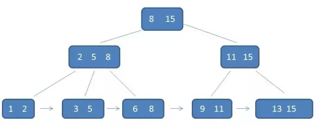

    B树

    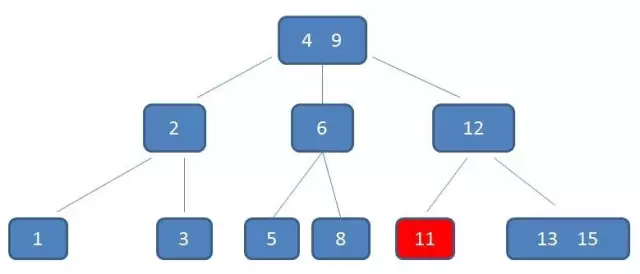

    

2. B+树每个元素不保存数据，只用来索引，所有数据都保存在叶子节点。

3. B+树每个父节点的元素都出现在子节点, 并且是子节点的最大元素

    

4. B+树的叶子节点用有序链表链接起来了, 因此在查询一个区间的时候不需要通过中序遍历去查找

    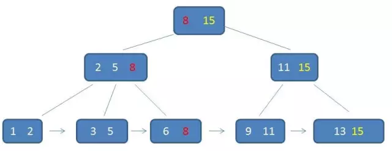

5. B树所有结点都带有卫星数据, 而B+树只有叶子节点带有卫星数据.

    > 需要补充的是，在数据库的聚集索引（Clustered Index）中，叶子节点直接包含卫星数据。在非聚集索引（NonClustered Index）中，叶子节点带有指向卫星数据的指针。

6. B+树比B树更加矮胖, 因为它的中间节点没有卫星数据, 因此能容纳更多的中间节点, 使得磁盘IO次数更少.

7. B+树性能不稳定, 因为它只要查找到结点就可以, 而B+树每次都需要查找到叶子节点.

8. B树的范围查询很繁琐, 因为需要经过中序遍历. 而B+树只需要通过链表.


### 为什么mysql数据库索引使用B+树而不是B树?

从上面的分析B树和B+树的对比可以知道, B+树更矮, 更稳定, 这大概就是mysql这种关系型数据库使用它的原因. <del>虽然我不是很理解为什么这种"稳定性"是优点, 那种"不稳定"不是效率更高吗? 大概是因为这种不稳定会导致树更高?</del> 

B+树支持方便的区间访问, 而B树则是需要中序遍历. 区间访问是关系型数据库中经常会有的.


### 为什么MongoDB使用B树作为索引而不使用B+树

MongoDB是聚合型数据库，而 B-树恰好 key 和 data 域聚合在一起. 这类数据库没有关系型数据库对区间访问的要求那么高, 

<del>不过我对这个问题的理解还是有点迷</del>

## 为什么map用红黑树而不是AVL树?

红黑树看红书上的讲解. 

https://www.zhihu.com/question/20545708/answer/58717264

1. 如果插入一个node引起了树的不平衡，AVL和RB-Tree都是最多只需要2次旋转操作，即两者都是O(1)；但是在删除node引起树的不平衡时，最坏情况下，AVL需要维护从被删node到root这条路径上所有node的平衡性，因此需要旋转的量级O(logN)，而RB-Tree最多只需3次旋转，只需要O(1)的复杂度。

2. 其次，AVL的结构相较RB-Tree来说更为平衡，在插入和删除node更容易引起Tree的unbalance，因此在大量数据需要插入或者删除时，AVL需要rebalance的频率会更高。因此，RB-Tree在需要大量插入和删除node的场景下，效率更高。自然，由于AVL高度平衡，因此AVL的search效率更高。

3. map的实现只是折衷了两者在search、insert以及delete下的效率。总体来说，RB-tree的统计性能是高于AVL的。

一篇不错的AVL树讲解: https://zhuanlan.zhihu.com/p/34899732

在线AVL可视化: https://www.cs.usfca.edu/~galles/visualization/AVLtree.html


## 最大堆

C++模板类代码实现

```cpp
#include <algorithm>
#include <iostream>
#include <vector>
using namespace std;

template <class T>
class MaxHeap {
   public:
	MaxHeap();
	~MaxHeap();

   public:
	// stl标准API
	T top();
	void push(T val);
	T pop();
	bool empty();

   private:
	// 用数组来保存二叉堆
	vector<T> heap;
	int size;

   private:
	// 元素下沉
	void sink(int top);
	// 元素上升
	void swim(int down);
};

template <class T>
inline MaxHeap<T>::MaxHeap() {
	heap.push_back(-1);
	size = 0;
}

template <class T>
inline MaxHeap<T>::~MaxHeap() {
	heap.clear();
}

template <class T>
inline T MaxHeap<T>::top() {
	return this->heap[1];
}

template <class T>
inline void MaxHeap<T>::push(T val) {
	heap.push_back(val);
	size += 1;
	swim(size);
}

template <class T>
inline bool MaxHeap<T>::empty() {
	return size == 0;
}

template <class T>
inline T MaxHeap<T>::pop() {
	int popVal = heap[1];
	swap(heap[1], heap[size]);
	size -= 1;
	sink(1);
	return popVal;
}

template <class T>
inline void MaxHeap<T>::sink(int top) {
	if (top >= size)
		return;
	int lTop = top * 2, rTop = top * 2 + 1;
	if (rTop <= size) {
		// 左子树和右子树都在范围内
		if (heap[lTop] > heap[top] && heap[lTop] >= heap[rTop]) {
			swap(heap[lTop], heap[top]);
			sink(lTop);
		} else if (heap[rTop] > heap[top] && heap[lTop] < heap[rTop]) {
			swap(heap[rTop], heap[top]);
			sink(rTop);
		}
	} else if (lTop <= size && heap[top] <= heap[lTop]) {
		// 左子树可以交换
		swap(heap[lTop], heap[top]);
		sink(lTop);
	}
	return;
}

template <class T>
inline void MaxHeap<T>::swim(int down) {
	int parent = down / 2;
	if (parent >= 1 && heap[down] > heap[parent]) {
		swap(heap[down], heap[parent]);
		swim(parent);
	}
	return;
}

int main() {
	auto ptr = new MaxHeap<double>();
	for (int i = 0; i < 10; i++) {
		ptr->push((i * i + 17) % 11 + 0.01);
	}
}
```


## 斐波那契堆

好文：https://www.cnblogs.com/skywang12345/p/3659060.html


## STL之vector

这篇文章给出了一些比较详细的介绍: https://blog.csdn.net/u012658346/article/details/50725933

vector使用三个指针来表示位置

```
protected:
    pointer _Myfirst;   // pointer to beginning of array
    pointer _Mylast;    // pointer to current end of sequence
    pointer _Myend; // pointer to end of array
```


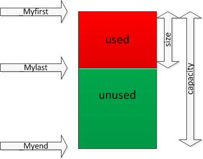

### 存储空间再分配问题

size表示vector中已有元素的个数，容量表示vector最多可存储的元素的个数；为了降低二次分配时的成本，vector实际配置的大小可能比客户需求的更大一些，以备将来扩充，这就是容量的概念。即capacity>=size，当等于时，容器此时已满，若再要加入新的元素时，就要**重新进行内存分配**，**整个vector的数据都要移动到新内存。二次分配成本较高，在实际操作时，应尽量预留一定空间，避免二次分配。** 

二次分配的移动次数不会超过2*n次.


### vector是在堆上还是栈上?

这个知乎回答 https://www.zhihu.com/question/36773826/answer/68943177 这样说

> vector本身并不一定占用动态内存。vector只是管理了一片动态内存。
> vector vs用栈上的vector管理一片动态内存。
> new vector用动态内存里的一个vector管理另一片动态内存。

类似于指针, 指针指向一个new的值, 这部分是在堆的内存空间. 但是这个指针本身是在栈上的. vector也是类似, vector管理了一段动态内存(堆), 但一个普通vector对象是在栈上的, 它管理的内存是堆上的动态内存. 

```cpp
#include <bits/stdc++.h>

using namespace std;

int main() {
	vector<int> vec;
	cout << (&vec) << endl; // 栈

	int b = 1;
	cout << &b << endl; // 栈

	int* a = new int;
	cout << a << endl;  // 堆
	cout << &a << endl;  // 栈

	vector<int>* vec2 = new vector<int>();
	cout << vec2 << endl;  // 堆
	cout << &vec2 << endl;  // 栈
}
```

结果

```
0x61fd20
0x61fd1c
0x666550
0x61fd10
0x666570
0x61fd08
0x666590
0x61fd00
0x2531c90
```


* erase删除的复杂度为O(n), 同insert

* vector中的元素是连续的


## STL之set

* set使用红黑树实现(调用红黑树的接口)

    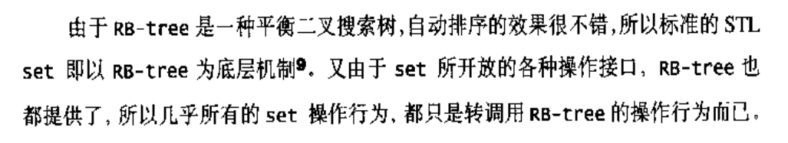

* set的值(也就是键)是不可以更改的

    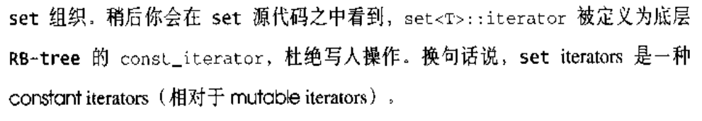

    如果尝试更改, 会报错(只读)

    ```
    setTest.cpp: In function 'int main()':
    setTest.cpp:10:7: error: assignment of read-only reference 's'
       s = 1;
    ```

* set使用RB-tree的 insert_unique(), 而multiset 是Yoon insert_equal, 从而允许同值得存在

    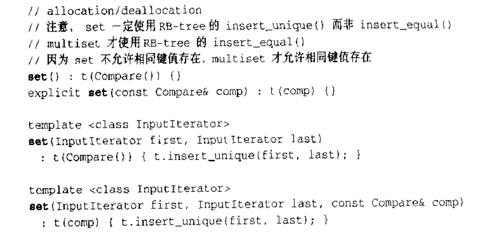


## STL之map

* map使用红黑树实现

    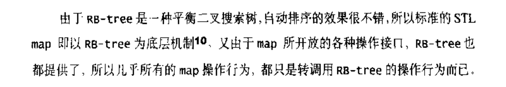

* map按键排序

* 不可以修改map的键

    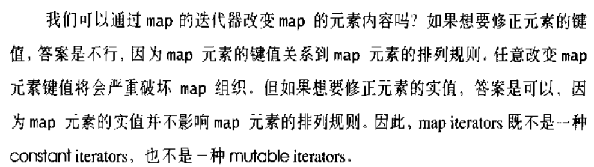

* map的键值对结构

    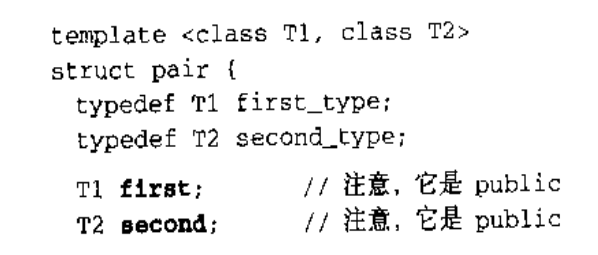

    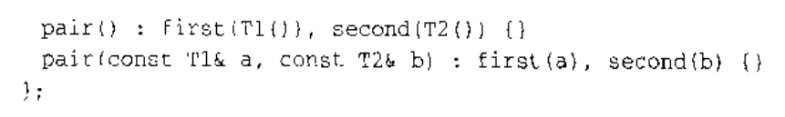


C++中map的键可以使用map类型, 因为两个同类型的map是可以比较的(应该是比最小的键的值).

但是unordered_map的键是不可以


## 跳跃表(跳表)

一种基于链表的有序集合

漫画跳跃表: https://zhuanlan.zhihu.com/p/53975333

通过给链表建立多级索引来实现快速查找, 删除, 插入

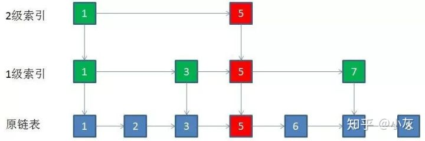

那么插入了一个元素之后, 如何更新索引呢?

用抛硬币的方法!

以一定概率(比如50%)决定需不需要在上一层建立索引, 如果建立了, 然后再抛硬币确定再上一层需不需要建立索引. 虽然无法达到完全的均匀索引, 但是整体上是均匀的.

redis的**Sorted-set**就是基于跳跃表的改进实现

### skiplist与平衡树、哈希表的比较

来源: https://blog.csdn.net/hebtu666/article/details/102556064

* skiplist和各种平衡树（如AVL、红黑树等）的元素是有序排列的，而哈希表不是有序的。因此，在哈希表上只能做单个key的查找，不适宜做范围查找。所谓范围查找，指的是查找那些大小在指定的两个值之间的所有节点。

* **在做范围查找的时候，平衡树比skiplist操作要复杂。**在平衡树上，我们找到指定范围的小值之后，还需要以中序遍历的顺序继续寻找其它不超过大值的节点。如果不对平衡树进行一定的改造，这里的中序遍历并不容易实现。而在skiplist上进行范围查找就非常简单，只需要在找到小值之后，对第1层链表进行若干步的遍历就可以实现。
    平衡树的插入和删除操作可能引发子树的调整，逻辑复杂，而skiplist的插入和删除只需要修改相邻节点的指针，操作简单又快速。

* **从内存占用上来说，skiplist比平衡树更灵活一些。**一般来说，平衡树每个节点包含2个指针（分别指向左右子树），而skiplist每个节点包含的指针数目平均为1/(1-p)，具体取决于参数p的大小。如果像Redis里的实现一样，取p=1/4，那么平均每个节点包含1.33个指针，比平衡树更有优势。
    查找单个key，skiplist和平衡树的时间复杂度都为O(log n)，大体相当；而哈希表在保持较低的哈希值冲突概率的前提下，查找时间复杂度接近O(1)，性能更高一些。所以我们平常使用的各种Map或dictionary结构，大都是基于哈希表实现的。

* **从算法实现难度上来比较，skiplist比平衡树要简单得多**。

### Redis中的skiplist和经典有何不同

https://blog.csdn.net/hebtu666/article/details/102556064

分数(score)允许重复，即skiplist的key允许重复。这在最开始介绍的经典skiplist中是不允许的。
在比较时，不仅比较分数（相当于skiplist的key），还比较数据本身。在Redis的skiplist实现中，数据本身的内容唯一标识这份数据，而不是由key来唯一标识。另外，当多个元素分数相同的时候，还需要根据数据内容来进字典排序。
第1层链表不是一个单向链表，而是一个双向链表。这是为了方便以倒序方式获取一个范围内的元素。
在skiplist中可以很方便地计算出每个元素的排名(rank)。


## 位图BitMap

适用于在一定范围内的海量数据的一些情形, 比如

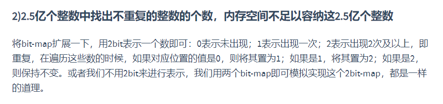

一个10G的文件都是int型数据(假设2.5亿个int数据, 可以是二进制文件). 而处理它的服务器只有1G内存, 怎么办呢?

使用位图, 这2.5亿个数据只需要用全部int型范围来表示, 即2^32, 一个数作为1个bit, 所以一个整型从32bit变成了1bit, 空间压缩了32倍. 那么表示全部的int型数据只需要512MB空间.

但是一个bitmap是无法做好这个问题的. 因为我们设置第一个出现的数为1了, 因为我们只有两个状态(0或1), 那么无法表示是否重复(只能表示是否存在). 那么我们可以用两个bitmap来表示4个状态, 第二个bitmap的位为1时说明重复.

但在这个问题里是不可行的, 因为空间不够, 两个512MB占用所有的空间.

所以我们第一遍的时候将重复出现的数都保存到文件(会有重复), 然后再经过一次bitmap, 这个时候只需要判断一个数是否出现过. 就是结果了.

一个bitset的测试

```cpp
#include <bits/stdc++.h>

using namespace std;

// 所有整数范围的位图
bitset<((long long)INT_MAX - INT_MIN)> maxIntBS;

int main() {
	cout << sizeof(maxIntBS) / (1 << 20) << "MB" << endl;
	cout << 512*1024*1024 << endl;
}
```

输出

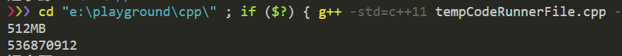


位图的缺点:

位图的大小跟数据范围有关, 而跟数据量无关. 因此如果数量很少, 但是范围很大, 这种情况是不适用的.

在大量数据处理中它的性价比比较高.


像是一种另类哈希表.

位图的存储实现可以看这篇博客: https://juejin.im/post/5bab2288e51d450e7a24ef37


## 哈希表

[这篇文章还不错, 下面的内容为对此文的总结](https://mp.weixin.qq.com/s/NoXdlYog2XloGwjARzZGAg) 

这篇文章介绍了三个部分

1. 冲突解决
2. hash到映射
3. 初始容量与扩容

下面分别展开介绍

### 冲突解决

1. hash表用一个数组来存储，数组中的每一个元素叫做`bucket`。至于hash冲突，就用链表来解决. golang和C++(unordered_map)都是这么做的

    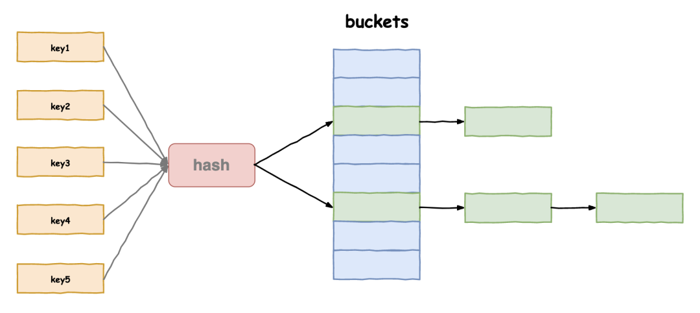

2. 但是如果冲突的元素过多, 那么链表会很长. 这个时候可以将链表转化成红黑树. Java的HashMap就是这么做的(当链表长度超过8时)

    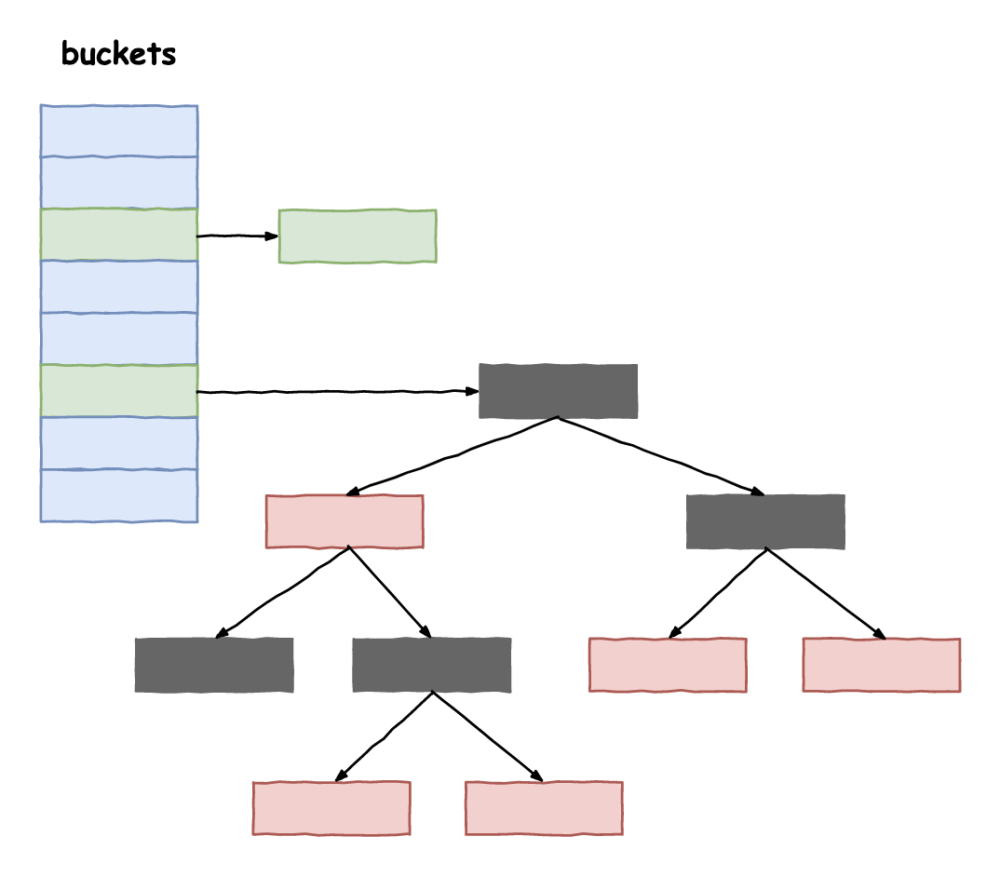

3. C#的HashTable使用的是双重hash

4. python的dict使用的是开放地址法. 一个有冲突那么顺序地向后面找空位.

    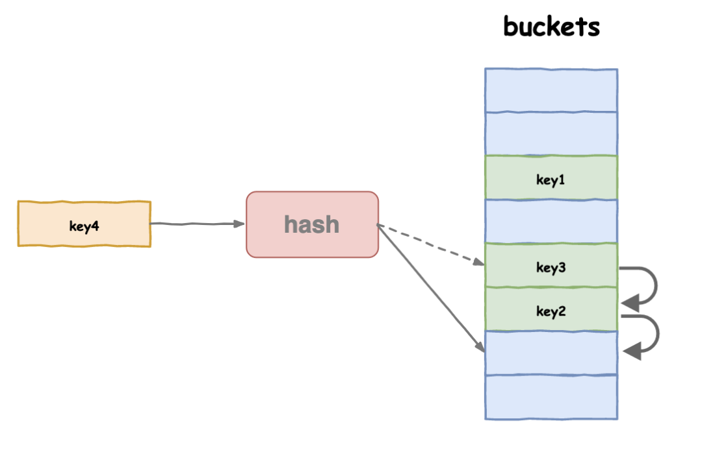


### hash到映射

> 指的是生成了hash值, 这个hash值如何映射到数组中的索引?

最基本的是用hash值对数组长度 length取模(C++, C#等用此方法)


python的dict和Java的HashMap有所差别, 用的是与运算. 

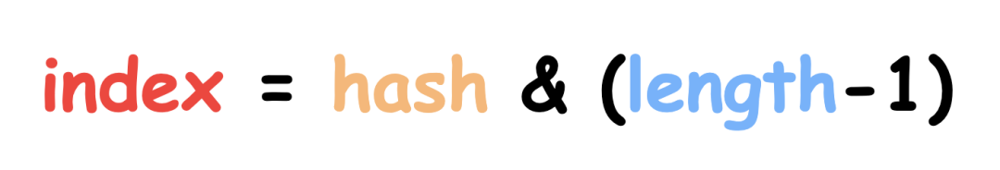

原因在于, length是2的幂次, 如length为16, -1 为`0000 1111`, 与运算更快, 结果取低4位. 

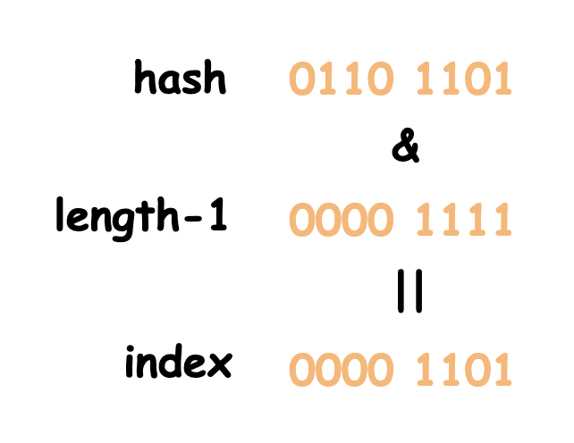

上面这种方法从运算结果的角度上来看, 是一样的, 他们都只用到了hash值的低位信息, 而高位信息没有用到. 因此Java的HashMap在这个的基础上增加了一些操作: 将高16位和低16位二进制进行异或运算, 得到一个新的hash值, 利用了原hash值的全部信息. 

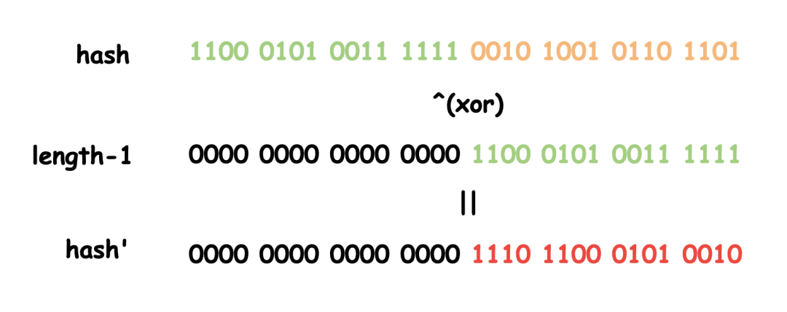


### 初始容量与扩容

1. Java

    > “那就我先吧”，Java帝国的`HashMap`站了起来，“我的默认初始容量是16，有一个叫**负载因子**的参数，默认是0.75。我的策略是，如果内部数组的空间使用了超过75%，那就要准备扩容了，否则后续Hash冲突的概率就会很大。哦对了，扩容时容量得是2的指数次方，原因前面已经交代了”

    HashMap的容量需要是2的k次方. 

2. python

    > `dict{}`第二个起身：“嗯，差不多，我的默认初始容量是8，扩容的时候也是要求是2的指数次方，另外我的负载因子是2/3，扩容时机比这位HashMap老哥更早一些”

    类似Java

3. C#和C++

    > C#帝国代表`HashTable`听闻也起身发言：“我的初始容量是3，至于负载因子嘛，我经过大量实验测试，得出的数据在两位之间，是0.72。容量大小方面我就没有2的指数次方的要求了，而是要求一个**素数**。之所以要求素数的原因，是因为我使用的求模运算进行的映射，使用素数的话，冲突会少一些。”
    >
    > 这时，C++帝国代表`unordered_map`也说话了，“巧了！我也是素数哎，你看，我提前把容量都算好存起来了，到时候扩容就挨个取就行了。”

    关键点: 数组大小是素数的话, 冲突会更少. (不过我觉得初始容量是3也太小了吧...抠门)

    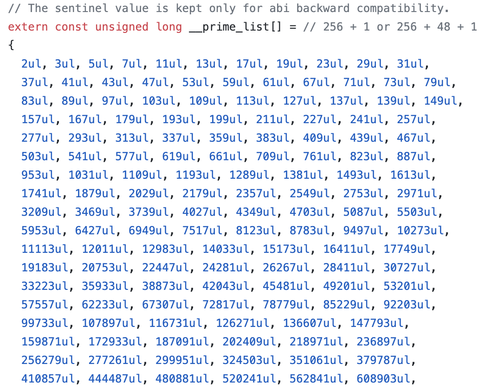

    

### 为什么数组大小(不)要用素数?

从上面的讨论中可以知道, C++和C#的数组大小用素数, 而python和Java则用2的幂次方. 为什么呢?

用素数的原因在于, 生活中有很多数据是有规律的, 比如 `2, 4, 6, 8, 10`. 如果使用了偶数比如6为大小, 则映射到`2, 4, 0, 2, 4`, 如果使用5, 则映射到`2, 4, 1, 3, 0`. 对于这种有规律的数, 素数往往可以使它们更分散, 平均. 

那为什么Java和Python使用2的幂次方呢?

因为他们用了和C++不一样的hash映射方法, 如上面所描述的, 他先将高位与低位异或, 得到了整个数的全部信息, 因此不会出现太多冲突. 而使用2的幂次方, 可以通过使用二进制操作来提高性能.

一般来说, 如果使用了较好的hash function, 那么数组大小就不必是素数.


### 字符串和文件的hash方法

对于字符串, 我们可以将它作为256进制(根据字符串范围来确定)的数字进行hash

[这篇文章列举了多种字符串hash算法](https://blog.csdn.net/MyLinChi/article/details/79508112)

其中效果较好的一种"BKDRHash算法"如下

```c
// BKDR Hash Function
unsigned int BKDRHash(char *str)
{
    unsigned int seed = 131; // 31 131 1313 13131 131313 etc..
    unsigned int hash = 0;
 
    while (*str)
    {
        hash = hash * seed + (*str++);
    }
 
    return (hash & 0x7FFFFFFF);
}
```

那么对于一个文件呢? 如果ascii文本文件, 可以将其当作字符串来处理.

其他文件, 如二进制文件, 个人觉得可以转化成字符串来hash, 方法应该是通用的. 


## hash链表

[我是从leetcode上这道O(1)复杂度实现LRU的题了解到这个数据结构](https://leetcode-cn.com/problems/lru-cache/solution/lru-ce-lue-xiang-jie-he-shi-xian-by-labuladong/) 

hash链表是一种结合了hash和链表的优点的数据结构. 

通过hash, 它可以快速地通过一个键找到一个元素, 也可以快速对单个元素的顺序进行修改. 

它的结构如图所示 

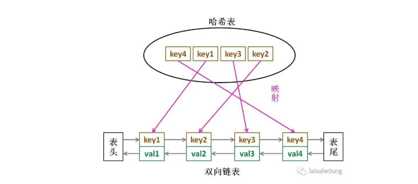


## 布隆过滤器

to be continue

