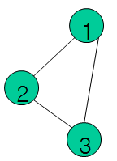
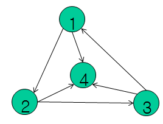
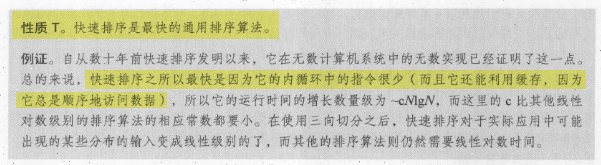
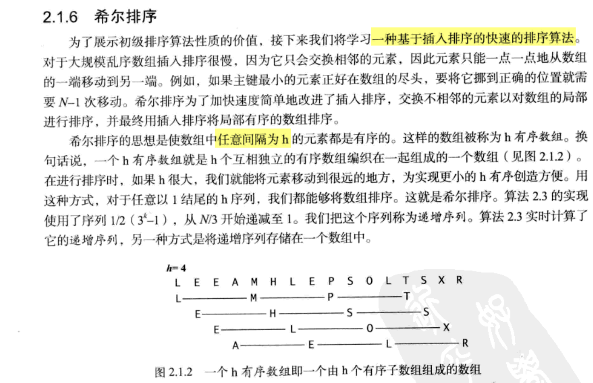
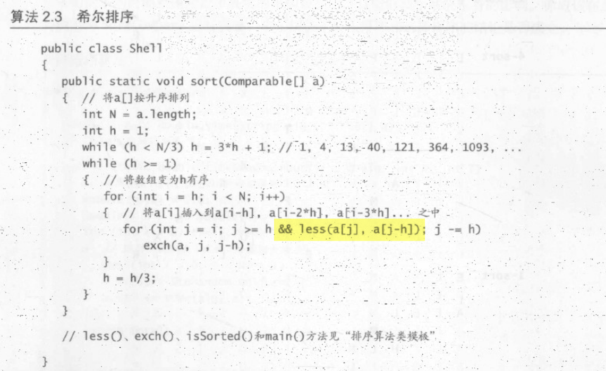

### 判断图是否有环

这篇文章非常详细, 介绍了好几个检测环的算法: 

https://www.cnblogs.com/tenosdoit/p/3644225.html

下面是转载内容

#### **对于无向图**

**算法1**

我们知道对于环1-2-3-4-1，每个节点的度都是2，基于此我们有如下算法（这是类似于有向图的拓扑排序）：

1. 求出图中所有顶点的度，
2. 删除图中所有度<=1的顶点以及与该顶点相关的边，把与这些边相关的顶点的度减一
3. 如果还有度<=1的顶点重复步骤2
4. 最后如果还存在未被删除的顶点，则表示有环；否则没有环

时间复杂度为O（E+V），其中E、V分别为图中边和顶点的数目，这个算法我们稍后分析算法3的时候再分析。

 

**算法2**

深度优先遍历该图，如果在遍历的过程中，发现某个节点有一条边指向已经访问过的节点，并且这个已访问过的节点不是当前节点的父节点（这里的父节点表示dfs遍历顺序中的父节点），则表示存在环。但是我们不能仅仅使用一个bool数组来标志节点是否访问过。如下图

[](https://images0.cnblogs.com/blog/517264/201404/032345087814344.png)

从节点1开始遍历-接着遍历2-接着遍历3，然后发现3有一条边指向遍历过的1，则存在环。但是回到1节点时，它的另一条边指向已访问过的3，又把这个环重复计算了一次。

我们按照算法导论22.3节深度优先搜索中，对每个节点分为三种状态，白、灰、黑。开始时所有节点都是白色，当开始访问某个节点时该节点变为灰色，当该节点的所有邻接点都访问完，该节点颜色变为黑色。那么我们的算法则为：**如果遍历的过程中发现某个节点有一条边指向颜色为灰的节点，那么存在环。**则在上面的例子中，回溯到1节点时，虽然有一条边指向已经访问过的3，但是3已经是黑色，所以环不会被重复计算。

下面的代码中visit数组的值分为0 1 2三种状态分别代表白色、灰色、黑色，调用函数dfs可以输出图中存在的所有环，图用邻接矩阵表示，如果两个节点之间没有边则对应的值为INT_MAX

```
void dfsVisit(vector<vector<int> >&graph, int node, vector<int>&visit,
               vector<int>&father)
{
    int n = graph.size();
    visit[node] = 1;
    //cout<<node<<"-\n";
    for(int i = 0; i < n; i++)
        if(i != node && graph[node][i] != INT_MAX)
        {
            if(visit[i] == 1 && i != father[node])//找到一个环
            {
                int tmp = node;
                cout<<"cycle: ";
                while(tmp != i)
                {
                    cout<<tmp<<"->";
                    tmp = father[tmp];
                }
                cout<<tmp<<endl;
            }
            else if(visit[i] == 0)
            {
                father[i] = node;
                dfsVisit(graph, i, visit, father);
            }
        }
    visit[node] = 2;
}
 
void dfs(vector<vector<int> >&graph)
{
    int n = graph.size();
    vector<int> visit(n, 0); //visit按照算法导论22.3节分为三种状态
    vector<int> father(n, -1);// father[i] 记录遍历过程中i的父节点
    for(int i = 0; i < n; i++)
        if(visit[i] == 0)
            dfsVisit(graph, i, visit, father);
}
```

算法时间复杂度也是O(E+V)

 

#### **对于有向图**

**算法3**

我们都知道对于有向图进行拓扑排序可以判断是否存在环。

对于有向图的拓扑排序，大家都知道的kahn算法：

1. 计算图中所有点的入度，把入度为0的点加入栈

2. 如果栈非空：

    取出栈顶顶点a，输出该顶点值，删除该顶点

    从图中删除所有以a为起始点的边，如果删除的边的另一个顶点入度为0，则把它入栈

3. 如果图中还存在顶点，则表示图中存在环；否则输出的顶点就是一个拓扑排序序列

如果利用上面的拓扑排序算法求环，可以判断是否有环，但是输出环时有点麻烦。因为并不是所有最后剩余的点都是环中的顶点，比如如下情况：

[](https://images0.cnblogs.com/blog/517264/201404/032345092182744.png)

对这个图运行上面的算法，最后所有的节点都不会被删除，但是只有1 2 3是环中的点，4不是环中的节点。

对于上面的算法1，和算法3的思想是一样的，所以也会存在这个问题。

 

**算法4**

其实算法2可以原封不动的搬来就可以检测并且输出所有有向图中的环                        [本文地址](http://www.cnblogs.com/TenosDoIt/p/3644225.html)

 

**算法5**

根据有向图的强连通分量算法，每个强连通分量中必定存在环，因为根据强连通分量的定义：从顶点 i 到 j 有一条路径，并且从 j 到 i 也有一条路径。求强连通分量的算法可以参考维基百科[here](http://zh.wikipedia.org/wiki/强连通分量)


**补充：利用dfs来拓扑排序**

只要对算法2稍微改动就可以输出有向图的拓扑排序结果，即按照节点标记为黑色的时间，越先标记为黑色，在拓扑序列中越靠后。我们在算法2的基础上加了一个栈来保存拓扑排序的结果，只有dfsVisit的最后一行有改动，该算法，可以完成拓扑排序，并且同时可以检测图中是否有环。（该算法思想和算法导论22.4节拓扑排序一样）

```
stack<int> tuopu;
 
void dfsVisit(vector<vector<int> >&graph, int node, vector<int>&visit,
               vector<int>&father)
{
    int n = graph.size();
    visit[node] = 1;
    //cout<<node<<"-\n";
    for(int i = 0; i < n; i++)
        if(i != node && graph[node][i] != INT_MAX)
        {
            if(visit[i] == 1 && i != father[node])//找到一个环
            {
                int tmp = node;
                cout<<"cycle: ";
                while(tmp != i)
                {
                    cout<<tmp<<"->";
                    tmp = father[tmp];
                }
                cout<<tmp<<endl;
            }
            else if(visit[i] == 0)
            {
                father[i] = node;
                dfsVisit(graph, i, visit, father);
            }
        }
    visit[node] = 2;
    tuopu.push(node);
}
 
void dfs(vector<vector<int> >&graph)
{
    int n = graph.size();
    vector<int> visit(n, 0); //visit按照算法导论22.3节分为三种状态
    vector<int> father(n, -1);// father[i] 记录遍历过程中i的父节点
    for(int i = 0; i < n; i++)
        if(visit[i] == 0)
            dfsVisit(graph, i, visit, father);
}
```


### 排序算法比较

https://blog.csdn.net/qq_39521554/article/details/79364718

为什么快排, 归并排序, 堆排序都是O(nlogn), 而快排性能往往更优?

甚至快排最坏O(n^2), 而堆排序最坏O(nlogn), 但快排要快很多?

> 堆排序每次取一个最大值和堆底部的数据交换，重新筛选堆，把堆顶的X调整到位，有很大可能是依旧调整到堆的底部（堆的底部X显然是比较小的数，才会在底部），然后再次和堆顶最大值交换，再调整下来，可以说堆排序做了许多无用功。
>
> 总结起来就是，快排的最坏时间虽然复杂度高，但是在统计意义上，这种数据出现的概率极小，而堆排序过程里的交换跟快排过程里的交换虽然都是常量时间，但是常量时间差很多。

```
测试的平均排序时间：数据是随机整数，时间单位是s
数据规模    快速排序       归并排序        希尔排序        堆排序
1000万       0.75           1.22          1.77          3.57
5000万       3.78           6.29          9.48         26.54  
1亿          7.65          13.06         18.79         61.31
```

下面来自《算法》第四版




### 希尔排序

一种基于插入排序的排序算法(似乎比堆排序的效率还要高)






