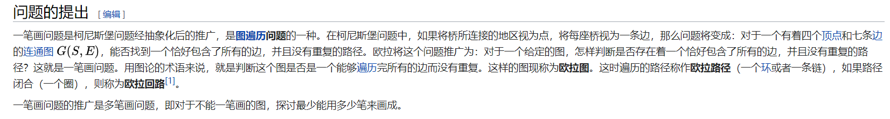
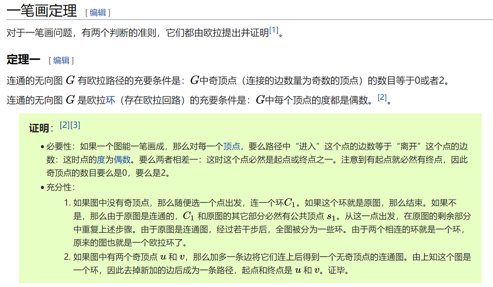
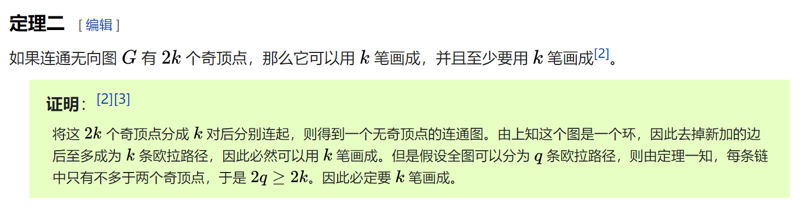
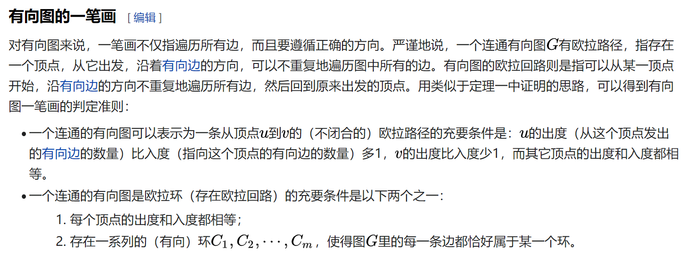

## 排序


### 排序算法比较

https://blog.csdn.net/qq_39521554/article/details/79364718

为什么快排, 归并排序, 堆排序都是O(nlogn), 而快排性能往往更优?

甚至快排最坏O(n^2), 而堆排序最坏O(nlogn), 但快排要快很多?

> 堆排序每次取一个最大值和堆底部的数据交换，重新筛选堆，把堆顶的X调整到位，有很大可能是依旧调整到堆的底部（堆的底部X显然是比较小的数，才会在底部），然后再次和堆顶最大值交换，再调整下来，可以说堆排序做了许多无用功。
>
> 总结起来就是，快排的最坏时间虽然复杂度高，但是在统计意义上，这种数据出现的概率极小，而堆排序过程里的交换跟快排过程里的交换虽然都是常量时间，但是常量时间差很多。

```
测试的平均排序时间：数据是随机整数，时间单位是s
数据规模    快速排序       归并排序        希尔排序        堆排序
1000万       0.75           1.22          1.77          3.57
5000万       3.78           6.29          9.48         26.54  
1亿          7.65          13.06         18.79         61.31
```

下面来自《算法》第四版


### 希尔排序

一种基于插入排序的排序算法(似乎比堆排序的效率还要高)


## 图论

### 单源最短路

[看对这几种最短路算法的复杂度分析](https://blog.csdn.net/xiazdong/article/details/8193680) 


#### dijkstra

朴素版O(n^2 + m)复杂度, 不支持负权边

[洛谷模板题-数据弱化版](https://www.luogu.com.cn/problem/P3371)

代码

```cpp
/**
 * dijkstra 不支持负权边
*/

#include <bits/stdc++.h>

using namespace std;

struct Edge {
	int next, val;
	Edge(int n, int v): next(n), val(v) {}
};

void Dijkstra(int s, vector<Edge> edges[], vector<int>& dst) {
	int n = dst.size();
	for (auto& v: dst) {
		v = INT_MAX;
	}
	vector<bool> visted(n);
	dst[s] = 0;

	for (int i = 1; i < n; i++) {
		int min_v = INT_MAX, next = -1;
		for (int j = 1; j < n; j++) {
			if (!visted[j] && dst[j] < min_v) {
				min_v = dst[j];
				next = j;
			}
		}
		if (next == -1) {
			break;
		}
		visted[next] = true;
		for (int j = 0; j < edges[next].size(); j++) {
			int nxt = edges[next][j].next;
			if (visted[nxt] == false && edges[next][j].val + dst[next] < dst[nxt]) {
				dst[nxt] = edges[next][j].val + dst[next];
			}
		}
	}
}

int main() {
	ios::sync_with_stdio(false);
	int n, m, s;
	cin >> n >> m >> s;
	vector<Edge> edges[n + 1];
	vector<int> dst(n + 1);
	for (int i = 0, x, y, z; i < m; i++) {
		cin >> x >> y >> z;
		edges[x].emplace_back(Edge(y, z));
		// edges[y].emplace_back(Edge(x, z));
	}
	Dijkstra(s, edges, dst);
	for (int i = 1; i < dst.size(); i++) {
		cout << dst[i] << ' ';
	}
}
```

dijkstra可以用最小堆优化, 复杂度O(nlogn + m) 

[洛谷模板题-标准版](https://www.luogu.com.cn/problem/P4779) 

```cpp
/* -------------------------------------------------------------------------- */
/*                               最大堆优化版的dijkstra                        */
/* -------------------------------------------------------------------------- */

#include <bits/stdc++.h>

using namespace std;

struct Edge {
	int next, val;
	Edge(int n, int v) : next(n), val(v) {}
};

struct Node {
	int id, dst;
	// 重载, 最大堆
	bool operator<(const Node& node) const {
		return dst > node.dst;
	}
};

void Dijkstra(int s, vector<Edge> edges[], vector<int>& dst) {
	int n = dst.size();
	for (auto& v : dst) {
		v = INT_MAX;
	}
	dst[s] = 0;

	priority_queue<Node> Q;
	Q.push(Node{s, 0});

	while (Q.size()) {
		int next	 = Q.top().id;
		int next_dst = Q.top().dst;
		Q.pop();
		if (next_dst != dst[next]) {
			continue;
		}

		for (int j = 0; j < edges[next].size(); j++) {
			int nxt = edges[next][j].next;
			if (edges[next][j].val + dst[next] < dst[nxt]) {
				dst[nxt] = edges[next][j].val + dst[next];
				Q.push(Node{nxt, dst[nxt]});
			}
		}
	}
}

int main() {
	ios::sync_with_stdio(false);
	int n, m, s;
	cin >> n >> m >> s;
	vector<Edge> edges[n + 1];
	vector<int> dst(n + 1);
	for (int i = 0, x, y, z; i < m; i++) {
		cin >> x >> y >> z;
		edges[x].emplace_back(Edge(y, z));
	}
	Dijkstra(s, edges, dst);
	for (int i = 1; i < dst.size(); i++) {
		cout << dst[i] << ' ';
	}
}
```


#### SPFA算法

SPFA最坏情况O(mn), 因此有的题会卡点. 用更稳定的优化的dijkstra更好一些

SPFA也可以求最短路, 可以有负权边, 但不支持负环

```cpp
/*
spfa是利用普通队列, 从起点开始, 将他更新的点(得到更小的距离)加入到队列中(如果不在队列)
这个方法最坏情况会遍历所有的边, 适合在点稀疏的情况下使用

缺点:
spfa支持负权边, 但不能处理负环

特点:
可以用来判断是否存在负环
*/

#include <bits/stdc++.h>

using namespace std;

struct Edge {
	int next, val;
	Edge(int n, int v): next(n), val(v) {}
};

void SPFA(int s, vector<Edge> edges[], vector<int>& dst) {
	for (auto& d: dst) {
		d = INT_MAX;
	}
	dst[s] = 0;

	vector<int> inQueue(dst.size());
	queue<int> Q;
	Q.emplace(s);
	inQueue[s] = true;

	while (!Q.empty()) {
		int front = Q.front(); 
		Q.pop();
		inQueue[front] = false;
		for (auto nxtn: edges[front]) {
			if (dst[nxtn.next] > dst[front] + nxtn.val) {
				dst[nxtn.next] = dst[front] + nxtn.val;
				if (inQueue[nxtn.next] == false) {
					inQueue[nxtn.next] = true;
					Q.push(nxtn.next);
				}
			}
		}
	}
}

int main() {
	ios::sync_with_stdio(false);
	int n, m, s;
	cin >> n >> m >> s;
	vector<Edge> edges[n + 1];
	vector<int> dst(n + 1);
	for (int i = 0, x, y, z; i < m; i++) {
		cin >> x >> y >> z;
		edges[x].emplace_back(Edge(y, z));
	}
	SPFA(s, edges, dst);
	for (int i = 1; i < dst.size(); i++) {
		cout << dst[i] << ' ';
	}
}
```

#### SPFA判环

SPFA还有一个作用就是用来判定是否有负环

[洛谷模板题](https://www.luogu.com.cn/problem/P3385), 注意条件 

```cpp
/**
 * spfa的一点改造: 判断是否存在负环
 */

#include <bits/stdc++.h>

using namespace std;

struct Edge {
	int next, val;
	Edge(int n, int v) : next(n), val(v) {}
};

bool SPFA(int s, vector<Edge> edges[], vector<int>& dst) {
	for (auto& d : dst) {
		d = INT_MAX;
	}
	dst[s] = 0;

	vector<int> inQueue(dst.size());
	vector<int> cnt(dst.size());
	queue<int> Q;
	Q.emplace(s);
	cnt[s]++;
	inQueue[s] = true;

	while (!Q.empty()) {
		int front = Q.front();
		Q.pop();
		inQueue[front] = false;
		for (auto nxtn : edges[front]) {
			if (dst[nxtn.next] > dst[front] + nxtn.val) {
				cnt[nxtn.next] += 1;
				if (cnt[nxtn.next] >= dst.size() - 1) {
					return true;
				}
				dst[nxtn.next] = dst[front] + nxtn.val;
				if (inQueue[nxtn.next] == false) {
					inQueue[nxtn.next] = true;
					Q.push(nxtn.next);
				}
			}
		}
	}
	return false;
}

int main() {
	ios::sync_with_stdio(false);
	int T;
	cin >> T;
	while (T--) {
		int n, m;
		cin >> n >> m;
		vector<Edge> edges[n + 1];
		vector<int> dst(n + 1);
		for (int i = 0, x, y, z; i < m; i++) {
			cin >> x >> y >> z;
			edges[x].emplace_back(Edge(y, z));
			// 题目诡异的要求
			if (z >= 0) {
				edges[y].emplace_back(Edge(x, z));
			}
		}
		bool res = SPFA(1, edges, dst);
		cout << (res ? "YES" : "NO") << endl;
	}
}
```


### 多源最短路

floyd算法: O(n^3)的复杂度

最外层遍历的结点i代表以i为中间结点

里面两层遍历分别代表源和目的结点, 如果通过中间节点使得源和目的节点更新了, 那就更新. 遍历完三层之后得到结果. 


### 最小生成树

#### kruskal

将边从小到大排序, 然后依次挑选未连通的点的边合并进入最小生成树. 当总的边数量为n-1时就可以停止了. 如何判断两个点没有连通呢? 可以通过并查集. 

复杂度O(mlogm), m为边的数量

[洛谷模板题](https://www.luogu.com.cn/problem/P3366) 

```cpp
#include <bits/stdc++.h>

using namespace std;

struct Edge {
	int from, to, val;
	Edge(int f, int t, int v) : from(f), to(t), val(v) {}
};

// 通过并查集查找祖结点
int find(vector<int>& fa, int sub) {
	// 路径压缩
	while (sub != fa[sub]) {
		sub = fa[sub] = fa[fa[sub]];
	}
	return sub;
}

int main() {
	ios::sync_with_stdio(false);
	int n, m;
	cin >> n >> m;
	vector<Edge> edges;
	for (int i = 0, x, y, z; i < m; i++) {
		cin >> x >> y >> z;
		edges.push_back(Edge{x, y, z});
	}
	sort(edges.begin(), edges.end(), [](const Edge& x, const Edge& y) {return x.val < y.val;});

	unordered_map<int, bool> has;
	int res = 0;
	int cnt = 0;
	// 并查集
	vector<int> father(n + 1);
	for (int i = 1; i <= n; i++) {
		father[i] = i;
	}
	for (auto edge: edges) {
		int fa = find(father, edge.from);
		int fb = find(father, edge.to);
		if (fa != fb) {
			cnt += 1;
			res += edge.val;
			father[fb] = fa;
			if (cnt == n - 1) {
				break;
			}
			has[edge.from] = has[edge.to] = true;
		}
	}
	cout << res << endl;
}

/*
4 5
1 2 2
1 3 2
1 4 3
2 3 4
3 4 3
*/
```


#### prim

**优先队列实现. 注意添加边的时候是双向边, 要添加两条, 而kruskal的边不区分方向, 有点不同. dijkstra的边区分方向.**  

和dijkstra的不同在于, 距离不同, 存的是边的距离. 以及需要计数, 得到了n-1条边就可以停止.

复杂度O(nlogn + m)

```cpp
/* -------------------------------------------------------------------------- */
/*                               最大堆优化版的prim                            */
/* -------------------------------------------------------------------------- */

#include <bits/stdc++.h>

using namespace std;

struct Edge {
	int next, val;
	Edge(int n, int v) : next(n), val(v) {}
};

struct Node {
	int id, dst;
	// 重载, 最大堆
	bool operator<(const Node& node) const {
		return dst > node.dst;
	}
};

int Prim(int s, vector<Edge> edges[], vector<int>& dst) {
	int n = dst.size();
	for (auto& v : dst) {
		v = INT_MAX;
	}
	dst[s] = 0;

	priority_queue<Node> Q;
	Q.push(Node{s, 0});
	int cnt = 0, dis = 0;
	vector<bool> visted(n);

	while (Q.size() && cnt < n) {
		int next	 = Q.top().id;
		int next_dst = Q.top().dst;
		Q.pop();
		if (visted[next]) {
			continue;
		}
		visted[next] = true;
		cnt++;
		dis += next_dst;

		for (int j = 0; j < edges[next].size(); j++) {
			int nxt = edges[next][j].next;
			if (edges[next][j].val < dst[nxt]) {
				dst[nxt] = edges[next][j].val;
				Q.push(Node{nxt, dst[nxt]});
			}
		}
	}
	return dis;
}

int main() {
	ios::sync_with_stdio(false);
	int n, m;
	cin >> n >> m;
	vector<Edge> edges[n + 1];
	vector<int> dst(n + 1);
	for (int i = 0, x, y, z; i < m; i++) {
		cin >> x >> y >> z;
		edges[x].emplace_back(Edge(y, z));
		edges[y].emplace_back(Edge(x, z));
	}
	int dis = Prim(1, edges, dst);
	cout << dis << endl;
}
```


### 拓扑排序


### 有向无环图DAG


### 判断图是否有环

这篇文章非常详细, 介绍了好几个检测环的算法: 

https://www.cnblogs.com/tenosdoit/p/3644225.html

下面是转载内容

#### **对于无向图**

**算法1**

我们知道对于环1-2-3-4-1，每个节点的度都是2，基于此我们有如下算法（这是类似于有向图的拓扑排序）：

1. 求出图中所有顶点的度，
2. 删除图中所有度<=1的顶点以及与该顶点相关的边，把与这些边相关的顶点的度减一
3. 如果还有度<=1的顶点重复步骤2
4. 最后如果还存在未被删除的顶点，则表示有环；否则没有环

时间复杂度为O（E+V），其中E、V分别为图中边和顶点的数目，这个算法我们稍后分析算法3的时候再分析。

 

**算法2**

深度优先遍历该图，如果在遍历的过程中，发现某个节点有一条边指向已经访问过的节点，并且这个已访问过的节点不是当前节点的父节点（这里的父节点表示dfs遍历顺序中的父节点），则表示存在环。但是我们不能仅仅使用一个bool数组来标志节点是否访问过。如下图

[](https://images0.cnblogs.com/blog/517264/201404/032345087814344.png)

从节点1开始遍历-接着遍历2-接着遍历3，然后发现3有一条边指向遍历过的1，则存在环。但是回到1节点时，它的另一条边指向已访问过的3，又把这个环重复计算了一次。

我们按照算法导论22.3节深度优先搜索中，对每个节点分为三种状态，白、灰、黑。开始时所有节点都是白色，当开始访问某个节点时该节点变为灰色，当该节点的所有邻接点都访问完，该节点颜色变为黑色。那么我们的算法则为：**如果遍历的过程中发现某个节点有一条边指向颜色为灰的节点，那么存在环。**则在上面的例子中，回溯到1节点时，虽然有一条边指向已经访问过的3，但是3已经是黑色，所以环不会被重复计算。

下面的代码中visit数组的值分为0 1 2三种状态分别代表白色、灰色、黑色，调用函数dfs可以输出图中存在的所有环，图用邻接矩阵表示，如果两个节点之间没有边则对应的值为INT_MAX

```cpp
void dfsVisit(vector<vector<int> >&graph, int node, vector<int>&visit,
               vector<int>&father)
{
    int n = graph.size();
    visit[node] = 1;
    //cout<<node<<"-\n";
    for(int i = 0; i < n; i++)
        if(i != node && graph[node][i] != INT_MAX)
        {
            if(visit[i] == 1 && i != father[node])//找到一个环
            {
                int tmp = node;
                cout<<"cycle: ";
                while(tmp != i)
                {
                    cout<<tmp<<"->";
                    tmp = father[tmp];
                }
                cout<<tmp<<endl;
            }
            else if(visit[i] == 0)
            {
                father[i] = node;
                dfsVisit(graph, i, visit, father);
            }
        }
    visit[node] = 2;
}
 
void dfs(vector<vector<int> >&graph)
{
    int n = graph.size();
    vector<int> visit(n, 0); //visit按照算法导论22.3节分为三种状态
    vector<int> father(n, -1);// father[i] 记录遍历过程中i的父节点
    for(int i = 0; i < n; i++)
        if(visit[i] == 0)
            dfsVisit(graph, i, visit, father);
}
```

算法时间复杂度也是O(E+V)

 

#### **对于有向图**

**算法3**

我们都知道对于有向图进行拓扑排序可以判断是否存在环。

对于有向图的拓扑排序，大家都知道的kahn算法：

1. 计算图中所有点的入度，把入度为0的点加入栈

2. 如果栈非空：

    取出栈顶顶点a，输出该顶点值，删除该顶点

    从图中删除所有以a为起始点的边，如果删除的边的另一个顶点入度为0，则把它入栈

3. 如果图中还存在顶点，则表示图中存在环；否则输出的顶点就是一个拓扑排序序列

如果利用上面的拓扑排序算法求环，可以判断是否有环，但是输出环时有点麻烦。因为并不是所有最后剩余的点都是环中的顶点，比如如下情况：

[](https://images0.cnblogs.com/blog/517264/201404/032345092182744.png)

对这个图运行上面的算法，最后所有的节点都不会被删除，但是只有1 2 3是环中的点，4不是环中的节点。

对于上面的算法1，和算法3的思想是一样的，所以也会存在这个问题。

 

**算法4**

其实算法2可以原封不动的搬来就可以检测并且输出所有有向图中的环                        [本文地址](http://www.cnblogs.com/TenosDoIt/p/3644225.html)

 

**算法5**

根据有向图的强连通分量算法，每个强连通分量中必定存在环，因为根据强连通分量的定义：从顶点 i 到 j 有一条路径，并且从 j 到 i 也有一条路径。求强连通分量的算法可以参考维基百科[here](http://zh.wikipedia.org/wiki/强连通分量)


**补充：利用dfs来拓扑排序**

只要对算法2稍微改动就可以输出有向图的拓扑排序结果，即按照节点标记为黑色的时间，越先标记为黑色，在拓扑序列中越靠后。我们在算法2的基础上加了一个栈来保存拓扑排序的结果，只有dfsVisit的最后一行有改动，该算法，可以完成拓扑排序，并且同时可以检测图中是否有环。（该算法思想和算法导论22.4节拓扑排序一样）

```cpp
stack<int> tuopu;
 
void dfsVisit(vector<vector<int> >&graph, int node, vector<int>&visit,
               vector<int>&father)
{
    int n = graph.size();
    visit[node] = 1;
    //cout<<node<<"-\n";
    for(int i = 0; i < n; i++)
        if(i != node && graph[node][i] != INT_MAX)
        {
            if(visit[i] == 1 && i != father[node])//找到一个环
            {
                int tmp = node;
                cout<<"cycle: ";
                while(tmp != i)
                {
                    cout<<tmp<<"->";
                    tmp = father[tmp];
                }
                cout<<tmp<<endl;
            }
            else if(visit[i] == 0)
            {
                father[i] = node;
                dfsVisit(graph, i, visit, father);
            }
        }
    visit[node] = 2;
    tuopu.push(node);
}
 
void dfs(vector<vector<int> >&graph)
{
    int n = graph.size();
    vector<int> visit(n, 0); //visit按照算法导论22.3节分为三种状态
    vector<int> father(n, -1);// father[i] 记录遍历过程中i的父节点
    for(int i = 0; i < n; i++)
        if(visit[i] == 0)
            dfsVisit(graph, i, visit, father);
}
```


###  并查集

[洛谷模板题](https://www.luogu.com.cn/problem/P3367) 

主要是find函数, 路径压缩

```cpp
class UnionMergeSet {
   private:
	vector<int> father;

   public:
	void merge(int x, int y) {
		int fx = find(x), fy = find(y);
		father[fx] = fy;
	}

	bool isOneSet(int x, int y) {
		int fx = find(x), fy = find(y);
		return fx == fy;
	}
    
    int find(int x) {
		return x == father[x] ? x : father[x] = find(father[x]);
	}

   public:
	UnionMergeSet(int n) {
		father.resize(n + 1);
		for (int i = 1; i <= n; i++) {
			father[i] = i;
		}
	}
};
```

[399. 除法求值-带权并查集](https://leetcode-cn.com/problems/evaluate-division/) 


### 二分图

[维基百科]([https://zh.wikipedia.org/wiki/%E4%BA%8C%E5%88%86%E5%9B%BE](https://zh.wikipedia.org/wiki/二分图)) 

[二分图的最大匹配、完美匹配和匈牙利算法](https://www.renfei.org/blog/bipartite-matching.html) 

[leetcode-判断二分图](https://leetcode-cn.com/problems/is-graph-bipartite/) 

判断二分图比较简单, 只需要dfs染色遍历即可. 


### 欧拉路径

[332. 重新安排行程](https://leetcode-cn.com/problems/reconstruct-itinerary/) 

[一笔画问题]([https://zh.wikipedia.org/wiki/%E4%B8%80%E7%AC%94%E7%94%BB%E9%97%AE%E9%A2%98](https://zh.wikipedia.org/wiki/一笔画问题))



如何判定是否有**欧拉回路**? 是否有**欧拉路径**? 



需要有多少画? 



有向图略有不同




### tsp问题


### 哈密顿问题


### 中国邮差问题

