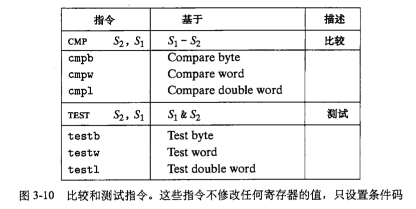

## 一些过程

### CPU指令执行过程

PC寄存器指向的地址是物理地址还是逻辑地址?

是逻辑地址: https://blog.csdn.net/weixin_42682806/article/details/84959647

> PC中存放的是下一条要执行指令的地址，通常程序都是按地址连续存储的，而明显在物理空间中是不会连续的，所以如果PC中存储的是物理地址，那么加1就不一定是下一条指令了。这是理解问题的一个方面。

首先CPU获取PC寄存器存放的逻辑地址, 逻辑地址经过MMU的地址翻译, 转化为实际的物理地址, 然后取出下一条指令(二进制), CPU再执行这个指令. 

执行过程如果要访问内存, 那么它会先经过MMU(访问TLB, 如果没有缓存则访问内存上的页表), 得到物理地址. 然后访问这个物理地址的时候会先访问L1, L2, L3缓存, 如果没有则会访问内存. 如果内存也没有, 那么可能是有效位为1存在位为0, 发生缺页异常, 代表映射了但是被交换到磁盘了, 那么从磁盘中交换出来. 如果有效位为0, 说明没有映射, 那么找到一片空闲内存空间建立映射. 根据实际情况判断是否需要从磁盘中加载文件到内存. 

下面转载这篇博客: https://blog.csdn.net/aigoogle/article/details/23750257

过程详述：
几乎所有的冯·诺伊曼型计算机的CPU，其工作都可以分为5个阶段：**取指令、指令译码、执行指令、访存取数、结果写回**。


1．**取指令阶段**

取指令（Instruction Fetch，IF）阶段是将一条指令从主存中取到指令寄存器的过程。

程序计数器PC中的数值，用来指示当前指令在主存中的位置。当一条指令被取出后，PC中的数值将根据指令字长度而自动递增：若为单字长指令，则(PC)+1àPC；若为双字长指令，则(PC)+2àPC，依此类推。

2．**指令译码阶段**

取出指令后，计算机立即进入指令译码（Instruction Decode，ID）阶段。

在指令译码阶段，指令译码器按照预定的指令格式，对取回的指令进行拆分和解释，识别区分出不同的指令类别以及各种获取操作数的方法。

在组合逻辑控制的计算机中，指令译码器对不同的指令操作码产生不同的控制电位，以形成不同的微操作序列；在微程序控制的计算机中，指令译码器用指令操作码来找到执行该指令的微程序的入口，并从此入口开始执行。

在传统的设计里，CPU中负责指令译码的部分是无法改变的。不过，在众多运用微程序控制技术的新型CPU中，微程序有时是可重写的，可以通过修改成品CPU来改变CPU的译码方式。

3．**执行指令阶段**

在取指令和指令译码阶段之后，接着进入执行指令（Execute，EX）阶段。

此阶段的任务是完成指令所规定的各种操作，具体实现指令的功能。为此，CPU的不同部分被连接起来，以执行所需的操作。

例如，如果要求完成一个加法运算，算术逻辑单元ALU将被连接到一组输入和一组输出，输入端提供需要相加的数值，输出端将含有最后的运算结果。

4．**访存取数阶段**

根据指令需要，有可能要访问主存，读取操作数，这样就进入了访存取数（Memory，MEM）阶段。

此阶段的任务是：根据指令地址码，得到操作数在主存中的地址，并从主存中读取该操作数用于运算。

5．**结果写回阶段**

作为最后一个阶段，结果写回（Writeback，WB）阶段把执行指令阶段的运行结果数据“写回”到某种存储形式：结果数据经常被写到CPU的内部寄存器中，以便被后续的指令快速地存取；在有些情况下，结果数据也可被写入相对较慢、但较廉价且容量较大的主存。许多指令还会改变程序状态字寄存器中标志位的状态，这些标志位标识着不同的操作结果，可被用来影响程序的动作。

在指令执行完毕、结果数据写回之后，若无意外事件（如结果溢出等）发生，计算机就接着从程序计数器PC中取得下一条指令地址，开始新一轮的循环，下一个指令周期将顺序取出下一条指令。

许多新型CPU可以同时取出、译码和执行多条指令，体现并行处理的特性。


### 一个进程运行的过程

举一个在shell中执行的进程, 如输入 ls

shell首先检查环境变量, 发现ls是一个内置的命令, 于是fork一个子进程, 这个子进程除了pid基本和shell一样. 然后设置这个子进程的环境变量, 参数. 接下来执行exec函数. exec函数会调用一个加载器, 加载器是一段操作系统代码, 它驻留在内存中. 它会将可执行文件的代码和数据加载到进程中, 然后跳转到程序的入口点. 系统开始执行这个进程. 在此进程执行完毕之后, 会返回到call main的下一条指令, 然后将控制权还给内核. 


### 一个中断发生的过程

什么是中断?

中断是异常的一种, 他是一种**异步异常**. 之所以说他是异步异常, 是因为**中断的发生是来自处理器外部的IO设备(如网络适配器, 磁盘控制器)的信号的结果. 硬件中断不是由任何一条专门的指令造成的.** 


**通过向处理器芯片上的一个引脚发信号，并将异常号放到系统总线上，以触发中断，这个异常号标识了引起中断的设备。**

在当前指令完成执行之后，处理器进入中断周期, 注意到**中断引脚的电压变高**了，就**从系统总线读取异常号**, 然后调用适当的中断处理程序. 

当处理程序返回时，它就**将控制返回给下一条指令**, 结果是程序继续执行，就好像没有发生过中断一样。


### 一个系统调用发生的过程

什么是系统调用? 系统调用是陷阱, 陷阱是有意的异常. 系统调用是**在用户程序和内核之间的一个像过程一样的接口**. 用户程序像内核请求服务, 比如读文件read, 创建进程fork, 加载程序exec, 终止进程exit. 

指令

```
syscall n
```

会导致一个到异常处理程序的陷阱. 


当用户进程使用系统调用, 处理器执行时检测到它.

Linux系统调用的参数是**通过通用寄存器**而不是栈传递的. 

* %eax 寄存器保存 系统调用号
* %ebx, %ecx, %edx, %esi, %edi, %ebp等都可以用来保存参数(最多6个)

比如这样一个系统级函数


它对应的汇编代码是这样的


当然, 在执行系统调用之前, 需要将之前正在执行的进程的上下文保存, 就跟进程调度时做的一样. 


### 一个信号发生的过程

Unix信号是一种软件形式的异常, **允许进程中断其他进程**(包括自己). 信号通知进程发生了某种类型的事件, 比如一个进程发生了除0错误(它是一个故障)的时候, 进程并不知道. 这个时候内核给他发送一个SIGFPE信号. 


下面来描述一下当在shell中执行一个前台进程, 然后按`ctrl+c`终止它的过程

shell捕获到键盘的输入`ctrl+c`, 然后他会给他的所有处在前台的进程发送一个SIGINT信号. 这个信号并不是像中断那样立刻去执行, 而是会等到接收信号的进程被调度时, 在运行之前先执行信号处理函数(handle函数). 

在Linux中, 可通过kill系统调用来发送一个信号


在任何时刻, 对于一个进程, 一种类型的信号最多只有一个待处理信号. 如果进程正在处理一个信号, 那么下一个同类型的信号就会被阻塞, 而第三个同类型的信号如果这个时候过来的话就会被丢弃. 这样在某些情况下会导致一些问题, 比如父进程处理僵尸进程的时候, 子进程变成僵尸进程的时候会给父进程发送信号(**给父进程发送SIGCHLD信号**), 然后父进程用信号处理函数去wait子进程, 将他回收. 由于同时存在的同一类型信号不能同时存在三个或以上, 那么就有的子进程无法被回收. 

比如

原先是这样子的


可以通过把if变成while来解决(虽然它还是有缺陷的)


这篇文章讲得非常详细: https://www.cnblogs.com/taobataoma/archive/2007/08/30/875743.html

内核处理一个进程收到的信号的时机是在一个进程从内核态返回用户态时。所以，当一个进程在内核态下运行时，软中断信号并不立即起作用，要等到将返回用户态时才处理。进程只有处理完信号才会返回用户态，进程在用户态下不会有未处理完的信号。

如果进程收到一个要捕捉的信号，那么进程从内核态返回用户态时执行用户定义的函数。而且执行用户定义的函数的方法很巧妙，**内核是在用户栈上创 建一个新的层**，该层中将返回地址的值设置成用户定义的处理函数的地址，这样进程从内核返回弹出栈顶时就返回到用户定义的函数处，从函数返回再弹出栈顶时， 才返回原先进入内核的地方。**这样做的原因是用户定义的处理函数不能且不允许在内核态下执行（如果用户定义的函数在内核态下运行的话，用户就可以获得任何权 限）。** 


### 一个地址翻译的过程


### 进程切换的过程


## 内核

### 内核态

> “CS寄存器还有一个很重要的功能，它含有一个两位的字段，用以指明CPU的当前特权级。值0代表最高优先级，而值为3代表最低优先级。Linux只用0级和3级，分别称之为内核态和用户态”

知乎上一个对于内核态的一个问题: https://www.zhihu.com/question/306127044

> * 内核态，或者说CPU的特权模式，是CPU的一种工作状态，它影响CPU对不同指令的执行结果。操作系统通过跟CPU配合，设置特权模式和用户模式，来防止应用程序进行越权的操作
>
> * 防止应用程序越权访问内存时使用了虚拟地址空间映射的技术，这是操作系统软件配合硬件的MMU共同实现的。在用户模式下，应用程序访问的内存地址是虚拟内存地址，会映射到操作系统指定的物理地址上。这个虚拟内存地址空间就是你说的用户空间。
>
> * 内核态是个操作系统概念，虽然对应到CPU的特权模式，但一般如果没有操作系统，就不说内核态了，直接说运行在CPU的特权模式应该没毛病。
>
> * 应用程序无法自由进入内核态，只能通过操作系统提供的接口调用进入，或者在硬件中断到来时被动进入
>
> * 应用程序通过操作系统功能来使用硬件
>
> 来源：https://www.zhihu.com/question/306127044/answer/555327651

另一个回答

> 进入内核态就是CPU在执行内核代码，可以认为CPU被操作系统内核占用了
>
> 内核态是一个状态，而不是一个位置。表示当前CPU在执行操作系统内核代码。内核态是操作系统的概念，CPU没有内核态一说。CPU有各种特权级，表示CPU的状态。一般来说操作系统内核态会在CPU的高特权级下执行，而应用程序会在CPU的低特权级下执行，这个是操作系统的逻辑决定的。
>
> 没有操作系统，也就没有内核态了。程序可以运行在CPU的任意特权级下，完全由程序自己逻辑决定。
>
> 操作系统可以决定把硬盘访问划到内核态执行，也可以把硬盘访问开放给应用程序，这个由系统设计初衷决定。
>
> 用户空间是操作系统划给应用程序使用的内存空间，当应用程序访问不属于自己的内存空间时，操作系统会检测到。这个检测是硬件做的，一般叫MMU或者MPU，具体规则由系统启动时配置好的。应用程序访问内存也需要通过MMU或者MPU，理论上会影响访问速度。
>
> 这个由硬件电路决定，南桥北桥只有PC有这个玩意。
>
> 普通用户可以通过触发指定的软中断/异常进入内核态，非内核态一般运行在CPU的低特权级下，在这种特权级下，只能访问有限的寄存器。
>
> 中断/异常向量表由芯片设计决定，可能是固定位置，也可能是启动后配置。发生中断/异常后硬件会去这个表查对应的处理函数。具体位置查阅芯片编程手册就可以了。
>
> 来源：https://www.zhihu.com/question/306127044/answer/555354376


### 内核态线程和用户态线程


## 汇编

csapp中介绍的CPU架构是**IA32 中央处理单元 (CPU)**

从百度百科的介绍上来看, 也被称x86或i386. 


### AT&T与intel格式

csapp第二版的汇编代码是AT&T格式的, 这也是gcc默认的汇编格式

可以使用如下命令生成intel格式的汇编代码

```bash
gcc -S -masm=intel test.c

# gcc -S -masm=att test.c
```

结果

```assembly
➜  cpp touch test.c
➜  cpp vim test.c
➜  cpp gcc -S test.c -o test.s
➜  cpp cat test.s
        .file   "test.c"
        .text
        .section        .rodata
.LC0:
        .string "hello, world"
        .text
        .globl  main
        .type   main, @function
main:
.LFB0:
        .cfi_startproc
        pushq   %rbp
        .cfi_def_cfa_offset 16
        .cfi_offset 6, -16
        movq    %rsp, %rbp
        .cfi_def_cfa_register 6
        leaq    .LC0(%rip), %rdi
        movl    $0, %eax
        call    printf@PLT
        movl    $0, %eax
        popq    %rbp
        .cfi_def_cfa 7, 8
        ret
        .cfi_endproc
.LFE0:
        .size   main, .-main
        .ident  "GCC: (Ubuntu 7.5.0-3ubuntu1~18.04) 7.5.0"
        .section        .note.GNU-stack,"",@progbits
➜  cpp gcc -S test.c -o test2.s -masm=intel
➜  cpp cat test2.s
        .file   "test.c"
        .intel_syntax noprefix
        .text
        .section        .rodata
.LC0:
        .string "hello, world"
        .text
        .globl  main
        .type   main, @function
main:
.LFB0:
        .cfi_startproc
        push    rbp
        .cfi_def_cfa_offset 16
        .cfi_offset 6, -16
        mov     rbp, rsp
        .cfi_def_cfa_register 6
        lea     rdi, .LC0[rip]
        mov     eax, 0
        call    printf@PLT
        mov     eax, 0
        pop     rbp
        .cfi_def_cfa 7, 8
        ret
        .cfi_endproc
.LFE0:
        .size   main, .-main
        .ident  "GCC: (Ubuntu 7.5.0-3ubuntu1~18.04) 7.5.0"
        .section        .note.GNU-stack,"",@progbits
```

区别: intel的寄存器没有%, 也没有pushq的q. 赋值的方向也不一样. 

```assembly
➜  cpp diff test.s test2.s
1a2
>       .intel_syntax noprefix
12c13
<       pushq   %rbp
---
>       push    rbp
15c16
<       movq    %rsp, %rbp
---
>       mov     rbp, rsp
17,18c18,19
<       leaq    .LC0(%rip), %rdi
<       movl    $0, %eax
---
>       lea     rdi, .LC0[rip]
>       mov     eax, 0
20,21c21,22
<       movl    $0, %eax
<       popq    %rbp
---
>       mov     eax, 0
>       pop     rbp
➜  cpp
```

csapp中列出的不同点


### 数据格式

不同类型的数据的汇编代码汇编不一样


### 寄存器结构


寄存器分为

调用者保存寄存器: `%eax, %edx, %ecx`

被调用者保存寄存器: `%ebx, %esi, %edi` 


### 操作数类型

1. 立即数, 如

    ```assembly
    $0x1F
    ```

2. 寄存器, 如

    ```assembly
    %eax
    
    %esp
    ```

3. 存储器引用

    

### 数据传送指令


一些限制: 

* 传送指令的两个操作数不能都指向存储器位置

* MOVS和MOVZ系列要注意

    


### 算术和逻辑操作


1. leal 指令: 可以做运算, 例如

    

2. 从上面的表中可以看出, 算术操作分为2元和3元. 

3. 要注意 NOT 和 NEG 的区别! 容易搞混. NEG是取负, 而NOT是取补. 也就是将1变为0, 将0变为1.

4. 注意自增自减操作符: INC, DEC

5. 注意二元操作符中右边的那个数是进行运算时左边的数

6. 区分逻辑移位和算术移位. 左移没有影响, 右移有. 

    算术移位指的是需要补上符号位

    逻辑移位则是补0
    
7. 还有些特殊的算术操作需要两个寄存器来保留结果, 因为会很容易溢出

    

    从指令上看, 要执行mull指令, 会将寄存器%eax的值乘以S, 然后高位放入到%edx中, 低位放入到%eax中

    要执行divl指令, 将取整的结果放入%eax中, 将余数放入%edx中


### 控制

#### 条件码

条件码是一些寄存器


进位是 carry-over, 所以CF表示进位标志. 

哪些指令会改变条件码? 哪些不会? 

leal不会, 而图3-7中其他的都会 


而cmp, test等指令只设置条件码而不更新目标寄存器



test指令的典型用法(行为跟AND指令一样)


cmp指令跟sub指令行为一样

设置了条件码, 如何获取他们呢? 又如何利用他们呢?

可以通过set指令获取他们的值.


比如一个 `a < b` 的案例


#### 跳转指令


1. jmp 为无条件跳转指令

    由两种跳转方式, 一种是直接跳转

    ```
    jmp .L1
    ```

    一种是间接跳转

    ```
    jmp *%eax  # 跳转到%eax中的值代表的地址
    
    jmp *(%eax) # 从%eax指向的存储器中读取地址作为跳转目标
    ```

2. 其他的跳转指令根据**条件码**的不同而执行不同的跳转操作

    一个 `if - else` 例子

    

3. 一个 `do - while` 的例子

    

    

#### switch

switch使用跳转表实现. 它是一个数组. 跳转表中一个条件跳转执行时间与switch条件个数无关. 

`&&` 运算符: 一个指向代码位置的指针. 


p是一个`void *`类型的指针

```c
#include <bits/stdc++.h>

using namespace std;

int main() {
    ios::sync_with_stdio(false);
    void* p = &&loc;

loc:
    cout << p << endl;
}
```


跳转表结构


### 过程

#### 调用结构


gcc分配多余空间: 为了对齐


例子: 24 + 4 + 4 = 32 (分配24, 加上返回地址和保存的ebp, 总共32B)


### 异质数据结构

Union 的大小是其中最大元素的大小

注意数据对齐


为什么要对齐?

https://zhuanlan.zhihu.com/p/30007037

> 尽管内存是以字节为单位，但是大部分处理器并不是按字节块来存取内存的.它一般会以双字节,四字节,8字节,16字节甚至32字节为单位来存取内存，我们将上述这些存取单位称为内存存取粒度.
>
> 现在考虑4字节存取粒度的处理器取int类型变量（32位系统），该处理器只能从地址为4的倍数的内存开始读取数据。
>
> 假如没有内存对齐机制，数据可以任意存放，现在一个int变量存放在从地址1开始的联系四个字节地址中，该处理器去取数据时，要先从0地址开始读取第一个4字节块,剔除不想要的字节（0地址）,然后从地址4开始读取下一个4字节块,同样剔除不要的数据（5，6，7地址）,最后留下的两块数据合并放入寄存器.这需要做很多工作.


## 其他

### CPU分支预测

这篇文章有个实验, 测试了确实存在分支预测而且可能会有很大的效率差别: https://zhuanlan.zhihu.com/p/22469702


### 编码

#### 原码, 反码, 补码

* 原码: 

    

* 反码: 

    

* 补码: 复数的补码也可以通过取反+1算出对应的正数. 

    

#### 大端和小端

* 大端法(big endian): 按最高有效位到最低有效位的顺序存储(即我们通常用的方法, 也是大多数)
* 小端法(little endian): 按最低到最高有效位顺序存储


注意, 即使是小段, 也是按整个字节(8位, 两个16进制)来作为基本单位的. 所以并不是完全的大端反转. 

#### 浮点数

* 浮点数编码是近似的

IEEE的浮点数一般由三个部分组成


同时它分为几类值从而表示一些特殊的数


规格化浮点数中, 阶码的值并不是直接表示的, 而是带有一个偏移


#### 浮点数舍入

有很多舍入规则, 比如向上/下舍入, 向0舍入, 向偶数舍入(也叫最近舍入) 

向偶数舍入跟四舍五入很像, 区别在于四舍五入中, 5都是向上舍入(在统计中, 会导致偏差), 而[向偶数舍入是50%的情况向上, 50%的情况向下(在统计中, 刚好抵消)](https://blog.51cto.com/8741388/1625404). 这个向偶数应该只是在舍去值为5这种中间值的时候才选择, 其他时候直接向最近的舍入. 

[这里有一些例子](https://blog.csdn.net/qq_34369618/article/details/52247350) 


#### 问题

1. 为什么最小寻址访问字节而不是位? 为什么要单独以字节为一个单位?

    我认为是因为一般最小基础类型char是8位, 8位就是一个字节. 大多数时候计算机都不会访问更小的结构了, 所以就以8为一个字节作为最小单位. 既然最小单位是8位, 那么就不需要每一位寻址了, 只需要按字节寻址.

    比如一个ACSII码就是8位一个字节, 这是对人有用的"最小信息". 

2. 为什么计算要用补码?

    > 使用补码，可以将符号位和数值域统一处理；同时，加法和减法也可以统一处理。此外，补码与原码相互转换，其运算过程是相同的，不需要额外的硬件电路。

    因为ALU计算方便, 不需要考虑符号位, 计算出来的结果刚好就是那个数的补码, 比如4位的数中

    (5) + (-3) = (0101)b + (1101)b = (10010)b, 其中最左边溢出直接舍去, 得到(0010)b, 也就是2. 这样计算出来的速度非常快

3. ALU的加法器是如何实现的?

4. 为什么浮点数精度会缺失?

    * 因为浮点数中表示是以2的k次方来表示的, k可以是负数. 而有的数字是无法用2的k次方表示. 所以表示他们很多都是近似值. 