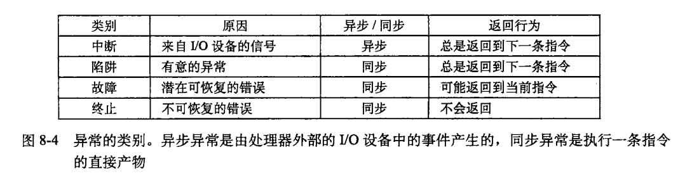

### CPU指令执行过程

PC寄存器指向的地址是物理地址还是逻辑地址?

是逻辑地址: https://blog.csdn.net/weixin_42682806/article/details/84959647

> PC中存放的是下一条要执行指令的地址，通常程序都是按地址连续存储的，而明显在物理空间中是不会连续的，所以如果PC中存储的是物理地址，那么加1就不一定是下一条指令了。这是理解问题的一个方面。


### 一个进程运行的过程

举一个在shell中执行的进程, 如输入 ls

shell首先检查环境变量, 发现ls是一个内置的命令, 于是fork一个子进程, 这个子进程除了pid基本和shell一样. 然后设置这个子进程的环境变量, 参数. 接下来执行exec函数. exec函数会调用一个加载器, 加载器是一段操作系统代码, 它驻留在内存中. 它会将可执行文件的代码和数据加载到进程中, 然后跳转到程序的入口点. 系统开始执行这个进程. 在此进程执行完毕之后, 会返回到call main的下一条指令, 然后将控制权还给内核. 


### 一个中断发生的过程

什么是中断?

中断是异常的一种, 他是一种**异步异常**. 之所以说他是异步异常, 是因为**中断的发生是来自处理器外部的IO设备(如网络适配器, 磁盘控制器)的信号的结果. 硬件中断不是由任何一条专门的指令造成的.** 



**通过向处理器芯片上的一个引脚发信号，并将异常号放到系统总线上，以触发中断，这个异常号标识了引起中断的设备。**

在当前指令完成执行之后，处理器进入中断周期, 注意到**中断引脚的电压变高**了，就**从系统总线读取异常号**, 然后调用适当的中断处理程序. 

当处理程序返回时，它就**将控制返回给下一条指令**, 结果是程序继续执行，就好像没有发生过中断一样。


### 一个系统调用发生的过程

什么是系统调用? 系统调用是陷阱, 陷阱是有意的异常. 系统调用是**在用户程序和内核之间的一个像过程一样的接口**. 用户程序像内核请求服务, 比如读文件read, 创建进程fork, 加载程序exec, 终止进程exit. 

指令

```
syscall n
```

会导致一个到异常处理程序的陷阱. 


当用户进程使用系统调用, 处理器执行时检测到它.

Linux系统调用的参数是**通过通用寄存器**而不是栈传递的. 

* %eax 寄存器保存 系统调用号
* %ebx, %ecx, %edx, %esi, %edi, %ebp等都可以用来保存参数(最多6个)

比如这样一个系统级函数


它对应的汇编代码是这样的


当然, 在执行系统调用之前, 需要将之前正在执行的进程的上下文保存, 就跟进程调度时做的一样. 


### 一个信号发生的过程

Unix信号是一种软件形式的异常, **允许进程中断其他进程**(包括自己). 信号通知进程发生了某种类型的事件, 比如一个进程发生了除0错误(它是一个故障)的时候, 进程并不知道. 这个时候内核给他发送一个SIGFPE信号. 


下面来描述一下当在shell中执行一个前台进程, 然后按`ctrl+c`终止它的过程

shell捕获到键盘的输入`ctrl+c`, 然后他会给他的所有处在前台的进程发送一个SIGINT信号. 这个信号并不是像中断那样立刻去执行, 而是会等到接收信号的进程被调度时, 在运行之前先执行信号处理函数(handle函数). 

在Linux中, 可通过kill系统调用来发送一个信号


在任何时刻, 对于一个进程, 一种类型的信号最多只有一个待处理信号. 如果进程正在处理一个信号, 那么下一个同类型的信号就会被阻塞, 而第三个同类型的信号如果这个时候过来的话就会被丢弃. 这样在某些情况下会导致一些问题, 比如父进程处理僵尸进程的时候, 子进程变成僵尸进程的时候会给父进程发送信号(**给父进程发送SIGCHLD信号**), 然后父进程用信号处理函数去wait子进程, 将他回收. 由于同时存在的同一类型信号不能同时存在三个或以上, 那么就有的子进程无法被回收.

比如

原先是这样子的


可以通过把if变成while来解决(虽然它还是有缺陷的)


这篇文章讲得非常详细: https://www.cnblogs.com/taobataoma/archive/2007/08/30/875743.html

内核处理一个进程收到的信号的时机是在一个进程从内核态返回用户态时。所以，当一个进程在内核态下运行时，软中断信号并不立即起作用，要等到将返回用户态时才处理。进程只有处理完信号才会返回用户态，进程在用户态下不会有未处理完的信号。

如果进程收到一个要捕捉的信号，那么进程从内核态返回用户态时执行用户定义的函数。而且执行用户定义的函数的方法很巧妙，**内核是在用户栈上创 建一个新的层**，该层中将返回地址的值设置成用户定义的处理函数的地址，这样进程从内核返回弹出栈顶时就返回到用户定义的函数处，从函数返回再弹出栈顶时， 才返回原先进入内核的地方。**这样做的原因是用户定义的处理函数不能且不允许在内核态下执行（如果用户定义的函数在内核态下运行的话，用户就可以获得任何权 限）。** 


### 一个地址翻译的过程


### 进程切换的过程


### 内核态

> “CS寄存器还有一个很重要的功能，它含有一个两位的字段，用以指明CPU的当前特权级。值0代表最高优先级，而值为3代表最低优先级。Linux只用0级和3级，分别称之为内核态和用户态”

知乎上一个对于内核态的一个问题: https://www.zhihu.com/question/306127044

> * 内核态，或者说CPU的特权模式，是CPU的一种工作状态，它影响CPU对不同指令的执行结果。操作系统通过跟CPU配合，设置特权模式和用户模式，来防止应用程序进行越权的操作
>
> * 防止应用程序越权访问内存时使用了虚拟地址空间映射的技术，这是操作系统软件配合硬件的MMU共同实现的。在用户模式下，应用程序访问的内存地址是虚拟内存地址，会映射到操作系统指定的物理地址上。这个虚拟内存地址空间就是你说的用户空间。
>
> * 内核态是个操作系统概念，虽然对应到CPU的特权模式，但一般如果没有操作系统，就不说内核态了，直接说运行在CPU的特权模式应该没毛病。
>
> * 应用程序无法自由进入内核态，只能通过操作系统提供的接口调用进入，或者在硬件中断到来时被动进入
>
> * 应用程序通过操作系统功能来使用硬件
>
> 来源：https://www.zhihu.com/question/306127044/answer/555327651

另一个回答

> 进入内核态就是CPU在执行内核代码，可以认为CPU被操作系统内核占用了
>
> 内核态是一个状态，而不是一个位置。表示当前CPU在执行操作系统内核代码。内核态是操作系统的概念，CPU没有内核态一说。CPU有各种特权级，表示CPU的状态。一般来说操作系统内核态会在CPU的高特权级下执行，而应用程序会在CPU的低特权级下执行，这个是操作系统的逻辑决定的。
>
> 没有操作系统，也就没有内核态了。程序可以运行在CPU的任意特权级下，完全由程序自己逻辑决定。
>
> 操作系统可以决定把硬盘访问划到内核态执行，也可以把硬盘访问开放给应用程序，这个由系统设计初衷决定。
>
> 用户空间是操作系统划给应用程序使用的内存空间，当应用程序访问不属于自己的内存空间时，操作系统会检测到。这个检测是硬件做的，一般叫MMU或者MPU，具体规则由系统启动时配置好的。应用程序访问内存也需要通过MMU或者MPU，理论上会影响访问速度。
>
> 这个由硬件电路决定，南桥北桥只有PC有这个玩意。
>
> 普通用户可以通过触发指定的软中断/异常进入内核态，非内核态一般运行在CPU的低特权级下，在这种特权级下，只能访问有限的寄存器。
>
> 中断/异常向量表由芯片设计决定，可能是固定位置，也可能是启动后配置。发生中断/异常后硬件会去这个表查对应的处理函数。具体位置查阅芯片编程手册就可以了。
>
> 来源：https://www.zhihu.com/question/306127044/answer/555354376


### 内核态线程和用户态线程

