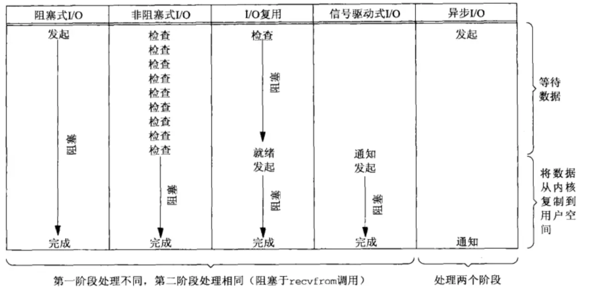

## 计算机网络


## http & https

very nice: https://juejin.im/post/5e9cda81e51d4547092219fa

### http和https

https://www.zhihu.com/question/19577317

http的默认端口为80, 而https默认端口为443.

http是HTTP协议运行在TCP之上。所有传输的内容都是明文，客户端和服务器端都无法验证对方的身份。

**https是HTTP运行在SSL/TLS之上，SSL/TLS运行在TCP之上**。所有传输的内容都经过加密，加密采用对称加密，但**对称加密的密钥用服务器方的证书进行了非对称加密**。此外客户端可以验证服务器端的身份，如果配置了客户端验证，服务器方也可以验证客户端的身份。

SSL（Security Sockets Layer，安全套接层）

SSL3.0后更名为TLS

这篇文章讲的非常好, 非常清楚: https://juejin.im/entry/58d7635e5c497d0057fae036

一个例子

> 这套证书其实就是一对公钥和私钥，如果对公钥和私钥不太理解，可以想象成一把钥匙和一个锁头，只是全世界只有你一个人有这把钥匙，你可以把锁头给别人，别人可以用这个锁把重要的东西锁起来，然后发给你，因为只有你一个人有这把钥匙，所以只有你才能看到被这把锁锁起来的东西。


### http版本: 1和2

一篇不错的掘金博客: https://juejin.im/post/5e9cda81e51d4547092219fa


### 一次url访问的过程

看这个: https://juejin.im/post/5e9cda81e51d4547092219fa#heading-19

先从浏览器缓存中找url对应的ip, 如果没有找到, 则到主机的host文件中找. (这也是为什么网上一些关于github代理的博客说改host文件加快github访问). 如果找不到，就向网络中发起一个 DNS 查询。DNS是基于UDP传输的. 先从本地的DNS服务器请求ip, 如果没找到, 就依次向上请求, 直到查询到服务器ip然后返回.

之后浏览器会和目标服务器建立 TCP 连接，需要经过三次握手的过程. 


### 如何实现登陆状态

在服务端维护session: https://www.jianshu.com/p/83f48ba6b1ff

> session机制是一种服务器端的机制，**服务器使用一种类似于散列表的结构来保存信息**，一般存储在文件、数据库或内存中。当客户端第一次请求服务端的时候，服务端会检查客户端的请求是否包含sessionid，如果有的话则会检索这个sessionid对应的session是否存在，如果不存在则会创建相应的会话信息，生成对应的session，并将sessionid返回给客户端，客户端接收到这个sessionid，把它存储起来，下一次发送请求的时候，附带着这个session一起发送给服务端，服务端只要根据这个sessionid，就知道是谁了,而这个sessionid就是这次会话生命周期的凭证，**服务端可以给这个sessionid设置过期时间，一但客户端丢失这个sessionid或者是服务端认为这个sessionid失效了，那么这次会话就结束了**

**session存储在哪?** 

session可以存储在文件, 数据库或内存. 

**session共享?**

由于负载均衡的存在, 客户端访问服务端可能主机不一样, 这种情况可以将session的数据存储到一个公用的数据库. 这样可以保证session的一致性. 

**客户端如何找到对应的session?**

服务端使用类似hashTable的结构来保存session信息. 当建立session的时候, 会生成一个sessionId, 保存到用户的cookie中, 然后用户再次请求的时候, 会包含这个sessionId, 然后就可以找到它对应的session信息.

**session生命周期**

服务端可以给这个sessionid设置过期时间，一但客户端丢失这个sessionid或者是服务端认为这个sessionid失效了，那么这次会话就结束了


### 爬虫与反爬的对抗

一个有趣的对抗故事: 如何应对网站反爬虫策略？如何高效地爬大量数据? - 申玉宝的回答 - 知乎 https://www.zhihu.com/question/28168585/answer/74840535

下面是常见的反爬策略和对应的应对方案


#### 反爬策略

1. 禁止一个ip短时间多次访问
2. 需要登陆
3. 信息在js中
4. 图形验证码
5. 智能验证码


#### 爬虫策略

1. ip代理池

    https://blog.csdn.net/sinat_29675423/article/details/87953362

    > 1. 构造合理的HTTP请求头，设置agent
    > 2. 正常的时间访问间隔，不要在极短的短时间内访问
    > 3. 多用几个代理ip，让服务器认为是不同的用户在访问
    > 4. 申请多个key，各个key轮流使用，突破QPS限制和访问次数限额。

    **adsl拨号**: 如何应对网站反爬虫策略？如何高效地爬大量数据? - 猿人学的回答 - 知乎 https://www.zhihu.com/question/28168585/answer/697801076

    这个回答填补了我之前的一些知识空缺. 每次拨号都可以更换ip. 

2. 模拟cookie: https://juejin.im/post/5bd6acdbf265da0aba710136

    1. POST 请求方法：需要在后台获取登录的 URL并填写请求体参数，然后 POST 请求登录，相对麻烦；
    2. 添加 Cookies 方法：先登录将获取到的 Cookies 加入 Headers 中，最后用 GET 方法请求登录，这种最为方便；

3. 使用**PhantomJS**这种无界面浏览器或者是selenium这种自动话测试工具

    https://blog.csdn.net/qq_33689414/article/details/78631009

4. 使用OCR工具, 识别图形验证码, 比如tesseract 

5. 滑块缺口的可以通过cv的知识破解, 毕竟人眼能分辨出, 那么通过一些方法程序也能识别出https://zhuanlan.zhihu.com/p/52705053


## 网络模型


### 线程池

https://juejin.im/post/5c8896be5188257ec828072f

https://blog.csdn.net/hanghangaidoudou/article/details/81628166

优点:

1、线程是稀缺资源，使用线程池可以减少创建和销毁线程的次数，每个工作线程都可以重复使用。

2、可以根据系统的承受能力，调整线程池中工作线程的数量，防止因为消耗过多内存导致服务器崩溃。

3、解耦作用；线程的创建于执行完全分开，方便维护。

**线程消耗的资源:** 

1. 内存资源(线程多了这个内存就会很大)
2. CPU调度的上下文切换资源
3. 线程创建和消亡的开销
4. 对锁/IO设备的竞争

多线程的代价: https://www.cnblogs.com/ktgu/p/3529144.html


### 五种IO模型

**转载自: https://juejin.im/post/5bd32b84f265da0ac962e7c9**

网络数据的IO过程:

- 等待数据从网络送达，到达后被复制到内核缓冲区
- 把数据从内核缓冲区复制到应用程序缓冲区

1. 阻塞式IO

    使用系统调用，并一直阻塞直到内核将数据准备好，之后再由内核缓冲区复制到用户态，在等待内核准备的这段时间什么也干不了

    

    

2. 非阻塞式IO

    内核在没有准备好数据的时候会返回错误码，而调用程序不会休眠，而是不断轮询询问内核数据是否准备好

    非阻塞式IO的轮询会耗费大量cpu，通常在专门提供某一功能的系统中才会使用。通过为套接字的描述符属性设置非阻塞式，可使用该功能


3. IO多路复用

    类似与非阻塞，只不过轮询不是由用户线程去执行，而是由内核去轮询，内核监听程序监听到数据准备好后，调用内核函数复制数据到用户态

    下图中select这个系统调用，充当代理类的角色，不断轮询注册到它这里的所有需要IO的文件描述符，有结果时，把结果告诉被代理的recvfrom函数，它本尊再亲自出马去拿数据

    IO多路复用至少有两次系统调用，如果只有一个代理对象，性能上是不如前面的IO模型的，但是由于它可以同时监听很多套接字，所以性能比前两者高

    

    多路复用包括：

    - select：线性扫描所有监听的文件描述符，不管他们是不是活跃的。有最大数量限制（32位系统1024，64位系统2048）
    - poll：同select，不过数据结构不同，需要分配一个pollfd结构数组，维护在内核中。它没有大小限制，不过需要很多复制操作
    - epoll：用于代替poll和select，没有大小限制。使用一个文件描述符管理多个文件描述符，使用红黑树存储。**同时用事件驱动代替了轮询。epoll_ctl中注册的文件描述符在事件触发的时候会通过回调机制激活该文件描述符。epoll_wait便会收到通知**。最后，**epoll还采用了mmap虚拟内存映射技术减少用户态和内核态数据传输的开销**

4. 信号驱动式IO

    - 使用信号，内核在数据准备就绪时通过信号来进行通知
    - 首先开启信号驱动io套接字，并使用sigaction系统调用来安装信号处理程序，内核直接返回，不会阻塞用户态
    - 数据准备好时，内核会发送SIGIO信号，收到信号后开始进行io操作

    

5. 异步IO

    异步IO依赖信号处理程序来进行通知

    不过异步IO与前面IO模型不同的是：前面的都是数据准备阶段的阻塞与非阻塞，异步IO模型通知的是IO操作已经完成，而不是数据准备完成

    异步IO才是真正的非阻塞，主进程只负责做自己的事情，等IO操作完成(数据成功从内核缓存区复制到应用程序缓冲区)时通过回调函数对数据进行处理

    unix中异步io函数以aio_或lio_打头

    

#### 对比

- 前面四种IO模型的主要区别在第一阶段，他们第二阶段是一样的：数据从内核缓冲区复制到调用者缓冲区期间都被阻塞住！
- 前面四种IO都是同步IO：IO操作导致请求进程阻塞，直到IO操作完成
- 异步IO：**IO操作不导致请求进程阻塞**(完全不导致！)




#### 同步IO和异步IO的区别

https://juejin.im/post/5c725dbe51882575e37ef9ed

**两者的区别就在于synchronous IO做”IO operation”的时候会将process阻塞。**按照这个定义，之前所述的blocking IO，non-blocking IO，IO multiplexing都属于synchronous IO。注意到non-blocking IO会一直轮询(polling)，这个过程是没有阻塞的，但是recvfrom阶段blocking IO,non-blocking IO和IO multiplexing都是阻塞的。 而asynchronous IO则不一样，当进程发起IO 操作之后，就直接返回再也不理睬了，直到kernel发送一个信号，告诉进程说IO完成。在这整个过程中，进程完全没有被block。


### IO多路复用

转载自: https://juejin.im/post/5c725dbe51882575e37ef9ed

#### select

select本质是通过设置或检查存放fd标志位的数据结构来进行下一步处理。缺点是：

1. 单个进程可监视的fd数量被限制，即能监听端口的大小有限。一般来说和系统内存有关，具体数目可以cat /proc/sys/fs/file-max察看。32位默认是1024个，64位默认为2048个

    不过我电脑上是这么多个。。。

    

2. 对socket进行扫描时是线性扫描，即采用轮询方法，效率低。当套接字比较多的时候，每次select()都要遍历FD_SETSIZE个socket来完成调度，不管socket是否活跃都遍历一遍。会浪费很多CPU时间。如果能给套接字注册某个回调函数，当他们活跃时，自动完成相关操作，就避免了轮询，这正是epoll与kqueue做的

3. 需要维护一个用来存放大量fd的数据结构，会使得用户空间和内核空间在传递该结构时复制开销大

#### poll

poll本质和select相同，将用户传入的数据拷贝到内核空间，然后查询每个fd对应的设备状态，如果设备就绪则在设备等待队列中加入一项并继续遍历，如果遍历所有fd后没有发现就绪设备，则挂起当前进程，直到设备就绪或主动超时，被唤醒后又要再次遍历fd。它没有最大连接数的限制，原因是它是基于链表来存储的，但缺点是：

1. 大量的fd的数组被整体复制到用户态和内核空间之间，不管有无意义。
2. poll还有一个特点“水平触发”，如果报告了fd后，没有被处理，那么下次poll时再次报告该ffd。

#### epoll

epoll支持水平触发和边缘触发，最大特点在于边缘触发，只告诉哪些fd刚刚变为就绪态，并且只通知一次。还有一特点是，epoll使用“事件”的就绪通知方式，通过epoll_ctl注册fd，一但该fd就绪，内核就会采用类似callback的回调机制来激活该fd，epoll_wait便可以收到通知。epoll的优点：

1. 没有最大并发连接的限制。
2. 效率提升，只有活跃可用的FD才会调用callback函数。
3. 内存拷贝，利用mmap()文件映射内存加速与内核空间的消息传递。

#### select、poll、epoll区别总结：

|        |    支持一个进程打开连接数     |                  IO效率                  |                   消息传递方式                   |
| :----: | :---------------------------: | :--------------------------------------: | :----------------------------------------------: |
| select |  32位机器1024个，64位2048个   |                 IO效率低                 | 内核需要将消息传递到用户空间，都需要内核拷贝动作 |
|  poll  |   无限制，原因基于链表存储    |                 IO效率低                 | 内核需要将消息传递到用户空间，都需要内核拷贝动作 |
| epoll  | 有上限，但很大，2G内存20W左右 | 只有活跃的socket才调用callback，IO效率高 |     **通过内核与用户空间共享一块内存来实现**     |


### epoll原理

[不错的博客](https://dreamgoing.github.io/epoll.html) 

这篇博客讲的非常详细: https://blog.csdn.net/daaikuaichuan/article/details/83862311

以下记录几个问题(部分内容拷贝自上面博客):

1. 基本API

    ```c
    int epoll_create(int size);  
    int epoll_ctl(int epfd, int op, int fd, struct epoll_event *event);  
    int epoll_wait(int epfd, struct epoll_event *events,int maxevents, int timeout);  
    ```

2. 为什么epoll要用红黑树记录事件, 而不是简单地使用例如链表或者是哈希表?

    首先肯定是不适合用链表的. 因为epoll是为了处理高并发的, 事件的数量可能会非常大, 比如上百万. 而且事件是会频繁地修改状态的, 那么如果用链表, 每次修改都需要O(n)的复杂度, 显然是不合适的.

    **那为什么不用hashTable?**

    看这个讨论: https://www.newsmth.net/nForum/#!article/CPlusPlus/408945

    <del>有人说是因为当时内核实现了红黑树而没有实现hash表。。。但我觉得这样的说法不靠谱</del> 

    还有人说是因为hash表需要占用过大的空间，对于内核来说, 节省空间是非常有必要的.

    [下面引用一位博主的分析]([https://xiaoyue26.github.io/2017/11/06/2017-11/epoll%E7%9B%B8%E5%85%B3%E5%9F%BA%E7%A1%80%E7%9F%A5%E8%AF%86/](https://xiaoyue26.github.io/2017/11/06/2017-11/epoll相关基础知识/)) 

    > **epoll为什么使用红黑树**
    > 因为epoll要求快速找到某个句柄, 因此首先是一个Map接口,候选实现:
    >
    > 1. 哈希表 O(1)
    > 2. 红黑树 O(lgn)
    > 3. 跳表 近似O(lgn)
    >     据说老版本的内核和FreeBSD的Kqueue使用的是哈希表.
    >
    > 个人理解现在内核使用红黑树的原因:
    >
    > 1. 哈希表. 空间因素,可伸缩性.
    >     (1)频繁增删. 哈希表需要预估空间大小, 这个场景下无法做到.
    >     间接影响响应时间,假如要resize,原来的数据还得移动.即使用了一致性哈希算法,
    >     也难以满足非阻塞的timeout时间限制.(时间不稳定)
    >     (2) 百万级连接,哈希表有镂空的空间,太浪费内存.
    > 2. 跳表. 慢于红黑树. 空间也高.
    > 3. 红黑树. 经验判断,内核的其他地方如防火墙也使用红黑树,实践上看性能最优.

3. 回调机制: 对于每一个注册的事件, 内核都会为其注册回调函数, 当中断事件发生时, 会向就绪链表中发送数据. 

    使用epoll_create之后, 内核会创建如下数据结构

    ```c
    struct eventpoll {
    　　...
    　　/*红黑树的根节点，这棵树中存储着所有添加到epoll中的事件，
    　　也就是这个epoll监控的事件*/
    　　struct rb_root rbr;
    　　/*双向链表rdllist保存着将要通过epoll_wait返回给用户的、满足条件的事件*/
    　　struct list_head rdllist;
    　　...
    };
    ```

4. 两种触发方式: LT(水平触发), ET(边缘触发)

    水平触发: 只**要这个文件描述符还有数据可读，每次 epoll_wait都会返回它的事件**，提醒用户程序去操作；

    边缘触发: 在它检测到有 I/O 事件时，通过 epoll_wait 调用会得到有事件通知的文件描述符，对于每一个被通知的文件描述符，如可读，则必须将该文件描述符一直读到空，让 errno 返回 EAGAIN 为止，否则下次的 epoll_wait 不会返回余下的数据，会丢掉事件。如果ET模式不是非阻塞的，那这个一直读或一直写势必会在最后一次阻塞。

    两个图解释

    

    

    - ET模式（边缘触发）**只有数据到来才触发**，**不管缓存区中是否还有数据**，缓冲区剩余未读尽的数据不会导致epoll_wait返回；
    - LT 模式（水平触发，默认）**只要有数据都会触发**，缓冲区剩余未读尽的数据会导致epoll_wait返回。

5. epoll为什么要有EPOLLET触发模式？

    如果采用EPOLLLT模式的话，系统中一旦有大量你不需要读写的就绪文件描述符，它们每次调用epoll_wait都会返回，这样会大大降低处理程序检索自己关心的就绪文件描述符的效率.。而采用EPOLLET这种边缘触发模式的话，当被监控的文件描述符上有可读写事件发生时，epoll_wait()会通知处理程序去读写。如果这次没有把数据全部读写完(如读写缓冲区太小)，那么下次调用epoll_wait()时，它不会通知你，也就是它只会通知你一次，直到该文件描述符上出现第二次可读写事件才会通知你！！！这种模式比水平触发效率高，系统不会充斥大量你不关心的就绪文件描述符。


## 网络知识


### 网络编程与原理

accept函数是什么时候返回的?

如图所示, 应该是三次握手之后收到ACK的时候返回的.


## 数据链路层

### 向网络层提供的服务

1. 组帧
2. 流量控制
3. 差错检验
4. 可靠传输机制


### 组帧

为什么要组帧? 是为了在数据发生错误时, 只需要重发相应的帧, 而不需要重发整个数据. 


#### 实现组帧的方式

1. 字符计数法

    

2. 字符填充法

    

3. 比特填充法: 每遇到连续5个1就补充一个0, 之后以同样方式解码

    

4. 违规编码法

    

    什么是曼彻斯特编码? 他跟我们数电学的不一样. [看维基百科](https://zh.wikipedia.org/wiki/曼彻斯特编码) 

    

    根据 ieee 802.3 编码格式:

    

    

### 差错检测


ARQ(自动重传请求)就是**将错误的数据帧丢弃, 然后超时重传.** 就实现了自动重传. 


#### 检错编码

1. 奇偶校验码

    如果是奇校验, 那么多出的1位使得所有的1为奇数. 

2. 循环冗余校验

    循环冗余码也叫多项式码

    模2除类似于 异或. 

    双方开始设置一个相同的 G(x) 

    

    

    

#### 纠错编码: 海明码

局限性: 只能纠错一位. 可以检测两位. 

[一篇不错的文章](https://blog.csdn.net/flyyufenfei/article/details/72235748) 

简单地描述就是将校验码插入到原编码中, 且插入的位置为2的幂次方开始(从1开始, 最小值也从1开始). 

然后每位都有一个位置下标(从1开始), 这些下标的第k位对应第k个海明位, 将所有第k位的位进行异或, 得到0或1, 如果是0, 第k位海明位为0, 否则为1. 这样, 检错是通过进行异或运算, 得到错误的那个位的下标, 然后将其取反即可纠错. 

1位可以纠错, 但如果是两位, 那么无法纠错. 


