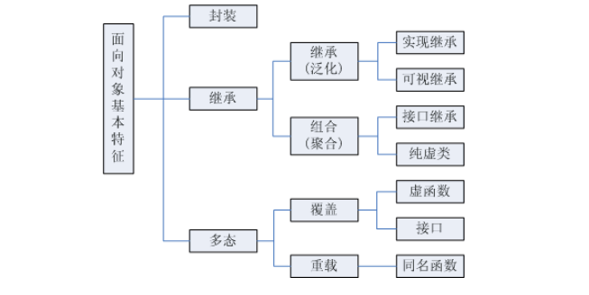

## 腾讯第二个一面

1. c++指针和引用的区别

    https://www.cnblogs.com/dolphin0520/archive/2011/04/03/2004869.html

2. 介绍一下const关键字

    我发现我答错了... 刚好答反了...

    ```c++
    const char* p2 = greeting;          // 指针变量，指向字符数组常量（const 后面是 char，说明指向的字符（char）不可改变）
    char* const p3 = greeting;          // 自身是常量的指针，指向字符数组变量（const 后面是 p3，说明 p3 指针自身不可改变）
    ```

3. 说一下static

4. struct 和 class 的区别

    有两种struct

    c语言的struct和C++的有很大的区别, C语言的struct基本只是一种自定义的数据结构, 它没有成员函数, 也就没有那些面向对象的特性了. **但是c语言是可以一些实现出面向对象的特性的**: [参考文章](https://blog.csdn.net/foruok/article/details/18192167)  [2](https://blog.csdn.net/foruok/article/details/18325977) [3](https://blog.csdn.net/foruok/article/details/18422955) 

    面向对象三大基本特征: 封装、继承、多态.

    

    C++的struct也可以继承 ... 

    **在C++中struct得到了很大的扩充：**

    **1.struct可以包括成员函数**

    **2.struct可以实现继承**

    **3.struct可以实现多态**

    [参考](https://zhuanlan.zhihu.com/p/47808468) 

    [从语法上，在C++中（只讨论C++中）。class和struct做类型定义时只有两点区别：](https://blog.csdn.net/hustyangju/article/details/24350175) 

    （一）默认继承权限。如果不明确指定，来自class的继承按照private继承处理，来自struct的继承按照public继承处理；

    （二）成员的默认访问权限。class的成员默认是private权限，struct默认是public权限。

    

5. 说一下C++的多态

6. 多态是如何实现的, 为什么虚函数可以实现多态

    虚函数表指针

7. 虚函数和普通的成员函数有什么区别

8. C++除了动态的多态有没有静态的, 静态的多态如何实现

    比如函数重载

9. 实现静态类型的高级方式(模板类)

10. C++类初始化的时候要注意什么

11. 创建一个类默认创建的函数(隐藏, 用户看不到) 

12. 介绍类型转化

13. 什么时候可以用虚析构函数

14. vector是怎么实现的

15. vector没有连续的空间了怎么办

16. 如果vector没有内存了怎么办

17. map和set怎么实现的

18. 红黑树和二分查找树的区别

19. 红黑树是相对平衡还是绝对平衡的

20. 为什么不用绝对平衡的AVL树

21. 手写一个快速排序

22. 讲一下快排算法

23. 说一下三次握手和四次挥手

24. 第三次握手的时候可以带数据吗

       https://www.zhihu.com/question/66407996

25. 取决于什么

26. tcp nagle算法有没有了解过

27. 拥塞控制了解过吗

28. tcp是可靠的吗? 是100%可靠的吗

       他说的意思是如果出现了一个包无法传输过来, 然后一直请求重传, 不可能重传100w次, 不一定所有包都能保证会传过去.

29. 进程和线程的区别

30. 进程的通信有哪些

31. 管道通信的缺点是什么

32. 共享内存了解过吗

33. 服务器端的网络编程分几步(Bind, Listen, Accept等API的含义)

34. 说一下你实习的项目

35. 怎么测试的, 是不是自动化测试

36. 介绍编译器项目

37. 说一下C++编译过程

38. 编译器过程哪部分比较难

39. linux熟悉吗, 平时用什么命令

40. 查进程, 查端口, 连接状态的命令

41. 查看一个端口是否被使用, 看tcp连接状态

42. 查看进程打开的文件

43. 文本处理三剑客

44. 微软实习收获了什么

